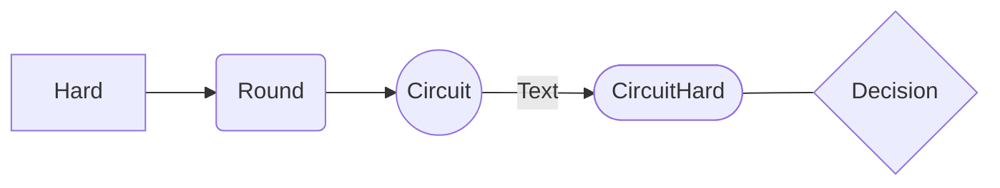

# 了不起的 Markdown

## VS Code 插件

VSCode 原生 Markdown 渲染器不完全支持 GFM 语法。这里有一些好用的 Markdown 插件可以让你在使用 VSCode 编辑 Markdown 时获得更好的体验。

**Essential**

- GitHub Markdown Preview：该插件包包含 GitHub 风格 Preview 以及 Emoji 支持，Checkbox 支持等
- Markdown Preview VS Code Highlighting：使 Preview 中的代码颜色与编辑器中的颜色匹配
- Markdown Footnotes：支持脚注语法
- Markdown Image Size：支持图片大小语法
- Markdown Preview Mermaid Support：Mermaid 图表支持
- Mermaid Markdown Syntax Highlighting：Mermaid 代码高亮
- Markdown All in One：数学符号，GFM 支持，自动补全等。在插入图片时非常好用。

**Optional**

- Markdown+Math：支持更多 Latex 符号；该插件渲染的符号比 Markdown All in One 的小一些
- Markdown Preview Enhanced：支持最全的 Markdown Preview，但是打开速度稍慢
- vscode all markdown：提供类似 Typora 的即时渲染功能

## 基础语法

### 标题

# 这是一个标题

**使用规范**

1. 建议标题的前后都要空一行（除非标题在文档开头）；`#` 与标题文本之间也要有一个空格。
2. 不要有多余的空格。
3. 建议标题的结尾不要有标点符号。
4. 标题要尽量简短。

使用 Markdown 写文档的推荐结构如下：

-----------------------------------------

# 文档标题

作者

摘要

目录

## 标题 1

### 标题 1.1

## 标题 2

### 标题 2.1

### 标题 2.2

-----------------------------------------

**说明**

1. 文档标题：文档的第一个标题应该是一级标题，写在第一行，建议与文件名相同，标题要尽量简短。
2. 作者：可选，用于声明文档的作者，如果是开源项目的文档，建议把作者名写在修订历史中。
3. 摘要：用 1~3 句话描述文档的核心内容。
4. 目录：用于快速了解文档的结构，便于导航。
5. 正文：正文中的标题从二级目录开始，逐级增加，不可跳级，不可相同。

### 字体风格

**粗体**

*斜体*

***粗斜体***

~~删除线~~

<u>下划线</u>

==高亮==

> 删除线属于扩展语法
>
> **在粗体和斜体语法标记的内部，建议不要有空格**

### 段落与换行

Markdown 中的段落使用空行来标记。

**语法说明**

1. 如果行与行之间没有空行，则会被视为同一段落。
2. 空行是指行内什么都没有，或者只有空格和制表符。
3. 如果想在段内换行，则需要在上一行的结尾插入两个以上的空格然后按回车键。也可以使用 <br> 或者（不建议）/。

**使用规范**

为了便于阅读，应该限制每行字符的数量，通常每行不超过 80 个字符，可以在编辑器中进行设置。

**建议**

1. 当超过 80 个字符后进行换行。
2. 在一句话结束（`.` 或 `!` 或 `?`）之后换行。
3. 当 URL 较长时换行（在 URL 之前加一个换行符，或者通过引用链接来进行优化）。
4. 不要用空格或制表符缩进段落。

### 列表

1. 有序列表
  1. 子列表
    - 子子列表

- 无序列表
  - 子列表
    - 子子列表
      1. 子子子列表 1
      2. 子子子列表 2

**语法说明**

1. 列表中可以嵌套列表（两个空格）。
2. 有序列表和无序列表也可以互相嵌套。

**使用规范**

1.  如果一个列表中所有的列表项都没有换行，建议使用 1 个空格（在 `-` 和列表内容之间），且列表项之间不要有空行。

2.  如果列表项有换行，则建议给无序列表使用 3 个空格，给有序列表使用 2 个空格（有序列表的 `.` 占据了一个空格）。且在列表项之间空 1 行。

3.  建议在列表前/后都空 1 行。

### 分隔线

使用 3 个以上的 `-`

**语法说明**

1. 行内不能有其他的字符。
2. 可以在标记符中间加上空格。
3. 分隔线的上面要有一个空行。若不留空行，就会变成放大上一行字。

**语法说明**

1. 图片替代文字在图片无法正常显示时会比较有用，正常情况下可以为空。
2. 图片地址可以是本地图片的路径也可以是网络图片的地址。
3. 本地图片支持相对路径和绝对路径两种方式。

### 链接

#### 文字链接

[Markdown 链接语法](https://markdown.com.cn/basic-syntax/links.html)

[带有 Title 的 Markdown 链接语法](https://markdown.com.cn/basic-syntax/links.html "鼠标移到链接上时会显示这个 Title")

> 这种写法当链接过多时可读性较差

#### 引用链接

把链接地址作为 “变量” 先在 Markdown 文件的页尾定义好，然后在正文中进行引用。

第一部分：

[Markdown 链接语法][markdown]

第二部分：

[markdown]: https://markdown.com.cn/basic-syntax/links.html "Title"

> 第二部分不能有其他字符，前面要有一个空行；冒号后面至少一个空格。

**语法说明**

1. 链接标记可以有字母、数字、空格和标点符号。
2. 链接标记不区分大小写。
3. 定义的链接内容可以放在当前文件的任意位置，建议放在页尾。
4. 当链接地址为网络地址时要以 `http` / `https` 开头，否则会被识别为本地地址。
5. 如果要对链接使用加粗、斜体，在链接语法两侧添加 `*`。要将链接表示为代码，在 `[]` 中添加 <code>`</code>。

#### 网址链接

使用 `<>` 将网络地址或邮箱地址包裹起来会被自动转换为超链接。

**使用规范**

要使用有意义的链接标题。如：

如果想了解关于Markdown的更多信息，请查看[Markdown指南](markdown_guide.md)

**不建议：**

如果想了解关于Markdown的更多信息，请查看[这里](markdown_guide.md)

#### 图片链接


也可以将图片嵌入链接：

[](链接地址)

##### GitHub Feature


该图片将只在 GitHub Light 模式下显示

### 行内代码与围栏代码块

`行内代码`

如果行内代码中含有反引号，则使用两个反引号来包裹 ``带有反引号`的行内代码``，或者这样 <code>带有反引号`的行内代码</code>。

代码块以 Tab 或 4 个空格开头

    def test_print():
      pass

**使用规范**

1. 除了行内代码，如果我们想转义或强调某些字符，也可以使用 `行内代码`。
2. 如果我们编写的是简单的代码片段，使用 4 个空格缩进的代码块也许更清晰。

进入虚拟环境：

    pipenv shell

安装依赖：

    pipenv install

#### 围栏代码块

```cpp
#include <iostream>

int main() {
  std::cout << "Hello, World!" << std::endl;
  return 0;
}
```

语言指示：小写语言名，如 html, css, javascript(js), shell, bash(sh), java, python(py), csharp(cs), c, cpp, arduino, cmake。[查看所有支持的语言][supported languages]

**使用规范**

1.  很多 Shell 命令都要粘贴到终端中去执行，因此最好避免在 Shell 命令中使用任何换行操作；可以在行尾使用一个反斜杠 `\` 将换行转义，这样既能避免命令换行，又能提高源码的可读性。
2.  建议不要在没有输出内容的 Shell 命令前加 `$`。在命令没有输出内容的情况下，`$` 是没有必要的，因为内容全是命令，我们不会把命令和输出的内容混淆。
3.  内容占位符用 `<>` 包裹，可选参数用 `[]` 包裹。

```bash
mkdir Demo;\ # 一定要加分号
cd Demo;\
touch file
```

```bash
$ echo "message"
message
```

```bash
git init [-q | --quiet] [--bare] [--template=<template_directory>]
```

### 引用

> 引用

> > 嵌套引用

**语法说明**

1. 多行引用也可以在每一行的开头都插入 `>`。
2. 在引用中可以嵌套引用。
3. 在引用中可以使用其他的 Markdown 语法。
4. 段落与换行的格式在引用中也是适用的。

**使用规范**

1. 在 `>` 之后添加一个空格
2. 不要在引用中添加空行

*推荐*

> 美是到处都有的，
>
> 我们缺少的是发现美的眼睛。

*不推荐*

> 美是到处都有的，

> 我们缺少的是发现美的眼睛。

### 转义

使用 `\`

## GFM 扩展语法

GFM: GitHub Flavored Markdown

### Emoji

:joy: :tada: 

#### Callouts

> :bulb: **Tip:** Here's an important tip to remember!

:) :( :|

> VS Code 原生渲染器不支持 emoji，需要安装 Markdown Emoji 插件。
>
> 更多表情符号请参考：<http://www.webpagefx.com/tools/emoji-cheat-sheet/>

### 自动链接

使用 GFM 扩展语法可以不使用 `<>` 包裹 URL 地址。

*注意*

自动链接只识别以 `www` 或 `http://` 开头的 URL 地址。

如果不想使用自动链接，可以这样：`www.google.com`。

### 表格

| 表头 1 | 表头 2 | 表头 3 |
| ----- | ------ | ----- |
| 内容 1 | 内容 2 | 内容 3 |
| 内容 1 | 内容 2 | 内容 3 |

**语法说明**

1. 单元格使用 `|` 来分隔，为了阅读更清晰，建议最前和最后都使用 `|` 。
2. 单元格和 `|` 之间的空格会被移除。
3. 表头与其他行使用 `-` 来分隔。
4. 表格对齐格式如下
    - 左对齐（默认）：`:-`
    - 居中对齐：`:-:`
    - 右对齐：`-:`
5. 块级元素（代码区块，引用区块）不能插入表格中。其他（粗体，斜体等）可在表格中正常使用。

**使用规范**

1. 在表格的前、后都空 1 行。
2. 每一行中的 `|` 尽量都对齐。
3. 不要使用庞大复杂的表格。

### 任务列表

- [ ] 未选择
- [x] 已选择

### 锚点 {#custom-id}

[跳转到锚点](#custom-id)

**语法说明**

1. Markdown 中每个标题都有一个默认 id：小写字母，短横线代替空格。可以使用默认 id，也可以自定义 id。
1. 锚点名建议使用字母和数字。
2. 锚点名区分大小写。
3. 锚点名中不能含有空格，也不能含有特殊字符。

### Wiki 链接

[[了不起的Markdown]]：引用文件

[[了不起的Markdown#Wiki 链接]]：引用一个标题，如果是文档内引用可以省略 `#` 前面的部分

> 不加文件名后缀的话可能会找不到文件

### 上标和下标

2^10^ 等于 1024

H~2~O 是一种液体

### 脚注

一些句子[^1]
[^1]: 一些句子的脚注

**语法说明**

1. 脚注的标识符可以是数字或单词，但不能包含空格或制表符。
2. 标识符仅有将脚注参考与脚注本身相关联的作用。在输出中，脚注按顺序标号。

### 数学公式

使用 `$$` 包裹 TeX 或 LaTeX 格式的数学公式。

$$
x = {-b \pm \sqrt{b^2-4ac} \over 2a}
$$

详见 [[LaTex]]

### 绘图



详见 [[mermaid]]

### HTML 元素

目前支持的 HTML 元素有：`<kbd>`, `<b>`, `<i>`, `<em>`, `<sup>`, `<sub>`, `<br>`, `<code>`, `<a>`, `<span>`, `<u>`, `<mark>`等。

使用 <kbd>Ctrl</kbd>+<kbd>Alt</kbd>+<kbd>Del</kbd> 重启电脑

<font color="red">Red Text</font>

x<sup>2</sup>, H<sub>2</sub>O

<details>
  <summary>⚡ This is a toggle!</summary>

  Contents of toggle.
</details>

> 在 HTML 区块标签间的 Markdown 格式语法将不会被处理

### 定义列表

术语
: 定义 1
: 定义 2

### 缩写

Markdown 将文本转换为 HTML。

*[HTML]: HyperText Markup Language

> 缩写对文件中所有匹配的文本有效

### 注释

[This is a hidden comment]: #

### 目录

按下 <kbd>F1</kbd> 或 <kbd>Ctrl</kbd> + <kbd>Shift</kbd> + <kbd>P</kbd> 打开命令面板，搜索 `table of contents`，Markdown All in One 插件将在光标位置处创建目录。

[supported languages]: https://github.com/highlightjs/highlight.js/blob/main/SUPPORTED_LANGUAGES.md
