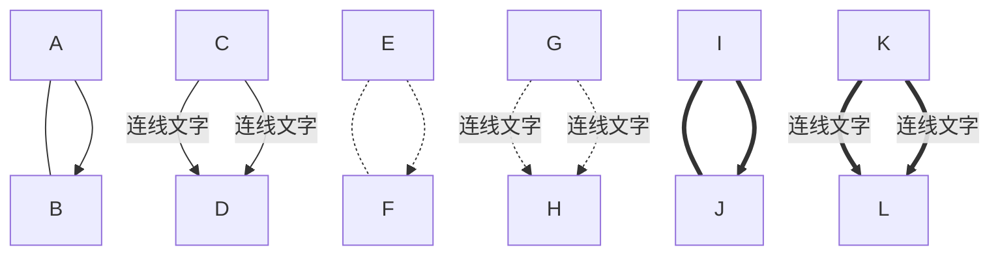
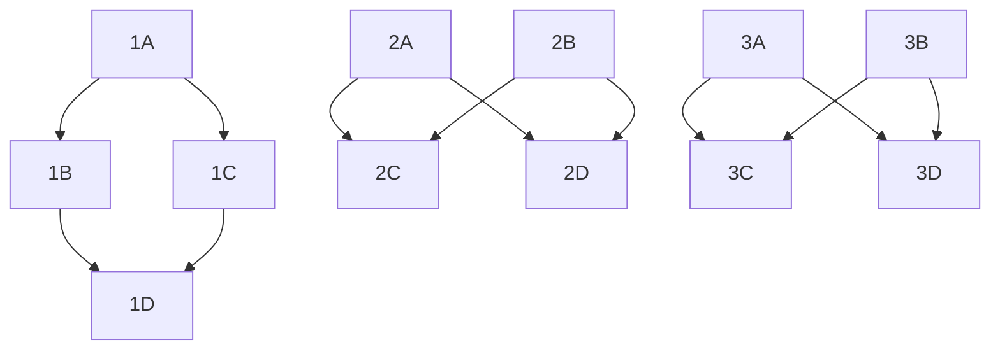
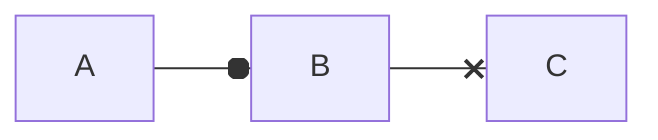
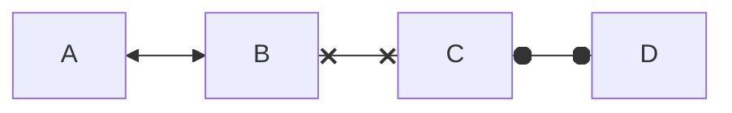
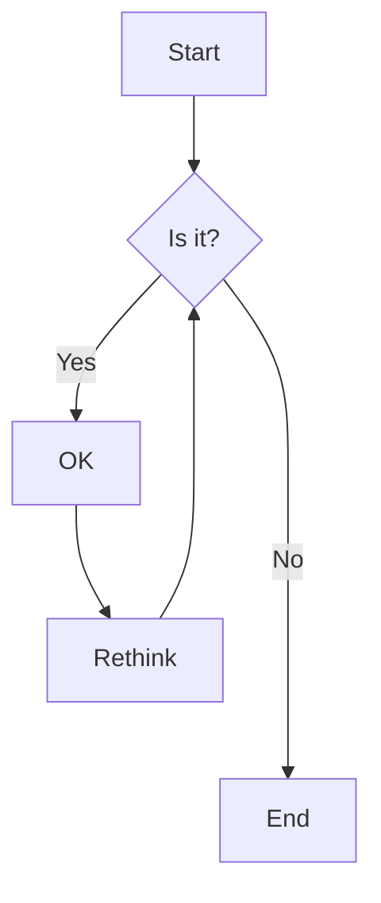
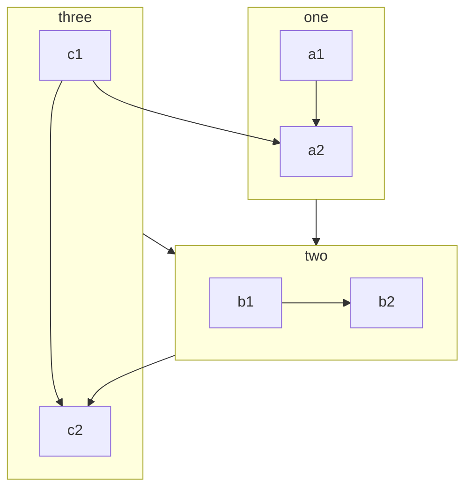
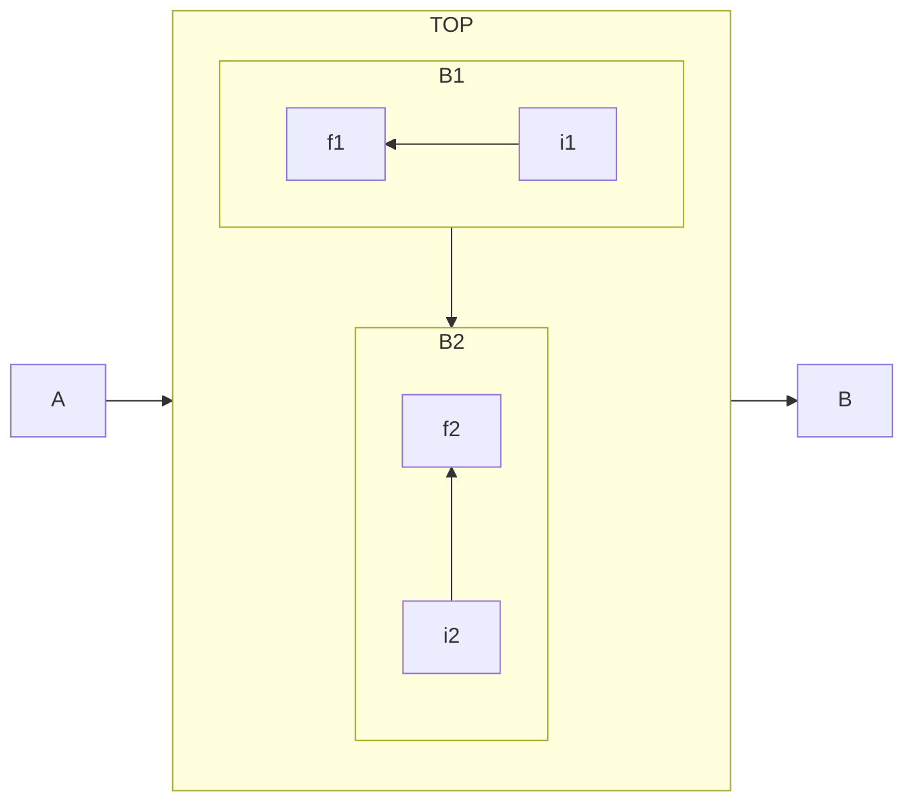
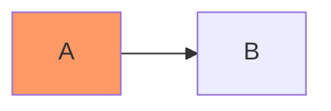
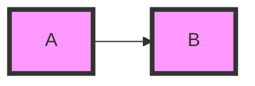

# Mermaid

## flowchart

### 流程图方向

- TB - top to bottom
- TD - top-down/ same as top to bottom
- BT - bottom to top
- RL - right to left
- LR - left to right

### 结点形状


### 连线



> 可以将文本放在 "双引号" 内，防止文本中的特殊字符破坏语法。

### 连线方式



### 特殊箭头



### 双向箭头



### 连线的长度

流程图中的每个结点都根据其连接到的结点获得一个等级，你可以通过在连线定义中添加额外的短划线来使其比常规连线多跨越一些等级（使连线更长）。下面的示例中，从结点 `B` 到结点 `E` 的连线添加了两个额外的短划线，因此它比常规连线多跨越两个等级。



> 对于虚线和粗线，要添加的字符分别是点和等号。

### 转义字符

```mermaid
flowchart TD
A(双引号&quot) %% 使用 HTML 字符名称
B(桃心&#9829) %% 十进制代码
```

### 子图

```
subgraph title
    graph definition
end
```

```mermaid
flowchart TB
    c1-->a2
    subgraph one
    a1-->a2
    end
    subgraph two
    b1-->b2
    end
    subgraph three [3] %% 为子图设置显式 ID
    c1-->c2
    end
```

#### 子图间的连线



#### 设置子图的方向



### 互动

[Interaction](https://mermaid-js.github.io/mermaid/#/flowchart?id=interaction)

### 注释

```mermaid
flowchart TD
%% comment
A %% comment
```

### 样式化与类

#### 样式化链接

[Styling links](https://mermaid-js.github.io/mermaid/#/flowchart?id=styling-links)

#### 样式化结点

```mermaid
flowchart LR
    id1(Start) --> id2(Stop)
    style id1 fill:#f9f,stroke:#333,stroke-width:4px %% 设置填充颜色，边框颜色，边框宽度
    style id2 fill:#bbf,stroke:#f66,stroke-width:2px,color:#fff,stroke-dasharray: 5 5 %% 设置文本颜色，边框片段长度
```

#### 类

你可以为样式定义一个类，并将类应用到多个结点上来样式化多个结点。

定义类：

```
 classDef className fill:#f9f,stroke:#333,stroke-width:4px;
```

将类应用到多个结点：

```
class nodeId1,nodeId2 className;
```

另一种将类添加到结点的简化形式是使用 `:::` 运算符：



#### 使用 CSS 类

[Css classes](https://mermaid-js.github.io/mermaid/#/flowchart?id=css-classes)

#### default 类

如果将类命名为 `default`，则它会被应用到所有没有指定类的结点。



### 对 fontawesome 的支持

[Basic support for fontawesome](https://mermaid-js.github.io/mermaid/#/flowchart?id=basic-support-for-fontawesome)

### 配置

[Configuration](https://mermaid-js.github.io/mermaid/#/flowchart?id=configuration)

> 参考：
>
> [帮助文档](https://mermaid-js.github.io/mermaid/#/flowchart)
>
> [知乎：Mermaid 从入门到入土](https://zhuanlan.zhihu.com/p/355997933)

[Mermaid 在线渲染器](https://mermaid-js.github.io/mermaid-live-editor/edit/)