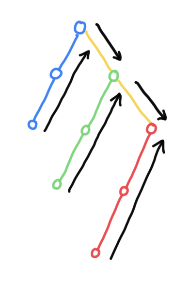
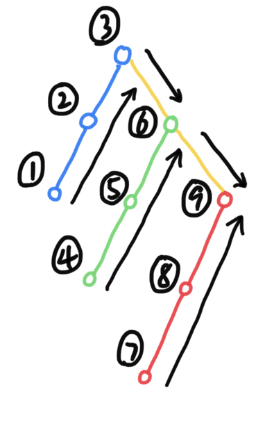
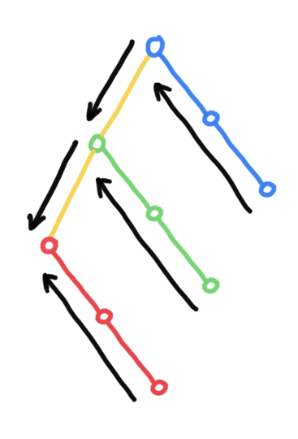
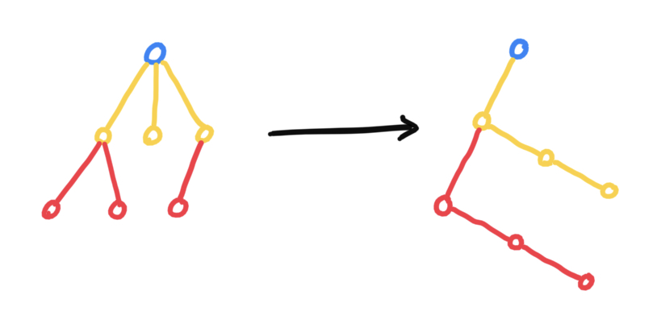
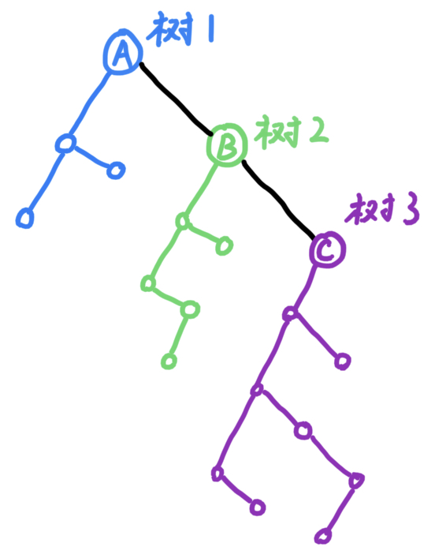

### 常见时间复杂度

二分查找：$O(log_2N)$


# 数组

### 数组的行序存储和列序存储

`a[row][col]`

行序：`a[i][j] = &a[0][0] + (i * col + j) * size`

```
a[0][0] a[0][1] ... a[0][col - 1]
a[1][0] a[1][1] ... a[1][col - 1]
```

> 先增加 j，当一行填满（ j = col - 1 ），再增加 i 。


列序：`a[i][j] = &a[0][0] + (j * row + i) * size`

```
a[0][0] a[1][0] ... a[row - 1][0]
a[0][1] a[1][1] ... a[row - 1][1]
```

> 先增加 i，当一列填满（ i = row - 1 ），再增加 j 。


[C 语言中文网：数组的存储顺序](http://data.biancheng.net/view/182.html)

> 行号和列号的位置是不变的（永远是 a[行][列]）
>
> 以列序为主

# String

## KMP 算法

```cpp
void getNext(string str, int next[]) { // next[j] 表示字符 str[j] 前面的子串的相等前后缀的长度
  auto len = str.length();
  next[0] = -1;
  int k = -1;
  int j = 0;
  while (j < len - 1) { // 在赋值时是将包含 str[j] 在内的子串的前后缀的长度赋给 next[j + 1]，因此 j 只用循环到 len - 2。
    // str[k] 表示前缀之后，str[j] 表示后缀之后。
    if (k == -1 || str[j] == str[k]) { // 前缀之后和后缀之后相等，说明相等前后缀可以延长 1 位。
      ++j;
      ++k;
      // 优化 KMP 算法加入的判断
      if (str[j] != str[k]) {
        next[j] = k;
      } else { // 在匹配时，如果后缀之后失配，那么就让前缀之后再次与之尝试匹配。因此如果前缀之后和后缀之后相等，就一定再次失配。因此这里直接递归 k 的值并将其赋给 next[j]。
        next[j] = next[k];
      }
    } else {
      k = next[k]; // 递归到更短的前缀中去判断
    }
  }
}
```

[博客园：从头到尾彻底理解 KMP](https://www.cnblogs.com/zhangtianq/p/5839909.html)

# 矩阵的压缩存储

## 对称阵

对于如下矩阵：


以深灰色为对称轴，由于矩阵内数据对称，因此只需要将任意一边的数据存储起来即可。

需要存储的元素为：


各个元素对应在一维数组中的位置示意图：


### 矩阵坐标转换数组坐标

数组下标 k 等于矩阵元素 $a_{ij}$ 上面的 $i - 1$ 行的元素个数加上当前行前面的元素个数（注意矩阵从 $a_{11}$ 开始计数）

**前 i -1 行的元素个数**

等差数列求和，$a_1=1,a_n=i-1,n=i-1$ （每行的元素个数就是它的行序）

$S_n = \dfrac{(a_1+a_n)n}{2}=\dfrac{i(i-1)}{2}$

**当前行前面的元素个数**

$j-1$

因此，可以得到 $k=\dfrac{i(i-1)}{2}+j-1$

上面的公式存储的是下三角的元素。对于上三角的元素，由于 $a_{ij}=a_{ji}$，因此上三角的元素位置公式可以将上式中的 $i$ 与 $j$ 互换得到。即 $k_{上三角}=\dfrac{j(j-1)}{2}+i-1$

## 稀疏矩阵

只存储非零元，非零元的个数以及矩阵的大小。非零元通过 `(行标, 列标, 值)` 的三元组表示。

### 三元组顺序表

```cpp
class Triple {
  int i, j, val;
};

class TSMatrix {
  Triple data[number]; // 三元组数组
  int n, m;            // 矩阵的行数和列数
  int num;             // 非零元个数
};
```

### 行逻辑链接的顺序表

三元组顺序表每次提取指定元素都要遍历整个三元组数组，效率很低。因此提出了三元组顺序表的升级版——行逻辑链接的顺序表。

行逻辑链接的顺序表在三元组顺序表的基础上加入了一个用于记录矩阵中每行的首非零元在三元组数组中的位置的数组。

```cpp
class RLSMatrix {
  Triple data[MAXSIZE + 1];
  int rpos[MAXRC + 1];
  int n, m;
  int num;
};
```


对于上面的矩阵，采用行逻辑链接的顺序表存储时，需要做两个工作：

1. 将矩阵中的非零元存储到三元组数组。


2. 使用数组 rpos 记录矩阵中每行的首非零元在 data 中的位置。


这样，当我们提取元素时，就可利用 rpos 数组定位要访问的位置区间来提高效率。

```c
void display(RLSMatrix M) {
  for (int i = 1; i <= M.m; ++i) {
    for (int j = 1; j <= M.n; ++j) {
      int flag = 0;     // 标记是否在 data 数组中找到该位置的元素
      if (i + 1 <= M.m) // 如果不是最后一行（最后一行的话 k = rpos[i + 1] 会越界）
      {
        for (int k = M.rpos[i]; k < M.rpos[i + 1]; ++k) // 通过 rpos 数组定位这一行在 data 数组中的位置
        {
          if (i == M.data[k].i && j == M.data[k].j) // 找到对应元素
          {
            printf("%d ", M.data[k].val);
            flag = 1;
            break;
          }
        }
        if (flag == 0) // 没有找到对应元素
        {
          printf("0 ");
        }
      } else // 最后一行
      {
        for (int k = M.rpos[i]; k <= M.num; ++k) // 定位
        {
          if (i == M.data[k].i && j == M.data[k].j) // 找到对应元素
          {
            printf("%d ", M.data[k].val);
            flag = 1;
            break;
          }
        }
        if (flag == 0) {
          printf("0 ");
        }
      }
    }
    printf("\n"); // 每行输出完输出一个换行
  }
}
```

[行逻辑链接的顺序表](http://c.biancheng.net/view/3372.html)

### 十字链表法

为解决数组不便于插入或删除的问题，提出了十字链表法。


如图，有一个行数组和一个列数组，数组中存的是该行（列）所有非零元的链表。


```cpp
class OLNode {
  int i, j, val;
  OLNode *right, *down;
}
```

[十字链表法详解](http://c.biancheng.net/view/3373.html)

# 稀疏矩阵的转置算法

转置：$a_{ij}=a_{ji}$

对于使用三元组顺序表或行逻辑链接的顺序表存储的矩阵，在转置时需要完成以下三步：

1. 将矩阵的行数 m 和列数 n 互换。
2. 将三元组表中每个元素的 i 和 j 互换。
3. 重新排列三元组表中的元素顺序。

**简单实现思路：不断遍历存储矩阵的三元组表，每次都从中取出 j 最小的那一个元素（如果有多个，则按照他们原来在三元组中的次序依次取出），互换 i 和 j，然后存储到一个新的三元组表中**


该算法的时间复杂度为 $O(n^2)$

[稀疏矩阵的转置算法](http://c.biancheng.net/view/3374.html)

# 树与二叉树

度
: 一个结点含有的子结点的个数
: 树中的度指的是结点拥有的子树数量

树的常用定理
------------------

1. 所有结点的度数之和是边数的 2 倍（这里的度是指一般的度）
2. 树中的边数等于结点数减 1（树根没有向上走的边）
3. 正则二叉树的叶子数比度为 2 的结点数多一个 ($n_0=n_2+1$)

> 正则二叉树：每个分支点的出度都为 2

## 二叉树

### 二叉树的遍历

```c
// 递归中序遍历
void InOrderTraverse(Node *node) {
  if (node) {
    InOrderTraverse(node->lchild); // 遍历左孩子
    displayElem(node);             // 访问结点
    InOrderTraverse(node->rchild); // 遍历右孩子
    }
}
```

[二叉树先序遍历](http://c.biancheng.net/view/3388.html)

> 确定了二叉树的遍历方式，就相当于确定了一个将二叉树转换为线性表的规则。

### 通过前序和中序序列还原二叉树

> 任何二叉树都可由中序序列和另一个序列唯一确定

1. 确定根结点（前序的第一个结点，后序的最后一个结点，层序的第一个节点），根据根结点将中序分割成左子树和右子树。画出根结点和左右分支。
2. 将左子树和右子树看成新的树，重复第一步。

> 写之前把前序和中序抄下来，先序每分析一个结点，就划掉一个，并在中序中把这个结点变成墙（很粗的分割线）。当其左右孩子确认下来后，将其涂黑。

---

**例：前序：ABCDEF，中序：CBAEDF**

A 是根结点，将中序分为：`CB[A]EDF`，CB 是左子树，EDF 是右子树。画出根结点和左右两个分支。

接下来根结点是 B，将中序分为 `C[B][A]EDF`，C 是左子树，没有右子树。

接下来 C。

接下来根结点是 D，将中序分为 `[C][B][A]E[D]F`，E 是左子树，F 是右子树。

---

```cpp
using size_type = string::size_type;

// 返回由 [LVR_begin, LVR_end) 构建的二叉树的根结点；VLR 是先序，LVR 是中序
Node *createBiTreeByVLRAndLVR(const string &VLR, const string &LVR, size_type LVR_begin, size_type LVR_end) {
  static size_type i;
  Node *root{};
  if (LVR_begin < LVR_end) {
    root = new Node(VLR[i++]); // 先序的首结点为根结点
    auto LVR_root = LVR.find(root->index); // 在中序中定位根结点
    root->lchild = createBiTreeByVLRAndLVR(VLR, LVR, LVR_begin, LVR_root);
    root->rchild = createBiTreeByVLRAndLVR(VLR, LVR, LVR_root + 1, LVR_end);
  }
  return root;
}
```

### 通过层序和中序序列还原二叉树

```cpp
using iter = vector<int>::iterator;

// 返回由 [LVR_begin, LVR_end) 构建的二叉树的根结点；LT 是层序，LVR 是中序
Node *createBiTreeByLTAndLVR(const vector<int> &LT, iter LVR_begin, iter LVR_end) {
  Node *root{};
  if (LVR_begin < LVR_end) {
    iter LVR_root;
    for (int i: LT) {
      if ((LVR_root = find(LVR_begin, LVR_end, i)) != LVR_end) { // 遍历层序，第一个属于该子树的结点就是该子树的根结点
        break;
      }
    }
    root = new Node(*LVR_root);
    root->lchild = createBiTreeByLTAndLVR(LT, LVR_begin, LVR_root);
    root->rchild = createBiTreeByLTAndLVR(LT, LVR_root + 1, LVR_end);
  }
  return root;
}
```

## 线索二叉树

借助线索可以在不使用递归或栈的条件下遍历线索二叉树。后继线索可以为我们指明当前子树遍历完成后应该进入哪个子树。

```cpp
typedef enum {Link, Thread} PointerTag; // 指示指针域存储的是孩子还是前驱后继的枚举

class Node {
  int val; // 数据域
  Node *lchild, *rchild; // 左、右孩子指针域
  PointerTag Ltag, Rtag; // 标志域
};
```

### 对二叉树进行线索化

```cpp
// 中序对二叉树进行线索化
void InOrderThreading(Node *node) {
  static Node *pre = nullptr;  // 上一次访问的结点，即前驱
  if (node) { // 如果当前结点存在
    InOrderThreading(node->lchild); // 递归左子树进行线索化
    // 如果当前结点没有左孩子，写入前驱
    if (!node->lchild) {
      node->Ltag = Thread;
      node->lchild = pre;
    }
    // 如果前驱没有右孩子，写入后继
    if (pre && !pre->rchild) {
      pre->Rtag = Thread;
      pre->rchild = node;
    }
    pre = node; // 更新前驱
    InOrderThreading(node->rchild); // 递归右子树进行线索化
  }
}
```

> 在两条递归语句中间的语句相当于遍历二叉树中的访问操作。如果把它放到两条递归语句前面，就变成前序线索二叉树。

### 遍历线索二叉树






```cpp
// 中序遍历线索二叉树
void InOrderThraverse(Node *node) {
  while (node) {
    while (node->Ltag == Link) { // 移步到最左下的结点
      node = node->lchild;
    }
    cout << *node << " "; // 访问结点
    // 如果结点存储了后继，就直接访问后继
    while (node->Rtag == Thread && node->rchild != NULL) {
      node = node->rchild;
      cout << *node << " ";
    }
    // 如果 rchild 存储的不是后继，那么 rchild 就是右子树。进入右子树开始新一轮中序遍历。
    node = node->rchild;
  }
}
```

[线索二叉树](http://c.biancheng.net/view/vip_3391.html)

### 双向线索二叉树

#### 线索化

在线索二叉树的基础上，添加一个头结点，其左孩子指向二叉树的树根，右孩子指向最后一个结点。这样就可以反向遍历（中序）二叉树：


```cpp
// 建立双向线索链表
void DoubleThreading(Node *&head, Node *tree) {
  // 初始化头结点
  head = new Node;
  head->Ltag = Link;
  head->Rtag = Link;
  // 如果树本身是空树
  if (!tree) {
    head->lchild = head;
    head->rchild = head;
  } else {
    auto pre = head; // 前驱
    head->lchild = tree; // 头结点的左孩子指向树根
    pre = InOrderThreading(tree, pre); // 稍作修改的 InOrderThreading 函数，从外部接收 pre 参数，并返回最后的 pre 参数，即尾结点。
    pre->rchild = head;
    pre->Rtag = Thread;
    head->rchild = pre;
  }
}
```

#### 正向遍历

和普通线索二叉树的区别是，while 循环判断的条件不是 `while (node)`，而是 `while (node != head)` 以及 `while (node->rchild != head)`

```cpp
// 中序正向遍历双向线索二叉树
void InOrderThraverse(Node *head) {
  Node *node = head->lchild;
  while (node != head) {
    while (node->Ltag == Link) {
      node = node->lchild;
    }
    cout << *node << " ";
    while (node->Rtag == Thread && node->rchild != head) {
      node = node->rchild;
      cout << *node << " ";
    }
    node = node->rchild;
  }
}
```

#### 逆向遍历

逆向遍历只要把右孩子当作左孩子，左孩子当作右孩子，然后正常遍历即可。

这时相当于右子树和自己是同一分支，左子树是另一分支。



```cpp
// 中序逆向遍历线索二叉树
void InOrderThraverse(Node *head) {
  Node *node = head->rchild;
  while (node != head) {
    while (node->Rtag == Link) { // 移步到最右下的结点
      node = node->rchild;
    }
    cout << *node << " "; // 访问结点
    // 如果结点存储了前驱，就直接访问前驱
    while (node->Ltag == Thread && node->lchild != head) {
      node = node->lchild;
      cout << *node << " ";
    }
    // 如果 lchild 存储的不是前驱，那么 lchild 就是左子树。进入左子树开始新一轮中序遍历。
    node = node->lchild;
  }
}
```

[双向线索二叉树](http://c.biancheng.net/view/vip_3393.html)

## 树

树与二叉树的区别：

1. 二叉树是有序树。
2. 树的度指树中最大的度。因此度为 2 的树不能是空树。而二叉树可以是空树。

### 树的孩子兄弟表示法

其实和二叉树的存储结构是一样的，这样就将树转化为了二叉树。树转化为二叉树后，原来的兄弟节点变成了右子树。于是树就变成了一个由左分支串起来的一堆兄弟节点子树。

树转化为二叉树时，父结点的第一个孩子不变，同一父结点的其余所有孩子连到第一个孩子上。

二叉树还原成树时，左孩子不变，右孩子连到自己的父结点上。




```cpp
class TreeNode {
  int val;
  TreeNode *nextSon, *nextBro;
}
```

### 树的遍历

先根遍历：先访问根结点，再按照从左到右的顺序依次访问每一棵子树。**先根遍历对应二叉树的先序遍历。**

后根遍历：先从左到右依次访问每一棵子树，再访问根结点。**后根遍历对应二叉树的中序遍历。**

## 森林

### 森林转化为二叉树

前面说过，中序访问的二叉树可以分成左右两个部分，左子树和自己是同一分支，右子树是另一分支（相当于右分支串了一堆左子树）。因此，可以把第一棵树作为第一个左子树，第二棵树作为第二个左子树，...



具体操作：

1. 将森林中所有树转化为二叉树
2. 将第一课树的树根作为整个森林的树根，其他树的树根看作第一棵树根结点的兄弟节点，采用孩子兄弟法将所有树进行连接。

森林转化为二叉树后，其前序遍历和中序遍历访问结点的顺序是不变的。

### 森林的遍历

#### 先序遍历

> 相当于二叉树的先序遍历

1. 访问森林中第一棵树的根结点
2. 先根遍历根结点的子树
3. 去掉第一棵树，重复

#### 中序遍历

> 相当于二叉树的中序遍历

1. 中序遍历第一棵树的根结点的子树
2. 访问第一棵树的根结点
3. 去掉第一棵树，重复

### 树与等价问题

$x$ 关于 $R$ 的等价类
: $[x]_R=\{y\mid y\in S\land xRy\}$
: $x$ 称为等价类 $[x]$ 的表示元素
: $R$ 的不同等价类的个数叫做 $R$ 的秩

---

e.g.

**$R$ 是自然数集合 $\N$ 上的模 3 等价关系 $\equiv_3$，试给出 $\equiv_3$ 所确定的等价类。**

$\begin{aligned}
[0]_3=\{0, 3, 6, \ldots\}\\
[1]_3=\{1, 4, 7, \ldots\}\\
[2]_3=\{2, 5, 8, \ldots\}
\end{aligned}$

---

#### 划分等价类

1. 将每个元素看成单个集合。
2. 如果有等价关系偶对 $(x,y)$，且两个元素来自不同集合，则将两个集合合并。
3. 剩下的所有非空集合就是等价类。

用森林表示一个划分 $S=S_1\cup S_2\cup\cdots\cup S_n$

一棵树就是一个等价类。树根是这个等价类的代表元素。

集合的合并：一个根指向另一个根

```cpp
class Node {
  int val;
  Node *parent;
};

class MFSet {
  int n;
  Node nodes[MAXSIZE];
};
```

改进：

1. 每次归并让深度少的指向深度多的
2. Find 时压缩路径

#### 并查集


[知乎：算法学习笔记(1) : 并查集](https://zhuanlan.zhihu.com/p/93647900)

##### 初始化

创建一个数组或 map，用于存储每个结点的父节点。初始时每个结点的父节点就是自己。

```cpp
int parent[SIZE];

inline void init(int n) {
  for (int i = 0; i < n; ++i) {
    parent[i] = i;
  }
}
```

##### 查询

```cpp
int findParent(int i) {
  return i == parent[i] ? i : (parent[i] = findParent(parent[i])); // 若自己不是集合的代表元素，那么集合的代表元素就是父结点所属集合的代表元素
}
```

##### 合并

```cpp
inline void merge(int v1, int v2) {
  parent[findParent(v2)] = findParent(v1); // 把 v2 所属集合归并到 v1 所属集合
}
```

## 哈夫曼树（最优二叉树）

WPL
: 树的所有叶子结点的带权路径长度之和，称为树的带权路径长度。

$$
{\rm WPL}=\sum_{i=1}^nw_i\,l_i
$$

> 把二叉树中除树根外所有非叶子结点的权加起来就是二叉树的带权路径长度

### 构造方法

将所有叶子按权值升序排列。每次找到两个权值最小的两片叶子，将它们合并起来，不断重复。

### 哈夫曼编码

如果对每个字符设计长度不同的编码，且让电文中出现次数较多的字符采用较短的编码，则可以减短电文的总长。利用前缀编码解决译码二义性的问题。

前缀编码
: 长度不等的编码，任一个编码都不是另一个编码的前缀。

### 利用二叉树设计二进制前缀编码

左分支表示 0 ，右分支表示 1 ，以字符的出现频率作为权值构造最优二叉树。

译码时根据编码指引探索二叉树（ 0 往左走，1 往右走），找到对应的字符叶子。

### 实现

对于给定的叶子个数，其正则二叉树的结点个数是已知的 ($n=2n_0-1$)，因此可以用线性结构存储哈夫曼二叉树。

构造一个长度为 2n - 1 的数组，前 n 个用于存储叶子，后 n - 1 个用于存储父结点。

```c
typedef struct {
  unsigned weight;
  unsigned parent
  unsigned lchild, rchild;
} HTNoode, *HuffmanTree;

typedef char **HuffmanCode; // 由于每个字符的编码长度不同，因此应该用动态数组存储哈夫曼编码。HuffmanCode 是指向存储所有字符的哈夫曼编码的二维数组的指针。
```

分配哈夫曼编码分为两步：

1. 构造哈夫曼树
2. 从叶子到根遍历哈夫曼树，确定每个字符的哈夫曼编码

> 也可以从根到叶子遍历二叉树

### 确定哈夫曼编码

```c
void HuffmanCoding(HuffmanTree HT, HuffmanCode *HC, int n) { // HT 为哈夫曼树（数组），HC 为存储所有哈夫曼编码的字符串数组，n 为结点的个数。
  *HC = (HuffmanCode)malloc((n + 1) * sizeof(char*));        // HC[0] 不用，因此申请 n + 1 个空间。
  char *temp = (char*)malloc(n * sizeof(char));              // 临时存放结点哈夫曼编码的字符串
  temp[n - 1] = '\0';          // 每次从临时字符串倒数第二个位置开始反向填写哈夫曼编码
  for (int i = 1; i <= n; ++i) {
    // 从叶子结点出发，得到的哈夫曼编码是逆序的，需要在字符串数组中逆序存放
    int flag = n - 1;          // 上一个编码填在临时数组的哪里
    int cur = i;               // 当前结点在数组中的位置
    int parent = HT[i].parent; // 父结点在数组中的位置
    // 一直寻找到根结点
    while (parent != 0) {
      // 如果该结点是左孩子则编码为 0 ，否则编码为 1 。
      if (HT[parent].left == cur)
        temp[--flag] = '0';
      else
        temp[--flag] = '1';
      // 更新父子结点
      cur = parent;
      parent = HT[parent].parent;
    }
    // 分配哈夫曼编码
    (*HC)[i] = (char*)malloc((n - flag) * sizeof(char));
    strcpy((*HC)[i], &temp[start]);
  }
  free(temp);
}
```

[哈夫曼编码](http://c.biancheng.net/view/vip_3399.html)

# 图

图
: 无向图的边数不超过 $\dfrac{n(n-1)}{2}$
: 有向图的边数不超过 $n(n-1)$

> 网就是边带权的图

## 图的邻接矩阵表示

若存在边 `[i, j]`，则 `a[i, j]` 设为 1 ，否则设为 0 。

> 图的邻接矩阵对角元一般为 0 。

在网中，`a[i, j]` 的值是边 `[i, j]` 的权。若边不存在，则 `a[i, j]` 设为 $\infty$ 。

> 网的邻接矩阵对角元一般为 $\infty$ 。

第 i 行的边数表示 $v_i$ 的出度，第 j 列的边数表示 $v_j$ 的入度。

## 图的邻接表存储

结点用数组存储，每个结点都有一个存储其所有边的链表。


```cpp
class Graph {
  int n;                     // 图的顶点数
  list<pair<int, int>> *adj; // 邻接表，存储边的终点和边的权 (v, w) 。

public:
  explicit Graph(int V);

  void addEdge(int u, int v, int w);
};

Graph::Graph(int i) : n(i) {
  adj = new list<pair<int, int>>[n];
}

void Graph::addEdge(int u, int v, int w) {
  adj[u].emplace_back(v, w);
  adj[v].emplace_back(u, w);
}
```

> 逆邻接表：存储入弧

## 十字链表

将有向图的邻接表和逆邻接表结合在一起就得到了十字链表

```cpp
class Node {
  string name;
  Arc *firstIn;
  Arc *firstOut;
};

class Arc {
  Node *from;
  Node *to;
  int info;
  Arc *nextIn;
  Arc *nextOut;
}
```

## 邻接多重表

类似十字链表

```cpp
class Node {
  string name;
  Arc *firstArc;
};

class Arc {
  bool mark;
  int info;
  Node *iNode;
  Node *jNode;
  Arc *iArc;
  Arc *jArc;
}
```

## 图的遍历

邻接表存储方式的时间复杂度：$O(n+e)$

邻接矩阵存储方式的时间复杂度：$O(n^2)$

两种遍历方法分别生成两种生成树。

### DFS

对每一个可能的分支路径深入到不能再深入为止

> 类似树的先序遍历

1. 访问顶点 v ；
2. 依次从未被访问的 v 的邻接点出发，对图进行 DFS；直至图中所有和 v 有相通路径的顶点都被访问；
3. 若此时图中尚有顶点未被访问，则从一个未被访问的顶点出发，重新进行 DFS，直到图中所有顶点均被访问过为止。

构造深度优先树的时候是沿着树支往下延伸

可以使用 stack 实现：

```cpp
// 假设此时已经遍历所有结点，并找到了一个未访问过的顶点 v 。
// 非递归实现
void DFS(int v) {
  stack<int> nodeStk;
  nodeStk.push(v);
  cout << v + 1 << " ";
  visited[v] = true;
  while (!nodeStk.empty()) {
    int top = nodeStk.top();
    bool isAllVisited = true;
    for (int i = 0; i < n; ++i) {
      if (adjMatrix[top][i] && !visited[i]) {
        nodeStk.push(i);
        cout << i + 1 << " ";
        visited[i] = true;
        isAllVisited = false;
        break;
      }
    }
    if (isAllVisited) {
      nodeStk.pop();
    }
  }
}

// 递归实现
void DFS(int v) {
  cout << v + 1 << " ";
  visited[v] = true;
  for (int i = 0; i < n; ++i) {
    if (adjMatrix[i][v] && !visited[i]) {
      DFS(i);
    }
  }
}
```

### BFS

> 类似树的层次遍历

1. 从顶点 v 出发，访问 v 。
2. 访问 v 的所有邻接点。
3. 分别访问所有邻接点的邻接点。
4. 重复 3 。

构造广度优先树的时候是一层一层构造

可以使用 queue 实现

```cpp
// 假设此时已经遍历所有结点，并找到了一个未访问过的顶点 v 。
// 非递归实现
void BFS(int v) {
  queue<int> nodeQue;
  nodeQue.push(v);
  visited[v] = true;
  while (!nodeQue.empty()) {
    int front = nodeQue.front();
    nodeQue.pop();
    cout << front + 1 << " ";
    for (int i = 0; i < n; ++i) {
      if (adjMatrix[front][i] && !visited[i]) {
        nodeQue.push(i);
        visited[i] = true;
      }
    }
  }
}
```

## 图的连通性

## 最小生成树

最小生成树（Minimum Cost Spanning Tree, MST）
: 树上各边的权值总和最小的生成树

### 普里姆算法（Prim 算法）

**适合稠密网**

> 不断选择到集合距离最近的顶点

从一个平凡图 $U$ 开始，逐步增加 $U$ 中的顶点，直至图中的顶点数与原图 $V$ 相同，可称为 "加点法" 。

在每次加点前，绘制一个顶点 $v_i$ 到 $U$ 的最短边长度表。如果顶点 $v_i$ 在 $U$ 中，则 $v_i$ 到 $U$ 的最短边长度为 $0$ 。如果顶点 $v_i$ 不邻接 $U$，则最短边长度为 $\infty$ 。

$$
\begin{array}{c|cc}
顶点          & v_1 & v_2 & v_3 & v_4\\
\hline
到U的最短边长度 &  0  &  2  &  5  &\infty
\end{array}
$$

[C 语言中文网：普里姆算法](http://c.biancheng.net/view/vip_3413.html)

### 克鲁斯卡尔算法 (Kruskal 算法)

**适合稀疏网**

> 将边按权值升序排序，不断选边进来（不能形成环）。（选边法）

1. 对各顶点赋予不同的标记。
2. 对所有边按权值升序排序。
3. 遍历所有边，若边的两顶点标记不同，则可以将该边加入生成树，同时将两顶点的标记置为相同（原先和两顶点标记相同的顶点的标记也要一起改变）。
4. 重复 3 ，直到选够 n - 1 条边。


[C 语言中文网：克鲁斯卡尔算法](http://c.biancheng.net/view/vip_3414.html)

## 有向无环图 DAG

### AOV 网

用顶点表示活动，边表示活动的顺序关系的有向图。

#### AOV 网拓扑排序

方法：不停地输出入度为 0 的顶点，输出以后把顶点及其出弧删掉，不断重复。

程序结束时有两种可能：

1. 图为空
2. 图中有环

> 逆拓扑排序：不停地输出出度为 0 的顶点，输出以后把顶点及其入弧删掉，不断重复。
>
> 如果确定图中没有环，可以采用 DFS 遍历。

```cpp
void Graph::checkLoop() {
  int left(n);                // 图中剩余顶点数
  queue<int> nodeQue;
  for (int i = 0; i < n; ++i) {
    if (!InDegree[i]) {
      nodeQue.push(i);        // 将所有入度为 0 的顶点入队列
    }
  }
  while (!nodeQue.empty()) {
    int front = nodeQue.front();
    nodeQue.pop();
    --left;
    cout << front + 1 << " "; // 输出顶点
    for (int i = 0; i < n; ++i) {
      if (adjMatrix[front][i]) {
        --InDegree[i];        // 将邻接点的入度 -1
        if (!InDegree[i]) {   // 若删除顶点后邻接点的入度变为 0
          nodeQue.push(i);    // 将邻接点入对列
        }
      }
    }
  }
  loop = left != 0;
}
```

[C 语言中文网：拓扑排序算法](http://c.biancheng.net/view/vip_3416.html)

### AOE 网

用边表示活动，用结点表示事件。

事件
: 在之前的活动已完成，在之后的活动可以开始。

源点
: 工程开始，是唯一入度为 0 的顶点。

汇点
: 工程结束，是唯一出度为 0 的顶点。

关键路径
: 从源点到汇点最长路径。其长度即为完成整个工程所需的时间。

关键活动
: 关键路径上的活动。关键活动的时间余量为 0。

> 只有在不改变关键路径的情况下提高关键活动的速度才有效。

#### AOE 网求关键路径

$e(i)$：活动（边）的最早开始时间。等于边的起点的最早发生时间。

$l(i)$：活动（边）的最晚开始时间。等于边的终点的最晚发生时间减去边的权值。

$Ve(i)$：事件（顶点）的最早发生时间。是从源点到该顶点的最长路径长度。

> 一个事件只有等所有前提事件都完成后才能发生，因此其最早开始时间就是源点到该顶点的最长路径长度。

$Vl(i)$：事件（顶点）的最晚发生时间。是汇点的最早发生时间减去从汇点到该顶点的最长路径长度。

**如果一条边的最早开始时间等于最晚开始时间，那么这条边所代表的活动就是关键活动。** 求关键路径问题就是求关键活动问题。

##### 计算过程

1. 源点的最早发生时间为 0 。
2. 从已知最早发生时间的结点 $v_i$ 出发，计算其直接后继 $v_j$ 的最早发生时间。其值等于 $v_i$ 的最早发生时间加上 $v_i$ 到 $v_j$ 的最长路径长度，并把计算中使用的最长路径加粗。
3. 重复 2 ，直到得到汇点的最早发生时间，即为整个工程的完成时间。关键路径为所有加粗的路径所形成的通路。

[教材中使用的表格计算法](https://blog.csdn.net/wang379275614/article/details/13990163)

```cpp
int n;           // 顶点数
int *InDegree;   // 入度
int *Ve;         // 顶点的最早发生时间

// 在拓扑排序的同时计算每个顶点的最早发生时间
int topoSort() {
  int left = n;                 // 图中剩下的顶点数
  queue<int> nodeQue;
  for (int i = 0; i < n; ++i) { // 将源点入队列
    if (!InDegree[i]) {
      nodeQue.push(i);
      Ve[i] = 0;                // 源点的最早发生时间为 0
    }
  }
  while (!nodeQue.empty()) {
    int v = nodeQue.front();
    nodeQue.pop();              // 不断将入度为 0 的顶点出队列
    --left;
    for (int i = 0; i < n; ++i) {
      if (adjMatrix[v][i]) {    // 找到 v 的邻接点
        --InDegree[i];          // 邻接点的入度 -1
        Ve[i] = max(Ve[i], Ve[v] + adjMatrix[v][i]); // 邻接点的最早发生时间等于 v 的最早发生时间加上活动时间。当有多个 v 通往该邻接点时，选取最大值。
        if (!InDegree[i]) {     // 若邻接点入度变为 0 则入队列
          nodeQue.push(i);
        }
      }
    }
  }
  if (left) {                   // 有剩余顶点，说明图中有环。
    return -1;
  } else {
    return Ve[n - 1];           // 汇点的最早发生时间就是关键路径的长度
  }
}
```

### 最短路径

#### Dijkstra 算法

**解决求出网中指定点到其余各点的最短路径长度的问题**

将网中顶点分成 $S$, $U$ 两组，$S$ 为已求出最短路径的顶点集合，初始时 $S$ 中只有源点。$U$ 包含其他顶点，且 $U$ 中顶点的距离为源点邻接该顶点的距离。以后每次都将路径最短的顶点加入到 $S$ 中，并刷新最短路径，直到所有顶点都加入到 $S$ 中为止。

e.g.


1. 初始状态，$S=\{\,a(0)\,\},\ U=\{\,b(2),\,c(\infty),\,d(6)\,\}$
2. 取出最短路径点 $b(2)$，并以 $b(2)$ 为桥梁刷新与 $b(2)$ 邻接的点的距离。即 $d_{ca}=\min\{\,l_{ca},\,l_{cb}+d_{ba}\,\}$[^1]
   这里 $d_{ca}=\min\{\,\infty,\,2+3\,\}=5,\quad d_{da}=\min\{\,\infty,\,2+2\,\}=4$  
   此时 $S=\{\,a(0),\,b(2)\,\},\ U=\{\,c(5),\,d(4)\,\}$
3. 重复 2

[^1]: （$d$ 指两点间的最短路径长度，$l$ 指两点间的邻接距离）

```cpp
vector<int> *Graph::Dijkstra(int src) {
  using d_v = pair<int, int>;                   // (d)v，最短路径_顶点
  priority_queue<d_v, vector<d_v>, greater<d_v>> min_heap; // 创建一个小顶堆（距离最近的顶点在堆顶），存储已经确认可达的顶点 (d)v。每次将距离最短的顶点（堆顶）取出，用它来刷新其邻接点的最短路径。
  bool *flag = new bool[n]{};                   // 用于判断是否已经使用过某顶点来刷新其邻接点的最短路径
  vector<int> dist = new vector<int>(n, INF);   // 所有顶点的最短路径，初始化所有顶点的最短路径为无穷大（不可达）。通过每次从堆顶取出的顶点（新确定最短路径的顶点）来刷新各顶点的最短路径。
  dist[src] = 0;                                // 源点的最短路径为 0
  min_heap.push(make_pair(0, src));             // 将源点插入小顶堆，使循环开始运行。
  while (!min_heap.empty()) {
    int u = min_heap.top().second;              // 取出距离最近的顶点 u
    min_heap.pop();
    if (!flag[u]) {
      for (auto i = adj[u].begin(); i != adj[u].end(); ++i) { // 以 u 为中转站，刷新其邻接点的最短路径。
        int v = i->first;                       // u 的邻接点 v
        int weight = i->second;                 // 边 (u, v) 的权
        if (dist[v] > dist[u] + weight) {       // 若通过 u 中转可以缩短 (d)v
          dist[v] = dist[u] + weight;           // 更新 (d)v
          min_heap.push(make_pair(dist[v], v)); // 将新的 (d)v 加入小顶堆
        }                                       // 因为我们可能将同一个顶点多次加入 min_heap，所以需要判断之前是否已经使用过某个顶点。
      }
      flag[u] = true;
    }
  }
  int max = 0;
  for (int i = 0; i < n; ++i) {
    max = dist[i] > max ? dist[i] : max;
  }
  return max;
}
```

[CSDN：Dijkstra 算法原理](https://blog.csdn.net/yalishadaa/article/details/55827681)

[知乎：Dijkstra 算法详解 通俗易懂](https://zhuanlan.zhihu.com/p/338414118)

#### Floyd Warshall 算法

**解决求出网中任意两点之间的最短路径长度的问题**

首先构造网的邻接矩阵，这个邻接矩阵同时表示网中任意两顶点在不借助任何中转顶点的情况下的最短路径。

接下来，我们让 $v_0$ 作为中转站，计算网中各顶点间的最短路径。即对矩阵中每一项，令 `d[i][j] = min(d[i][j], d[i][0] + d[0][j])`。

此时的矩阵表示网中任意两顶点在可以借助 $v_0$ 中转的情况下的最短路径。

接下来让 $v_1$ 作为中转站，计算网中各顶点间的最短路径 `d[i][j] = min(d[i][j], d[i][1] + d[1][j]`。

因为此时的 `d[i][j]`，`d[i][1]` 和 `d[1][j]` 已经是在可以借助 $v_0$ 中转的情况下的最短路径了，所以这时得到的矩阵表示网中任意两顶点在可以借助 $v_0$ 和 $v_1$ 中转的情况下的最短路径。

如此重复 n 次，这时所有的顶点都可作为中转站了，此时的矩阵就表示网中任意两点间的最短路径了。

##### 记录最短路径

使用一个二维数组 `next[i][j]` 记录在 i 到 j 的最短路径中，i 的下一个顶点是什么。

初始时，若 $v_i$, $v_j$ 邻接 `graph[i][j] != INF`，则 `next[i][j] = j`。

之后计算网中任意两顶点在可以借助 $v_k$ 中转的情况下的最短路径，若发现将 $v_k$ 添加进来后可以缩短 $v_i$ 到 $v_j$ 的最短路径，那么 $v_i$ 到 $v_j$ 的最短路径的下一个顶点就应该是 $v_i$ 到 $v_k$ 的最短路径的下一个顶点，即 `next[i][j] = next[i][k]`。

```cpp
void Floyd() {
  for (int k = 0; k < n; ++k) {
    for (int i = 0; i < n; ++i) {
      for (int j = 0; j < n; ++j) {
        if (graph[i][j] > graph[i][k] + graph[k][j]) { // 如果通过 k 可以缩短 i, j 的长度
          graph[i][j] = graph[i][k] + graph[k][j];     // 更新最短路径长度
          next[i][j] = next[i][k];                     // 从 i 到 j 的最短路径的下一个顶点就是从 i 到 k 的最短路径的下一个顶点
        }
      }
    }
  }
}
```

[知乎：弗洛伊德算法](https://zhuanlan.zhihu.com/p/139112162)

# 查找

## 平均查找长度（ASL）

$$
{\rm ASL}=\sum_{i=1}^np_i\,c_i
$$

1. $p_i$ 是查找到某个元素的概率
2. $c_i$ 是查找到这个元素时已经比较的次数

若假定每个结点被查找的概率相同，即 $p_i=\dfrac{1}{n}$，则：

$$
{\rm ASL}=\frac{1}{n}\sum_{i=1}^nc_i
$$

### 几种常见的平均查找长度

#### 顺序查找

$$
\begin{aligned}
& {\rm ASL}_{成功}=\frac{1+n}{2}\\
\\
& {\rm ASL}_{失败}=n
\end{aligned}
$$

#### 二分查找

$$
\begin{aligned}
& {\rm ASL}_{成功}=\frac{1}{n}\sum_{i=1}^hl_i\,k_i\\
\\
& {\rm ASL}_{失败}=\frac{1}{n+1}\sum l_{外i}\,k_{外i}\\
\\
& {\rm ASL}_{平均}=\frac{n+1}{n}\log_2(n+1)-1\approx\log_2(n+1)-1
\end{aligned}
$$

> $l$ ：层数；$k$ ：该层的结点数
>
> 二分查找判定树中的结点都是查找成功的情况。为每个结点的空指针创建一个实际上不存在的结点——外结点，所有外结点都是查找不成功的情况。如果有序表的长度为 n，则外结点一定有 n + 1 个。
>
> 深度为 $h$ 的满二叉树的结点数为 $2^h-1$，第 $i$ 层的结点数为 $2^{i-1}$
>
> ${\rm ASL}_{平均}$ 是满二叉树的平均查找长度

[博客园：如何计算折半查找的平均查找长度？](https://www.cnblogs.com/joshua317/p/14441144.html#:~:text=%E5%88%99%E7%BB%8F%E8%BF%87%E5%8C%96%E7%AE%80%E8%AE%A1%E7%AE%97)

#### 二叉排序树

> 树中结点的比较次数就是结点的层数

$$
{\rm ASL}=\frac{1}{n}\sum_{i=1}^hl_i\,k_i
$$

1. $l_i$ 是层数
2. $k_i$ 是该层的结点数

#### 哈希表

##### 开放定址法

$$
\begin{aligned}
& {\rm ASL}_{成功}=\frac{1}{n}\sum构造哈希表时每个关键字的比较次数\\
\\
& {\rm ASL}_{失败}=\frac{1}{m}\sum每个\ H(key)\ 根据冲突处理方法比较几位找到\ {\rm NULL}
\end{aligned}
$$

> $m$ 是 $H(key)$ 值域的长度
>
> 开放定址法中与 NULL 的比较也算次数（因为不知道下一个元素是不是 NULL），而链地址法不算与 NULL 的比较次数。

##### 链地址法

$$
{\rm ASL}_{成功}=\frac{1}{n}\sum_{i=1}^hl_i\,k_i
$$

[CSDN：常见的平均查找长度总结](https://blog.csdn.net/qq_34902437/article/details/101847240)

## 静态查找表

### 二分查找

[C 语言中文网：二分查找](http://c.biancheng.net/view/3428.html)

### 分块查找

[C 语言中文网：分块查找](http://c.biancheng.net/view/vip_3429.html)

## 动态查找表

若找到关键字，则返回其指针。否则创建关键字并返回其指针。

### 二叉排序树

[C 语言中文网：二叉排序树](http://c.biancheng.net/view/3431.html)

初始时为空树。在查找时，若查找关键字比结点关键字小，则在其左子树中查找，否则在右子树中查找。若左（右）子树为空，则以关键字创建左（右）子树。

#### 删除结点

若结点 P 只有左子树或右子树，则摘除 P，然后把左子树或右子树顺移上来即可。

若 P 既有左子树，又有右子树，此时有两种方法：

1. 令结点 P 的左子树为 P 的父结点的左子树；结点 P 的右子树为 P 的直接前驱的右子树。（把 P 的右子树接到 S 上，变成 S 的右子树）


> P 的左子树是所有比 P 小的结点，P 的右子树是所有比 P 大的结点，因此删除 P 后，P 的右子树比 P 的左子树的所有结点都大，可以作为左子树最右下的结点（即 P 的直接前驱）的右子树。

2. 用结点 P 的直接前驱（或直接后继）S 来代替结点 P，同时在二叉排序树中对 S 做删除操作。（用 S 替代 P）


> P 的直接前驱 S 就是 P 的左子树中最大的结点（最大的比 P 小的结点），因此如果用 S 代替 P，S 的左子树依然是所有比 S 小的结点，S 的右子树依然是所有比 S 大的结点。
>
> P 的直接前驱是 P 的左子树中最右下的结点，因此它或者是叶子结点，或者只有左子树。因此对 S 的删除操作只要摘除 S，并将 S 的左子树（如果有的话）顺移上来即可。
>
> 直接后继 Q 是右子树中最小的结点，如果用 Q 代替 P，那么 Q 的左子树依然都比 Q 小，Q 的右子树依然都比 Q 大。

```cpp
void delete(Node *&node) {
  if (!node->rchile) {        // 若没有右孩子
    Node *temp = node;
    node = node->lchild;
    delete temp;
  } else if (!node->lchild) { // 有右孩子但没有左孩子
    Node *temp = node;
    node = node->rchild;
    delete temp;
  } else {                    // 左右孩子都有
    Node *pre = node->lchild; // node 的直接前驱
    Node *pre_parent = node;  // pre 的父节点
    while (pre->rchild) {     // node 的直接前驱是其左子树最右下的结点
      pre_parent = pre;
      pre = pre->rchild;
    }
    node->val = pre->val;     // 用直接前驱的值替换删除结点的值

    // 接下来要删除直接前驱
    if (pre_parent != node) { // 如果 node 的左孩子有右孩子（即直接前驱不是 node 的左孩子）
      pre_parent->rchild = pre->lchild;
    } else {                  // 如果 node 的左孩子没有右孩子（即直接前驱就是 node 的左孩子）
      pre_parent->lchild = pre.lchild;
    }
    delete pre;
  }
}
```

### 平衡二叉树

平衡因子（BF）
: 左子树的深度减去右子树的深度
: 若二叉树中所有结点的平衡因子的绝对值都不超过 1 ，则该树称为平衡二叉树。

最小不平衡子树
: 从新插入的结点开始向上查找，以第一个平衡因子的绝对值超过 1 的结点为根的子树称为最小不平衡子树。
: 平衡二叉树的失衡调整主要是通过旋转最小失衡子树来实现的。旋转的目的就是减少高度，通过降低整棵树的高度来平衡。哪边的子树高，就把哪边的子树向上旋转。

#### 左旋


1. 让根结点的右孩子作为新根
2. 新根的左孩子作为旧根的右孩子
3. 旧根作为新根的左孩子

#### 右旋


1. 让根结点的左孩子作为新根
2. 新根的右孩子作为旧根的左孩子
3. 旧根作为新根的右孩子

#### 先左后右


#### 四种可能的失衡方式及解决方法

| 插入方式 |                   描述                    |   旋转方式   |
| :------: | :---------------------------------------: | :----------: |
|    LL    | 在 A 的左孩子的左子树上插入结点而破坏平衡 |     右旋     |
|    RR    | 在 A 的右孩子的右子树上插入结点而破坏平衡 |     左旋     |
|    LR    | 在 A 的左孩子的右子树上插入结点而破坏平衡 | 先左旋后右旋 |
|    RL    | 在 A 的右孩子的左子树上插入结点而破坏平衡 | 先右旋后左旋 |

[知乎：什么是平衡二叉树（AVL）](https://zhuanlan.zhihu.com/p/56066942)

### B-树

[C 语言中文网：B-树及其基本操作详解](http://c.biancheng.net/view/vip_3434.html)

用于文件存放

m 阶 B-树
: 每个结点至多有 m 棵子树
: 若根结点不是叶子结点，则至少有两棵子树
: 除根之外的所有非终端结点至少有 $\lceil m/2\rceil$ 棵子树
: B-树的叶子结点都是 NULL 结点，并都在同一层次


#### 插入关键字

因为对于 m 阶的 B-树来说，所有的非终端结点包含关键字的个数的范围是`[⌈m/2⌉-1, m-1]`，所以在插入新的数据元素时，首先向最底层的某个非终端结点中添加，如果该结点中的关键字个数没有超过 m-1，则直接插入成功，否则还需要继续对该结点进行处理。

分裂：


自己只保留 ⌈m/2⌉-1 个关键字，把第 ⌈m/2⌉ 个关键字放到父结点中，并且该关键字右侧的指针指向剩下的关键字组成的结点。

#### 删除关键字

两种情况：

1. 删除最后一层结点
2. 删除其余结点


删除其余结点：只需找到该结点

### 哈希表

#### 哈希函数的构造

##### 直接定址法

$H(key)=a\cdot key+b$

##### 数字分析法

当关键字由多位字符或数字组成，就可以抽取其中的 2 位或多位作为哈希地址。

> 哈希地址表示关键字在查找表中的存储位置，而不是实际的物理地址

##### 平方取中法

对关键字做平方操作，取中间几位作为哈希地址。

##### 折叠法

将关键字分割成位数相同的几部分（最后一部分的位数可以不同），然后取这几部分的叠加和（舍去进位）作为哈希地址。

1. 移位折叠
2. 间界折叠


##### 除留余数法（常用）

$H(key)=key\,\%\,p$

$p$ 通常取不大于表长且最接近表长的质数或不包含小于 20 的质因子的合数。

##### 伪随机数法

$H(key)=\text{rand}(key)$

适用于关键字长度不等的情况。

#### 处理冲突的方法

##### 开放定址法

$H(key)=\left(H(key)+d\right)\%\,m$

> $m$ 为表长

获取 $d$ 的值：

1. 线性探测法 $d_i=1,2,3,\ldots$
2. 二次探测法 $d_i=1^2,-1^2,2^2,-2^2,\ldots$
3. 伪随机数探测法

> 线性探测法就是一个一个往后找，找到空位置就放进去
>
> 线性探测法容易产生堆积的问题：几个哈希地址不同的关键字争夺同一个哈希地址

##### 再哈希法

当通过哈希函数求得的哈希地址冲突时，使用另一个哈希函数计算，直到没有冲突为止。

##### 链地址法

将所有产生冲突的关键字存储到一个链表中。


##### 建立公共溢出区法

建立两张表，一张基本表，一张溢出表。基本表存储没有冲突的数据，溢出表存储有冲突的数据。

# 排序


## 插入排序

将表分为有序表和无序表两段。首先将表中第一个元素加入有序表，之后每次取无序表第一个元素，将其与有序表尾元素比较，若大于等于则直接放在有序表后面，有序表长度加一。否则进入有序表查找，找到合适的位置后将该位置及之后的有序表元素后移一位，然后将该元素插入，有序表长度加一。不断重复，直到有序表长度等于原表长。


```cpp
void insertSort(long arr[], int size) {
  for (int i = 1; i < size; ++i) {    // i 代表无序表的起始位置
    long temp = arr[i];               // 记录待插入元素的值
    int j = i - 1;                    // 接下来即将比较元素的索引
    while (j > -1 && temp < arr[j]) { // 查找插入位置，同时将有序表元素后移。
      arr[j + 1] = arr[j];
      --j;
    }
    arr[j + 1] = temp;                // 此时 temp 大于等于元素 j，将 temp 插入到 j 后面。
  }
}
```

### 折半插入排序

在查找的过程中，由于是在有序表中查找，因此可以使用折半查找法。

```cpp
void insertSort(int arr[], int size) {
  int beg, end; // [beg, end)
  for (int i = 1; i < size; ++i) {
    beg = 0;
    end = i;
    int temp = arr[i];
    while (beg < end) {
      int mid = (beg + end) / 2;
      if (temp < arr[mid]) {
        end = mid;
      } else {
        beg = mid + 1;
      }
    }
    for (int j = i - 1; j >= beg; --j) { // 有序表中插入位置后的元素统一后移
      arr[j + 1] = arr[j];
    }
    arr[beg] = temp; // 插入元素
  }
}
```

### 二路插入排序

在插入排序中，一大消耗时间的操作就是将有序表中的元素后移的过程。当需要将元素插入到表头位置时，需要将有序表中的所有元素后移一位。如果我们可以直接将元素放到有序表前面，那么就能省下移动元素的时间。利用循环数组可以达到这一效果。


```cpp
void insertSort(long arr[], int size) {
  long circ[size];                          // 循环数组
  int front, back;                          // 循环数组的首和尾
  front = back = 0;
  circ[0] = arr[0];
  for (int i = 1; i < size; ++i) {
    if (arr[i] < circ[front]) {             // 待插入元素比循环数组首元素小，插入到循环数组首。
      front = (front - 1 + size) % size;
      circ[front] = arr[i];
    } else if (arr[i] > circ[back]) {       // 待插入元素比循环数组尾元素大，插入到循环数组尾。
      back = (back + 1 + size) % size;
      circ[back] = arr[i];
    } else {                                // 其他情况
      int j = back;
      while (arr[i] < circ[j]) {            // 查找插入位置并后移数组元素
        circ[(j + 1 + size) % size] = circ[j];
        j = (j - 1 + size) % size;
      }
      circ[(j + 1 + size) % size] = arr[i]; // 插入
      back = (back + 1 + size) % size;
    }
  }
  for (int i = 0; i < size; ++i) {          // 将循环数组复制到原表中
    arr[i] = circ[(front + i + size) % size];
  }
}
```

### 表插入排序

前面的三种插入排序算法都使用数组进行存储，无法避免排序过程中的数据移动问题。要想从根本上解决问题只能改变存储结构，即使用（循环）链表。


#### 对链表进行再加工

表插入排序算法得到的有序表是用链表表示的，意味着在使用时只能使用顺序查找。为了使用时更高效，我们可以将它转换成数组。

具体方法是：找到链表第一个结点，先保存它的地址 cur 和链表下一个结点的地址 next，然后将它与数组第一个元素互换位置，同时将它的 next 指向原地址 cur，方便我们之后找到与它互换位置的元素。然后通过 next 移到下一个元素，重复。


找到首结点 list[4]~13~，保存 cur = 4，next（图中是 p） = 5。将它与 list[1] 互换，然后将它的 next 值置为 4


通过 next 找到第二个结点 list[5]~27~，保存 cur = 5，next = 2。将它与 list[2] 互换位置，然后将它的 next 值置为 5。


通过 next 找到第三个结点 list[2]~27~，此时我们已经将下标 3 之前的所有元素互换过位置，因此此时的 list[2] 已经不是原先的元素了，需要通过它的 next 指针找到原先的元素，即 list[5]~38~。保存 cur = 5，next = 1。将它与 list[3] 互换位置，然后将它的 next 置为 5。 


通过 next 找到第四个结点 list[1]，同样，需要再通过它的 next 指针找到原先的元素 list[4]。list[4] 就在第四个位置上，它的位置不用改变。接下来的 list[5] 的位置也不用改变，排序完成。

```cpp
class Node {
  int val;
  int next;
}

class LinkList {
  Node list[SIZE];
  int length;
}

void rearrange(LinkList &l) {          // 将有序链表转换成有序数组
  int cur = l.list[0].next;            // 定位到首结点
  for (int i = 1; i < l.length; ++i) { // i 之前的元素都是重新排列过的
    if (cur < i) {                     // 需要找到原先的元素
      cur = l.list[cur].next;
    }
    int next = l.list[cur].next;
    if (cur != i) {
      swap(l.list[i], l.list[cur]);
      l.list[i].next = cur;
    }
    cur = next;
  }
}
```

### 希尔排序

[简书：希尔排序](https://www.jianshu.com/p/d730ae586cf3)

## 快速排序

快速排序算法是在起泡排序的基础上进行改进的一种算法，其实现的基本思想是：通过一次排序将整个无序表分成相互独立的两部分，其中一部分中的数据都比另一部分中包含的数据的值小，然后继续沿用此方法分别对两部分进行同样的操作，直到每一个小部分不可再分，所得到的整个序列就成为了有序序列。

例如，对无序表 `{ 49, 38, 65, 97, 76, 13, 27, 49 }` 进行快速排序，大致过程为： 

1. 选取表中第一个元素作为支点，选取 49
2. 将表格中小于 49 的元素放在 49 的左侧，大于 49 的放在 49 的右侧。完成后的无序表为：`{ 27, 38, 13, 49, 65, 97, 76, 49 }`
3. 以 49 为支点将整个无序表分割成了两个部分，分别为 `{ 27, 38, 13 }` 和 `{ 65, 97, 76, 49 }`，继续采用此方法分别对两个子表进行排序
4. 前部分子表以 27 为支点，排序后的子表为 `{ 13, 27, 38 }`，此部分已经有序；后部分子表以 65 为支点，排序后的子表为 `{ 49, 65, 97, 76 }`
5. 此时前半部分子表中的数据已完成排序；后部分子表继续以 65 为支点，将其分割为 `{ 49 }` 和 `{ 97, 76 }`，前者不需排序，后者排序后的结果为 `{ 76, 97 }`
6. 通过以上几步的排序，最后由子表 `{ 13, 27, 38 }`、`{ 49 }`、`{ 49 }`、`{ 65 }`、`{ 76，97 }` 构成有序表：`{ 13, 27, 38, 49, 49, 65, 76, 97 }`

其中最重要的步骤是通过支点分割无序表的操作。具体方法是：创建两个指针 low 和 high，分别指向无序表的首和尾。首先将支点即 arr[low] 取出来，这时 low 指向的位置为空。保持 low 不动，不断将 high 左移，直到找到比支点小的元素，然后将该元素抛给 low。此时 high 所指向的位置为空。保持 high 不动，不断将 low 右移，直到找到比支点大的元素，再抛给 high。重复，直到 low 和 high 重合。此时它们指向的位置的元素已经被 low 或 high 抛出去了，并且该位置的左边都是比支点小的元素，该位置的右边都是比支点大的元素。将支点插入该位置，此时就完成了分割操作。

```cpp
// 将无序表 [low, high] 以 arr[low] 为支点分为两部分。返回支点索引。
int partition(int arr[], int low, int high) {
  int pivot = arr[low];                        // 取出支点
  while (low < high) {
    while (low < high && arr[high] >= pivot) { // 不断将 high 左移，直到找到比支点小的元素。
      --high;
    }
    arr[low] = arr[high];                      // 将该元素抛给 low
    while (low < high && arr[low] <= pivot) {  // low 指针右移，直至遇到比支点大的元素。
      ++low;
    }
    arr[high] = arr[low];                      // 将该元素抛给 high
  }
  arr[low] = pivot;                            // 放回支点
  return low;
}

void quickSort(int arr[], int low, int high) {
  if (low < high) {
    int pivotLoc = partition(arr, low, high);  // 将无序表分割成两个子表
    quickSort(arr, low, pivotLoc - 1);         // 对支点左侧的子表进行排序
    quickSort(arr, pivotLoc + 1, high);        // 对支点右侧的子表进行排序
  }
}
```

## 堆排序

堆
: 一般指二叉堆，二叉堆是完全二叉树（叶子结点只能出现在最下层和次下层，且最下层的叶子结点集中在树的左部）。
: 大顶堆：父结点大于等于子结点
: 小顶堆：父结点小于等于子结点

堆排序的基本思想是：将无序序列构造成一个大顶堆，此时整个序列的最大值就是堆顶，将其与堆尾交换，然后将堆尾摘除，放在数组末尾。然后将剩余 n-1 个元素重新构造成一个大顶堆。如此反复执行，便能得到一个有序序列了。

> 堆尾指的是堆里下标最大的结点

在构造大顶堆的过程中，由于大顶堆不仅要求根结点大于等于其左右孩子，还要求以左右孩子为根的子树本身也是大顶堆。因此必须自底向上，从最后一个根结点开始构建大顶堆。（上浮）

交换堆顶与堆尾的操作会破坏堆的结构，因此交换堆顶与堆尾之后还需要自上向下重新构建大顶堆。（下沉）


```cpp
// 堆化以 root 作为根结点的子树。arr 是排序数组，n 是元素个数。
void heapify(int arr[], int n, int root) {
  int largest = root;                             // 将最大结点初始化为根结点
  int lChild = 2 * root + 1;
  int rChild = 2 * root + 2;

  if (lChild < n && arr[lChild] > arr[largest]) { // 用左孩子更新最大结点
      largest = lChild;
  }
  if (rChild < n && arr[rChild] > arr[largest]) { // 用右孩子更新最大结点
    largest = rChild;
  }

  // 如果最大结点不是根结点，就交换最大结点和根结点的值。
  if (largest != root) { 
    swap(arr[root], arr[largest]);
    heapify(arr, n, largest);                     // 交换操作可能破坏子堆的结构，因此重新堆化子堆。
  }
}

// 堆排序主函数
void heapSort(int arr[], int n){
  for (int i = n / 2 - 1; i >= 0; --i) {          // 自底向上构建堆
    heapify(arr, n, i);
  }
  // 一个一个地从堆顶提取元素
  for (int i = n - 1; i > 0; --i) {
    swap(arr[0], arr[i]);                         // 将堆顶与堆尾交换
    heapify(arr, i, 0);                           // 堆顶与堆尾交换破坏了子堆的结构，重新堆化子堆。
  }
}
```

> 数组的最后一个结点的索引是 n-1，设其父结点的索引为 i，则有：
>
> 1. 若该结点是 i 的左孩子，则 2i + 1 = n - 1，解得 i = n / 2 - 1 （ n 为偶数）；
> 2. 若该结点是 i 的右孩子，则 2i + 2 = n - 1，解得 i = (n - 1) / 2 - 1 （ n 为奇数） = n / 2 - 1；
>
> 所以，最后一个根结点的索引永远是 n / 2 - 1 。

## 归并排序

[CSDN：归并排序](https://blog.csdn.net/doubleguy/article/details/81390951)

## 计数排序

[知乎：计数排序](https://zhuanlan.zhihu.com/p/137576551)

## 桶排序

[C 语言中文网：桶排序](http://c.biancheng.net/algorithm/bucket-sort.html)

## 基数排序

[C 语言中文网：基数排序](http://c.biancheng.net/view/vip_3450.html)
