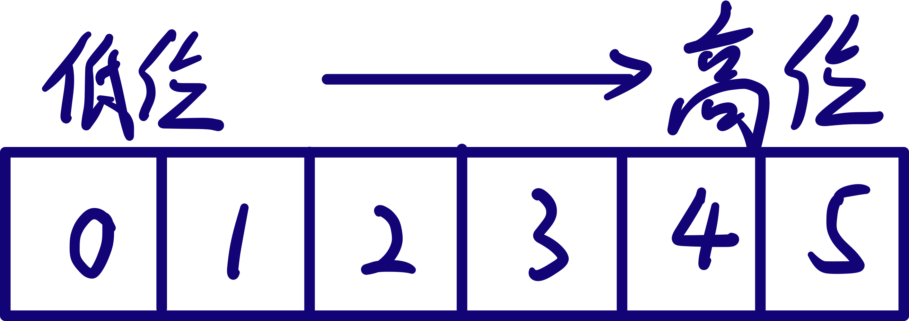

# 杂项

以 `\u` 开头的数字表示 Unicode

```zsh
gcc file1.c file2.c -o outpur # 编译 file1.c，file2.c，并生成文件 output
g++ file1.cpp file2.cpp -o output

clang file1.c file2.c -o output
clang++ file1.cpp file2.cpp -o output
```

## 逗号表达式

C 语言提供一种特殊的运算符，逗号运算符，优先级别最低，它将两个及其以上的式子联接起来，从左往右逐个计算表达式，整个表达式的值为最后一个表达式的值。

## 读取数量不定的输入数据

```cpp
while (cin >> val) //检测的是 cin 流的状态。当读取到文件结束符 (Ctrl + Z) 或输入错误时循环结束
```

## switch 内部的变量定义

==在 case 分支内使用的变量最好放到语句块里：==

```c
case 1:
  //TO DO
  {
    int k = 0; //变量的定义放在语句块里
    //TO DO
  }
  //TO DO
  break;
```

在 `switch` 内可以定义变量，但不能初始化。因为初始化语句可能被 `case` 跳过。

在 `switch` 内定义的变量从定义处到 `switch` 语句块结束都可见。

双引号 `""` 括起的来字符串常量表示一个地址；单引号 `''` 括起来的一个字符表示其编码值。

作用域操作符 `::`，全局作用域没有名字。

## 对象的初始化方式

### 直接初始化

不使用赋值运算符 `=`，而是使用括号 `()`

```cpp
int a(5);
string s1("abc");
string s2(10, 'A');
```

### 拷贝初始化

使用赋值运算符 `=`

### 值初始化

用于容器类。将容器中每个元素都初始化为 0，对于对象元素则使用默认初始化。

### 列表初始化

用花括号 `{}` 括起来的初始化器

## 自动类型判断

`auto`：自动分析表达式的类型并用表达式的值初始化变量

`decltype`：分析表达式的类型，但不使用表达式的值初始化变量

==`auto` 返回引用所指向的数据类型，而 `decltype` 返回引用本身的类型==

`auto` 可以这样使用：

```cpp
auto p = StrBlobPtr(*this, data->size()); //相当于StrBlobPtr p(*this, data->size());
```

## 位运算符

位与 `&`，位或 `|`，位异或 `^`，按位取反 `~`

移位运算符 `<<`，`>>`：超过的位丢失，空出的位补零。**右移 n 位相当于除以 2 的 n 次方，左移 n 位相当于乘以 2 的 n 次方。**`1 << 21` 表示 2 的 21 次方。

main 函数可以无返回值类型（不是 `void`）

万能头文件：`<bits/stdc++.h>`

使用 Unioncode：`wchar_t` 宽字符类型

`register` 关键字：建议编译器将该变量存入寄存器而不是内存。有助于提高频繁使用的变量的访问速度。

`inline` 关键字：建议编译器将该函数设为内联函数。内联函数是将函数体取代函数调用，以此来省去函数调用所花费的时间。一般将那些函数体很小，且被频繁调用的函数声明为内联函数。

`static` 关键字：用于声明静态变量（函数）。

- 全局静态变量：仅在文件内可见

- 局部静态变量：变量不随着函数的退出而消失，以此来保存函数上一次运行后变量的值。**相比于使用全局变量，局部静态变量可以保证该变量只能由其所属函数访问。** 局部变量的初始化语句只会执行一次

- 类静态变量：在类中被声明为 `static` 的成员属于整个类，被所有类对象共用。**注意类静态变量需要在类外初始化。** 静态方法不具有 `this` 指针。

## 类内初始值

或者放在花括号 `{}` 里，或者放在等号 `=` 右边，不能使用圆括号 `()`。

## 默认初始化

没有给定初值的内置类型，在定义时将执行默认初始化。如果该变量定义在块外，则被初始化为 0。如果在块内，将不被初始化（值是随机的）。

## 原生字符串

格式：`R"()"`

原生字符串无转义

## 命名的强制类型转换

为了使强制类型转换的潜在风险更加细化，使书写格式更加规范，C++对类型转换进行了分类。一个命名的强制类型转换具有如下形式：

`cast-name<type>(expression)`

**cast-name 有：**

`static_cast`：用于良性转换，一般不会导致意外发生，风险很低。*static_cast 在编译期间完成转换*

`const_cast`：用于 const 与非 const、volatile 与非 volatile 之间的转换。

`reinterpret_cast`：高度危险的转换，这种转换仅仅是对二进制位的重新解释，不会借助已有的转换规则对数据进行调整，但是可以实现最灵活的 C++ 类型转换。

`dynamic_cast`：用于在类的继承层次之间进行类型转换。借助 RTTI，用于类型安全的向下转型。*dynamic_cast 在程序运行期间进行转换*

## size_t 和 size_type

为了使自己的程序有很好的移植性，C++ 程序员应该尽量使用 `size_t` 和 `size_type` 而不是 `int`，`unsigned`。

1. `size_t` 是全局定义的类型；`size_type` 是 STL 类中定义的类型属性，用以保存任意 string，vector 的长度。
2. `size_t` 使用时需要 `<cstddef>` 头文件。`size_type` 在其所属类的头文件中。
3. 在用下标访问元素时，vector 使用 `vector::size_type` 作为下标类型，而数组下标的正确类型是 `size_t`

> `size_t` 表示一个平台上最大可能出现的对象大小

## x86 与 amd64

x86 ：英特尔的划时代 CPU 8086，以及之后相同架构的系列 CPU 80186，80286。x86 架构的特点是 CPU 的寄存器是 32 位的。

amd64：随着时代的进步，Intel 开始向 64 位架构发展，结果被 AMD 领先，制造出了兼容 x86 的 64 位 CPU，并称之为 AMD64。后来 Intel 也支持了 AMD64 的指令集，但是名字叫做 x86-64。所以 x86-64，x64，AMD64 就是一个东西。

## extern "C"

让编译器以 C 语言的方式编译紧跟的语句或语句块。

## extern

声明外部变量，告诉编译器该变量的定义在别处。

*如果要使常量公开，则不论是声明还是定义都应添加 extern。*

*extern 声明必须与原声明一致：*

```c
char a[6];
extern char a[]; //正确
extern char *a; //错误
```

> 在函数内使用 extern 表明使用文件内的外部变量。
>
> 可以把 extern 理解为一种声明关键词，该关键词说明这条语句是一个声明。
>
> 函数的默认作用域是程序作用域（即函数默认是 `extern` 的），被声明为静态函数后，在其他文件中使用该函数前需使用 `extern` 声明。

## 且和或

`&&` 的优先级大于 `||`，因此当 `&&` 和 `||` 并存时，先计算 `&&`，再计算 `||`。

## 列表初始化

```cpp
int i = 0;
int i{0};
int i = {0}; //等价于int i{0}
int i(0);
```

**当出现丢失精度的赋值时，列表初始化会报错**

## 左值和右值

左值一开始指可以位于赋指语句左侧的值。可以说，当一个对象被用作左值的时候，用的是对象的身份（在内存中的位置）。当对象被用作右值的时候，用的是对象的值（内容）。左值可以当成右值使用。


`decltype` 在遇到表达式时，若求值结果是左值，则返回的是引用类型：

```cpp
int *p;
decltype(*p); //返回的是 int&
```

若求值结果是右值，则返回的是指针：

```cpp
 decltype(&p); //返回 int**
```

## 引用（左值引用）

```c
int &ref = i; //ref 的类型是 int，而不是 int&。类型修饰符 (*, &) 只是声明符的一部分
```

**引用不是对象，而是对象的别名。**

**引用一旦绑定编无法更改**

```cpp
int *&r = p; //r 是一个对指针 p 的引用
```

## 命令行参数

```c
int main(int argc, char **argv)
int main(int argc, char *argv[])
```

> `argv[0]` 永远是程序名

### 获取参数函数 getopt()

`<unistd.h>`

[博客园：Linux 下 getopt() 函数的简单使用](https://www.cnblogs.com/qingergege/p/5914218.html)

#### 定义

```c
int getopt(int argc, char * const argv[], const char *optstring);
//参数 argc 和 argv 通常由 main 函数直接传入
//optstring：选项字符串
//返回值：如果找到符合的参数则返回此参数，否则返回 '?'。分析结束则返回 -1

extern char *optarg; //如果某个选项有参数，optarg 就是该选项的参数字符串

extern int optind; //下一次进行选项搜索的索引值，从 1 开始
extern int opterr; //如果将 opterr 置为 0，则关闭错误输出
extern int optopt; //当发现无效选项字符，即 getopt() 返回 '?' 时，optopt 就是该无效选项字符
```

> getopt() 会改变 argv[] 中参数的顺序。经过多次 getopt() 后，argv[] 中正确的选项及其参数会被放置在数组前面，而 optind 会指向第一个非选项和参数的位置。

#### optstring

`abc` 表示接收 -a, -b, -c 参数（`-abc` 等同于 `-a -b -c`：不带参数的选项可以写在一起）

`a:` 表示选项 -a 有一个必选参数。必选参数可以和选项连在一起写，也可以用空格隔开

`a::` 表示选项 -a 有一个可选参数。可选参数与选项之间不能有空格

## 类型别名

`typedef`

注意在 typedef 中，`*`, `&` 是类型修饰符。

```c
typedef int *p; //将 p（而不是 *p）声明为 int* 的同义词
```

普通的声明声明的是变量，`typedef` 声明的是类型。

> 注意如果对别名使用 const，则声明的是顶层 const
>
> typedef 是一个储存类关键字，因此不能和其他储存类关键字 (static, register, auto, extern) 共用

typedef 像是一种彻底的 "封装" 类型，声明之后不能再往里添加别的东西：

```c
typedef int INT;
unsigned INT a; //错误

typedef int *pointer;
const pointer p1; //指向 int 的常量指针。p1 的数据类型是指针。
const int *p2; //指向 const int 的指针。p2 的数据类型是 const int。
```

## 别名声明

```cpp
using SI = Sales_item //SI 是 Sales_item 的别名
```

==不允许将**非常量引用绑定到临时量**。因为修改临时量值的操作是无意义的。为避免错误使用，C++ 将此行为定义为非法。一般这种报错容易在调用使用了非常量引用参数的函数时出现。==

临时量
: 编译器为了暂存表达式的求值结果临时创建的一个未命名对象

## 作用域

|         名称         |         位置         |            格式             |              作用域              |             生存周期             |
| :------------------: | :------------------: | :-------------------------: | :------------------------------: | :------------------------------: |
|  内部变量（自变量）  | 函数或复合语句内定义 |          `int i;`           | 从定义处到函数（或复合语句）结束 | 从定义处到函数（或复合语句）结束 |
| 外部变量（全局变量） |      函数外定义      | `int i;`<br>`extern int i;` |        从定义处到程序结束        |            程序运行期            |
|     静态外部变量     |      函数外定义      |       `static int i;`       |        从定义处到文件结束        |            程序运行期            |
| 静态内部（局部）变量 | 函数或复合语句内定义 |       `static int i;`       | 从定义处到函数（或复合语句）结束 |            程序运行期            |
|       内部函数       |       函数之外       |      `static int f();`      |        从定义处到文件结束        |            程序运行期            |
|       外部函数       |       函数之外       | `int f(); extern int f();`  |        从定义处到程序结束        |            程序运行期            |

## 头文件与源文件

头文件中一般用于声明类，包括类的成员，方法，还有函数原型，以及一些 define 等，但是不写出来具体的实现方法，而源文件中主要是这些类中声明的函数的具体实现方法。

**我们引入一个头文件，目的就是将头文件中的函数声明出来。**

头文件：

```c
//#pragma once
#ifndef _文件名大写_H_
#define _文件名大写_H_

//类代码

#endif
```

源文件：

```c
#include "头文件.h"

//具体实现
```

main 文件：

```c
#include "头文件.h"
```

一般把函数的声明放在头文件，而实现放在源文件中。除了内联函数和 constexpr 函数通常定义在头文件中（它们要在编译过程中能随时展开）。

**头文件里只包含头文件本身所要用到的头文件（一般不需要包含），而源文件中包含所有要用到的头文件。**

在源文件里 `#include <stdafx.h>` 加快编译速度？

*头文件不应使用 using 声明*

### 文件重复包含错误

A 包含了 B，B 又包含了 A。这种情况下，编译器不会直接在源代码中标出错误提示，而是在编译时才报错：

> error C2061 语法错误：标识符"…"

*头文件 A 要用到 B 中的类，头文件 B 又要用 A 中的类*

解决办法是在头文件中通过 `class` 声明引入类，在源文件中再使用 `#include` 包含类。

## Visual Studio 调试模式中出现 "烫烫烫" 和 "屯屯屯" 的原因

[经典乱码"烫烫烫"和"屯屯屯"](https://blog.csdn.net/fanxueya1322/article/details/88417173?utm_medium=distribute.pc_relevant_t0.none-task-blog-2%7Edefault%7EBlogCommendFromBaidu%7Edefault-1.no_search_link&depth_1-utm_source=distribute.pc_relevant_t0.none-task-blog-2%7Edefault%7EBlogCommendFromBaidu%7Edefault-1.no_search_link)

## 格式化输入/输出函数

### 字符的输入/输出

```cpp
//C
int getchar(); //返回值表示读入的字符。EOF(-1)表示错误或流结束。
int putchar();

//C++
get();
```

### 输入/输出一行

```c
char *gets(char *str); //返回自己的实参
char *gets_s(char *str, int size);
int puts(char *str);
```

**注意！C11 删除了 gets() 函数，并使用一个新的更安全的函数 gets_s() 替代。** 然而 get_s() 仅在 MSVC 中可用。我们可以使用 fgets() 来替代 gets()。不过要注意的是：fgets() 不会自动去掉行尾的换行符：

```c
char *fgets_wrapper(char *buffer, size_t buflen, FILE *fp) {
  if (fgets(buffer, buflen, fp) != 0) {
    buffer[strcspn(buffer, "\n")] = '\0';
    return buffer;
  }
  return 0;
}
```

```cpp
//istream 类方法
istream &getline(char *目标数组，int 读取长度);

istream &getline(char *目标数组, int 读取长度, char 终止字符);

//普通函数
istream &getline(istream, string&);

istream &getline(istream, string&, char);
```

### 使用 scanf 时系统认为数据输入结束的情况

1. 遇到空格，换行，制表符。
2. 达到输入域宽。
3. 遇到非法字符输入。

> 进行多数据输入时，即使 scanf 函数中格式字符间没有空格，输入数据时也可通过空格进行划分

### 编写在 Windows 控制台环境下输入/输出中文的程序

控制台默认使用 GBK 编码，因此我们编写的代码最好也使用 GBK 编码。这样编译出的程序无论是输出中文还是输入中文都没有问题。

或者，在没有中文输入需求的情况下，若源代码使用 UTF-8 编码，那么可以在程序主函数第一行加入：

```c
system("chcp 65001 > nul"); //让控制台使用 UTF-8 编码页，并丢弃编码页提示（nul 是 Windows 的空设备名）
```

这样可以正常输出中文，但是程序从控制台读取到的字符依然是 GBK 编码。如果让程序再次输出读取到的字符，那么会变成乱码（但是在控制台中看不到）。

> UTF-8 编码页对应 65001，GBK 编码页对应 936。可以使用 chcp 命令查看当前编码页或更改编码页

[Windows 修改控制台编码为 UTF-8](https://mxy493.xyz/2021052715441/)

# 函数

## 返回数组指针的函数

使用类型别名

```c
typedef int arrT[10]; //using arrT = int[10];
arrT *func(); //func 返回一个指向维度为 10 的数组的指针
```

类似普通数组声明

```c
int(*func())[10];
```

## 列表初始化返回值

函数返回一个值的方式和初始化一个变量或形参的方式一样。因此可以用列表初始化的方式来创建返回值。

```cpp
vector<int> func() {
  return {1, 2, 3};
}
```

## 列表初始化形参

通过列表初始化形参 (initializer_list) 可以实现可变参数函数。

```cpp
void func(initializer_list<int> il);
func({1, 2, 3});
```

## 尾置返回类型

```cpp
auto func()->int(*)[10]; //func 返回指向 int[10] 的指针
auto func(int)->int(*)(int, int); //func 返回函数指针。等价于 int(*func(int))(int, int)
```

## 默认实参

```cpp
string screen(int h = 24, int w = 80);
```

*一旦某个形参被赋予了默认值，它后面所有形参都必须有默认值。调用时也只能省略右侧的实参。设计时应尽量让经常使用默认值的形参在后面*

在给定的作用域中，一个形参只能被赋予一次默认实参，且其右侧的所有形参都必须有默认默认值。

*函数，全局变量也可以作为默认实参*

通常，应该在函数声明中指定默认实参，并将该声明放在头文件中。

## 函数指针

函数的类型由返回类型和形参类型共同决定。

```cpp
bool lengthCompare(const string&,const string&); //函数类型是 bool(const string&, const string&)
```

要想声明函数指针，只需要用指针名替换函数名即可：

```cpp
bool (*pf)(const string&, const string&);
```

*可以直接使用函数指针调用函数，无需解引用*

在形参中函数类型会自动转换成函数指针：

```cpp
void func(int a, int b, int pf(int, int)); //pf 实际上是一个指针
```

使用 `typedef` 和 `decltype` ：

```cpp
typedef void Func(int, int); //Func 是函数类型
typedef decltype(func) Func;

typedef void (*FuncP)(int, int); //FuncP 是指向函数的指针
typedef decltype(func) *FuncP;
```

使用类型别名：

```cpp
using PF = int(*)(int, int);

decltype(func) *getFunc(const string&);
```

# 含有可变形参的函数

## initializer_list 形参

`<initializer_list>`

```cpp
initializer_list<string> il{"a", "b", "c"};
```

`initializer_list` 作为函数形参时，用花括号 `{}` 将要传入 `initializer_list` 的值括起来：

```cpp
//函数定义
void error_msg(initializer_list<string> lst);

//函数调用
error_msg("aaa", "bbb", "ccc");
```

*与 vector 不同，initializer_list 对象中的元素永远是常量*

## 省略符形参

*省略符形参是为了便于 C++ 程序访问某些特殊的 C 代码而设置的。需要注意，大多数类对象在传递给省略符形参时都无法正确拷贝*

## constexpr 函数

1. 函数的返回类型及所有形参都是字面值类型。
2. 函数体中唯一的可执行语句是 return。

# 调试帮助

## assert 预处理宏

`<cassert>`

*很多头文件都包含 cassert*

*assert: 断言*

`assert(expr);`，若表达式为假，`assert` 输出信息并终止程序的执行。

## NDEBUG 预处理变量

如果定义了 `NDEBUG`，将关闭调试状态。此时 `assert` 什么都不做。

也可以使用 `NDEBUG` 编写自己的条件调试代码：

```c
void print() {
  #ifndef NDEBUG
  //这部分代码将会在没有定义 NDEBUG 时执行
  #endif
}
```

在调试时可以使用这些由编译器定义的变量来为调试输出更多信息：

- `__func__`：当前调试的函数的名字。是一个 `const char[]`
- `__LINE__`：当前行号
- `__DATE__`：文件编译日期
- `__FILE__`：当前文件名
- `__TIME__`：文件编译时间

# string

## 初始化

1. 和初始化 C 风格字符串相同的方式：`string s = "abc";`
2. 重复字符符值：`string s(5, 'a');`
3. 直接初始化：`string("abc");`

## 常用成员函数

```cpp
s.c_str()           //转换为 C 风格字符串
s.insert()
s.erase()
s.substr()
s.find()            //还有反向查找 rfind；若未找到则返回 string::npos
s.find_first_of()   //找出指定字符串的首字符第一次出现的下标
s.find_last_of      //尾字符
s.find_first_not_of //找出第一个与指定字符串不等的字符的下标
s.find_last_not_of
```

例：查找字符串中子串的个数

```cpp
while ((pos = str1.find(str2, pos)) != string::npos) {
  pos += str2.length(); //这句很重要
  sum++;
}
```

# 数组

数组名可以隐式转换为指向数组首元素的指针。比如在作为函数参数的时候。

```c
int arr[4][5][6];
arr[1][2][3] == arr + 1 * 5 * 6 + 2 * 6 + 3;
```

## 变长数组

- 在 C89 中，必须使用常量表达式指明数组长度。也就是说，数组长度中不能包含变量。
- 而在 C99 中，可以使用变量指明数组长度。

*普通数组（固定长度的数组）是在编译期间分配内存的，而变长数组是在运行期间分配内存的。*

## 二维数组的初始化

```cpp
int a[2][3] = {{1, 2, 3}, {1, 2, 3}};
int a[2][3] = {1, 2, 3, 4, 5, 6};
int a[][3] = {{1, 2, 3}, {4, 5}}; //在有初值的情况下一维长度可以省略
                                  //未指定值的元素被初始化为 0
```

*如果有初值，数组的一维长度可省略*

用 `memset()` 重置数组

```c
void *memset(void *beg, int 替换值, unsigned 字节数);
```

使用指针遍历数组

```cpp
for (auto row = arr; row < end(arr); ++row) {
  for (auto col = *row; col < end(*row); ++col) {
    //TO DO
  }
}
```

使用范围 for 遍历数组

```cpp
for (auto &row : arr) {   //row 必须是引用，否则编译器会将 arr 的元素转换为指针
  for (auto &col : row) { //最内层可以不是引用
    //TO DO
  }
}
```

## 数组引用形参

```cpp
int (&rArr)[10] = arr; //arr 是一个 int[10] 的引用。维度 10 是类型的一部分。
```

*数组的维度是数组类型的一部分*

可以通过 `sizeof` 获取数组长度：

```c
int a[10];
int length = sizeof a / sizeof *a; //length = 10
```

## 复合类型

复合类型是指基于其他类型定义的类型。比如：指针，引用，数组。

一条声明语句由一个**基本数据类型**和紧随其后的一个**声明符列表**组成，每个声明符命名一个变量并指定该变量为与基本数据类型有关的某种类型。

# 指针

*指针变量名一般以 p 开头*

## 指针算数运算

指针加减整数：指针加 1 表示跳过其所对应的基类型所占字节数

## 数组指针

```c
int (*pArr)[5]; //pArr 是指向 int [5] 的指针
```

*数组与指针并不等价，但是很多时候数组会被转换为指针*

## 指针数组

```c
int *arr[5]; //arr 是一个数组，储存 int*
```

*字符串常量 "abcd" 是一个常量指针*

*对指针解引用得到对是其所指数据的引用*

## 指向多维数组的指针

降维处理，声明数组指针的时候将数组的一维部分置为空：

```c
int arr[2][3][4];
int pArr[][3][4] = arr; //等价于 int (*pArr)[3][4] = arr;
```

## 函数指针

```c
int (*pf)(double, int);
```

在形参中函数类型会自动转换为指针类型

*数组名和函数名可以自动转换为指针*

## 如何读懂指针的定义语句

找到标识符，先尽可能向右分析，然后尽可能向左分析。

运算符优先级：括号 `()` > 后缀操作符 `[]`, `()` > 前缀操作符 `*`

## 引用

*函数形参应尽量使用常量引用*

## const

### 顶层 const，底层 const

顶层 const 指变量本身的 const，底层 const 是指针、引用所指向对象的 const。

### constexpr

用于声明指针、引用时，其所指对象的地址必须固定（比如全局变量）

## 字面值类型

基本数据类型都是字面值类型

## 指针与字符串

要创建一个字符串数组，可以：

1. 建立一个二维字符数组 `char arr[5][10]`
2. 建立一个字符串指针数组 `char **argv`

# 动态储存管理

## 内存分配函数

`<stdlib.h>`

```c
void *malloc(size_t n); //只分配内存块，不初始化
void *calloc(size_t ele_num, size_t ele_size); //分配内存块，并将内存块初始化为0
void *realloc(void *之前分配的内存, size_t 需要的字节数); //调整之前分配的内存大小
```

*在扩充内存块时，若原内存块无法扩充，realloc 会在别处分配新内存块，并复制原内存块数据。因此一旦 realloc 函数返回，一定要对指向原内存块的所有指针进行更新*

使用 `if` 来确保在内存分配成功的条件下进行操作。

内存分配常用结构：

```c
if (!(p = malloc(size))) {
  //处理分配失败的情况
}
```

## 内存操作库函数

`<memory.h>`

`<memory>`

`<stdlib.h>`

```c
void *memset(void *beg, int replace, size_t count);

void *memcpy(void *目标地址, const void *源地址, size_t 字节数); //可以用于数组的复制

void free(void*);
```

## 程序占用的 5 块内存

### 栈 (stack)

编译器自动分配和释放，存放函数的参数，局部变量等。

### 堆 (heap)

由程序员分配和释放。若在程序结束时没有释放则可能由操作系统回收。堆是不连续的内存区域，其大小受限于虚拟内存。它的空间较大。

### 全局区 (静态区)

用于存储全局变量和静态变量。其中初始化的全局变量和静态变量储存在一块区域，未初始化的全局变量和静态变量存储在相邻的另一块区域。程序结束后由系统释放。

### 程序代码区

存放函数体的二进制代码

# 结构体

## 定义方法

### 先声明，在需要的时候再定义

```c
struct Demo {
  //TO DO
};
```

*注意在实例化结构体对象时仍需写 struct*

### 声明结构体的同时定义对象

```c
struct Demo {
  //TO DO
} s1, s2;
```

*这种方式只能在定义结构体的同时定义对象*

*此时结构体的名字并不是必须的*

### 声明时使用 typedef

```c
typedef struct {
  //TO DO
} STUDENT; //typedef 后面一般用大写

//声明链表结点
typedef struct Node { //这里 struct 和 Node 组合成一个类型名，而 typedef 将下面的 Node 声明为 struct Node 的别名
  //TO DO
} Node;
```

**结构体的成员默认是 public 的**

**结构体的定义仅仅是声明了一种新的数据类型，相当于一个模版，没有分配空间。**

## 结构体的嵌套定义

```c
typedef struct {
  struct { //名字可省略
    int year;
  } birthday;
} STUDENT;
//使用时：STUDENT.birthday.year
```

## 用初始化列表初始化成员变量

```cpp
STUDENT stu = {"20009200401", "LiXiao", 98.5}; //缺省值为 0
```

## 结构体的空间分配

理论上内存空间线性连续排列。但计算机往往实行字对齐，因此结构体成员并不一定连续排列。结构体的实际占用空间也可能大于理论空间。

*CPU 处理数据时以字为单位*

## 定义结构体数组

```c
//先定义结构体，后定义数组
struct Demo {
  //TO DO
};
struct Demo arr[n];

//定义结构体的同时定义数组
struct Demo {
  //TO DO
} arr[n];

//直接定义结构体数组
struct {
  //TO DO
} arr[n];
```

## 初始化结构体数组

```c
struct Demo {
  int a;
  int b;
} arr[2] = { //在提供初值的情况下数组维度可省略
  {1, 2},
  {3, 4}
};
```

# 链表

## 创建/插入结点

```c
Node *head = NULL; //如果没有链表头，则先创建链表头
Node *temp = (Node*)malloc(sizeof(Node)); //为结点分配内存单元
temp->value = n; //存储数据到结点中
temp->next = head; //插入结点
head = temp;
```

## 删除结点

1. 定位到要删除的结点
2. 将上一个结点与下一个结点相连
3. 收回内存空间

# 位域

有些数据在存储时并不需要占用一个完整的字节，只需要占用一个或几个二进制位即可。因此，C语言提供一种叫做位域的数据结构。

在结构体定义时，我们可以指定某个成员变量所占用的二进制位数 (bit)，这就是位域。

```c
struct bs {
  unsigned m;
  unsigned n: 4;
  unsigned char ch: 6;
};
```

冒号 `:` 后面的数字用来限定成员变量占用的位数。成员 m 没有限制，因此占用 4 个字节。成员 n, ch 收到限制，因此分别占用 4 和 6 位的内存。此时 n, ch 的取值范围非常有限，数据稍大就会溢出。高位将被截断，只保留低位。

C 语言标准规定，**位域的宽度不能超过它所依附的数据类型的长度。** 可以认为位域技术就是在成员变量所占用的内存中选出一部分位宽来存储数据。

C 语言标准还规定，**只有有限的几种数据类型可以用于位域。** 在 ANSI C 中，这几种数据类型是 int、signed int 和 unsigned int（int 默认就是 signed int）；到了 C99，_Bool 也被支持了。但编译器在具体实现时都进行了扩展，额外支持了 char、signed char、unsigned char 以及 enum 类型，所以上面的代码虽然不符合 C 语言标准，但它依然能够被编译器支持。

## 位域的存储

1. 当相邻成员的类型相同时，如果它们的位宽之和小于类型的 sizeof 大小，那么后面的成员紧邻前一个成员存储，直到不能容纳为止；如果它们的位宽之和大于类型的 sizeof 大小，那么后面的成员将从新的存储单元开始，其偏移量为类型大小的整数倍。（就是说，如果其数据类型能放得下，就把它们都放到一起，同时它们整体占用的大小就是其数据类型的大小。）

2. 当相邻成员的类型不同时，不同的编译器有不同的实现方案，GCC 会压缩存储，而 VC/VS 不会。

3. 如果成员之间穿插着非位域成员，那么不会进行压缩。

==通过上面的分析，我们发现位域成员往往不占用完整的字节，有时候也不处于字节的开头位置，因此使用 `&` 获取位域成员的地址是没有意义的，C 语言也禁止这样做。地址是字节 (Byte) 的编号，而不是位 (bit) 的编号。==

## 无名位域

位域成员可以没有名称

```c
struct bs {
  int m: 12;
  int  : 20; //该位域成员不能使用
  int n: 4;
}
```

无名位域一般用来作填充或者调整成员位置。因为没有名称，无名位域不能使用。

上面的例子中，如果没有位宽为 20 的无名成员，m, n 将会挨着存储，`sizeof(struct bs)` 的结果为 4；有了这 20 位作为填充，m, n 将分开存储，`sizeof(struct bs)` 的结果为 8。

> 引自 [C语言位域（位段）详解](http://c.biancheng.net/view/2037.html)

# 联合体

联合体（共用体）内的所有成员共用一块内存。因此，修改一个成员的值也会影响到其他成员。共用体起到把不同的变量包装成一个变量的作用。

联合体的定义和结构体类似：

```c
union Demo {
  char ch;
  int i;
};

union Demo d;
```

C++98 不允许联合体的成员是非 POD 类型。不过 C++11 标准规定，任何非引用类型都可以成为联合体的数据成员，这种联合体也被称为非受限联合体。

> POD(Plain Old Data): 见 [C++11非受限联合体（union）](http://c.biancheng.net/view/7165.html)

*C++11 允许联合体有静态成员，但却不能使用。*

# 枚举

在实际编程中，有些数据的取值往往是有限的，只能是非常少量的整数，并且最好为每个值都取一个名字，以方便在后续代码中使用，比如一个星期只有七天，一年只有十二个月，一个班每周有六门课程等。

```c
enum Demo { Value0, Value1, Value2 }; //枚举值默认从 0 开始，往后逐个加 1。

enum Demo { Value0 = 1, Value1 = 2, Value2 = 3 }; //自定义枚举值

enum Demo { Value0 = 1, Value1, Value2 }; //更简便的方法
```

**注意事项**

1. 枚举列表中的标识符的作用范围是全局的（严格来说是 main() 函数内部），不能再定义与它们名字相同的变量。
2. 枚举值是常量，不能再对它们赋值，只能将它们的值赋给其他的变量。

# 类

*成员变量一般以 `m_` 开头*

*如果想使用默认构造函数进行初始化，需要去掉对象名之后的空括号对，否则它会被编译器当作函数声明 😂*

## 构造函数初始化列表

```cpp
Demo(int a, int b) : m_a(a), m_b(b) { }
```

**成员变量的初始化顺序与初始化列表中列出的顺序无关，它只与成员变量在类中声明的顺序有关**

数据成员的初始化发生在构造函数体之前。如果没有构造函数初始值的话，它们将执行默认初始化。

*只能使用初始化列表来初始化 const 成员变量*

## 析构函数

## this 指针

每个成员函数都有一个隐式形参 this 指向调用它的对象。当成员互相调用时，this 指针在其中隐式地传递。

*成员函数的第一个参数是一个隐含的 this 指针*

## 常量成员函数

`string isbn() const;`

把 const 放在函数列表后面表示 this 是一个指向常量的指针。可以根据函数是否是 const 来进行重载。

常量对象只能调用常量成员函数。常量成员函数无法改变数据成员的值。

## =default

`MyClass() = default;`

在类中如果定义了其他构造函数，还希望编译器生成一个合成的默认构造函数，就这样写。

*合成的构造函数：由编译器创建的构造函数*

## 友元

`friend`

**友元的声明仅仅指定了访问的权限，而非一个通常意义上的声明。** 因此还需要在友元声明之外再进行一次声明（很多编译器也支持不再次声明的行为）。一般把这些声明与类的声明放在一个头文件中。

> 友元不存在传递性
>
> 友元不是类的成员，也不受它所在区域访问权限的约束。
>
> 定义在类内部的函数是隐式的 inline 函数。如果要显式地声明成员函数为 inline，一般在类外部定义的地方说明 inline。

## 类型成员

可以在类中定义类型别名。这些类型别名和普通类成员一样具有访问权限。另外，这些类型别名必须先定义后使用，这与普通成员有所区别。

## 可变数据成员

如果想要在常量成员函数中也能改变某个数据成员的值，可在变量的声明中加入 `mutable` 关键字。

## 类的作用域

一个类就是一个作用域。在类的外部定义成员函数时， **一旦遇到类名，定义的剩余部分就在类的作用域之内了。** 而函数的返回类型通常在函数名之前，因此返回类型中使用的名字都位于类的作用域之外。

## 名字查找与类的作用域

**编译器处理完类中的全部声明后才会处理成员函数的定义。** 只需要确保函数声明中使用的名字在使用前可见就行。

*只有当类的定义完成之后编译器才知道储存该类的对象需要多少储存空间。因此类当成员类型不能是该类自己。然而，一旦一个类的名字出现后，它就被认为是声明过了，因此类允许包含指向它自身类型的引用或指针。*

## 委托构造函数

```cpp
Demo() : Demo(0, 0, 0) {} //在初始值列表的位置调用另一个构造函数
```

程序将先执行受委托的构造函数，再执行自己。

## 隐式类类型转换

我们为类定义接受一个实参的构造函数实际上是定义了一个隐式转换规则。这种构造函数也叫**转换构造函数**。如果想要阻止程序利用该构造函数进行隐式转换，需要将构造函数声明为 `explicit` 的。

*explicit 关键字只允许出现在类内的构造函数声明处*

## 聚合类

- 所有成员都是 public 的
- 没有定义任何构造函数
- 没有类内初始值
- 没有基类，也没有虚函数

聚合类可以通过花括号括起来的成员初始值列表来初始化其数据成员。

*C 中的结构体就是聚合类*

```cpp
struct Demo {
  int val;
  string str;
};

Demo d = {0, "abc"};
```

## 字面值常量类

> 见 C++ Primer 267 页

## 静态成员

静态成员在类的内部声明，在类的外部定义和初始化，其生命周期贯穿整个程序。注意 `static` 关键字只出现在类内部。

静态数据成员可以是不完全类型。即静态数据成员的类型可以就是它所属的类类型，而非静态成员则只能声明称其指针或引用。

不完全类型
: 仅仅声明而未定义的类。在类中定义使用其他类的方法时可能出现不完全类错误，此时应将方法定义移至类外。

还可以使用静态成员作为默认实参，非静态数据成员则不行。

### 静态成员的类内初始化

通常类的静态成员不应该在类内初始化。

> 见 C++ Primer 270 页

# 函数模版

```cpp
template<typename T> void func(T a, T b) {
  //TO DO
}
```

`template` 是定义函数模版的关键字，其后紧跟尖括号 `<>`，括号内部是类型参数。`typename` 是另外的关键字，用来声明具体的类型参数。

`template<typename T1, T2>` 叫模版头，可以单独写在一行。

类型参数一般命名为 T, T1, T2, Type，可用在任何需要类型的地方。

*类型参数只能接收内置类型*

*关键字 `typename` 也可用 `class` 代替*

*函数模版也可以提前声明，记得带上模版头*

*函数模版可以根据实参推断数据类型，因此在使用函数模版时不必指明数据类型。*

# 类模版

```cpp
template<typename T1, T2> class Demo { //和函数模版一样
  //TO DO
};
```

## 在类模版外定义成员函数

```cpp
template<typename T1, typename T2> //模版头必须和类声明时一致
T1 Demo<T1, T2>::func(T2 var) { //注意类名后面要有类型参数
  //TO DO
}
```

*使用类模版时必须指明数据类型，编译器无法推出类的数据类型。*

# 标准异常

*p176*

`<exception>`：定义了最通用的异常类 `exception`。它只报告异常的发生，不提供任何额外信息。

`<stdexcept>`：定义了几种常用的异常类。一般用的 `out_of_range`，`runtime_error` 都在里面。

`<new>`：定义了 `bad_alloc` 异常。

`<type_info>`：定义了 `bad_cast` 异常

> exception，bad_alloc，bad_cast 异常类只能默认初始化。而其他异常类则恰恰相反，需要提供 string 或 C 风格字符串传递错误有关信息。
>
> 异常类定义了一个名为 `what()` 的成员函数，返回一个 C 风格字符串，表示错误有关信息。

# 顺序容器

|      vector      |      deque       |          list          |      forward_list      |     array      |      string      |
| :--------------: | :--------------: | :--------------------: | :--------------------: | :------------: | :--------------: |
|   支持随机访问   |   支持随机访问   |      支持双向访问      |      支持单向访问      |  支持随机访问  |   支持随机访问   |
| 在尾部增删元素快 | 在头尾增删元素快 | 在任意位置增删元素都快 | 在任意位置增删元素都快 | 不支持增删元素 | 在尾部增删元素快 |

## 赋值和 swap

```cpp
c1 = c2;
c = {1, 2, 3};
swap(c1, c2); // c1.swap(c2)
// swap 函数实际上只是交换两个容器的内部数据结构，元素本身并未交换

// assign 操作不适用于关联容器和 array
seq.assign(beg, end);
seq.assign(il); // 将 seq 中的元素替换为 il 中的元素
seq.assign(n, val); // 将 seq 中的元素替换为 n 个值为 val 的元素
```

赋值运算符要求左边和右边的运算对象具有相同的类型。而 `assign` 允许从一个不同但相容的类型赋值。比如可以把 `vector<char*>` 赋给 `list<string>`。

赋值相关运算符会导致指向左边容器内部的迭代器、指针和引用失效，而 swap 不会。（除了 array 和 string）

> 适用于所有容器的操作：见 C++ Primer 295 页  
> 向顺序容器添加元素：见 C++ Primer 305 页  
> 顺序容器删除元素：见 C++ Primer 311 页

对于 array 来说，swap 之后指针、引用和迭代器所绑定的元素不变，但元素的值已经和另一个 array 中对应的元素的值进行了交换。

> 容器的 `insert`, `emplace`, `erase` 操作返回的都是指向操作位置的迭代器。

## 使用 insert 的返回值

利用 `insert` 的返回值可以在容器中的特定位置反复插入元素：

```cpp
while (cin >> word) {
  iter = lst.insert(iter, word); // 不断向 iter 位置插入元素。insert 返回指向第一个新元素的迭代器
}
```

## emplace

与 `push_front`, `push_back`, `insert` 不同，`emplace` 的作用是在指定位置构造一个对象。（前者是将实参的拷贝插入指定位置）因此传递给 emplace 的参数必须与元素类型的构造函数相匹配。

## begin(), end(), front(), back()

`begin`, `end` 函数返回指向首元素、尾后元素的迭代器。`front`, `back` 返回首元素、尾后元素的引用。

如果在一个循环中插入/删除 vector, string 或 duque 中的元素，**不要保存 end() 返回的迭代器。** 因为在每次操作后原来 end() 返回的迭代器会失效，导致死循环。因此必须在每次操作后重新调用 end()，而不能在循环开始前保存迭代器。

## at()

`at` 函数的作用类似下标运算符 `[]`，但会检查下标的有效性。若下标越界，则抛出 `out_of_range` 异常。

## 添加元素

`push_front`, `push_back`, `insert`

*insert 可以在尾后位置插入元素。*

*insert 函数可以插入相容类型的元素。*

*vector, string 不支持 push_front; forward_list 不支持 push_back。*

## 删除元素

`pop_front`, `pop_back`, `erase`, `clear`

*vector, string 不支持 pop_front; forward_list 不支持 pop_back。*

*容器中的元素是原对象的拷贝，容器中的元素与提供值的对象之间没有任何关联。*

## resize

```cpp
resize(int);
resize(int, value_type ele); //通过 val 指定新元素的值
```

若缩小容器，容器后部的元素会被删除。若增大容器，会添加值初始化的新元素，或通过一个参数指定新元素的值。

## vector 的增长方式

当不得不获取新的内存空间时，vector 和 string 会分配比新的空间需求更大的内存空间，以避免多次重新分配内存。同时，它们也提供了一些函数供我们与它们的内存分配互动：

`shrink_to_fit()`: 请求退回多余内存空间。只适用于 vector, string 和 duque。

`capacity()`: 在不重新分配内存的情况下可以保存多少元素。只适用于 vector 和 string。

`reserve(n)`: 分配至少能容纳 n 和元素的内存空间。只适用于 vector 和 string。

> 向容器中添加元素和从容器中删除元素的操作可能会使指向容器元素的指针、引用或迭代器失效（内存重新分配）。因此必须保证每次改变容器的操作之后都正确地定位迭代器，尤其是 vector, string 和 duque。可以利用 insert, emplace, erase 等函数的返回值来更新迭代器。


# vector

## 初始化

```cpp
// 直接初始化
vector<T> vec(n, val); // 构造 n 个值为 val 的对象
vector<T> vec{a, b, c}; // 列表初始化
vector<T> v1(v2); // 使用另一个 vector 初始化。两 vector 的类型必须相同
vector<T> vec(beg, end); // 使用迭代器范围内的元素初始化
vector<vector<T>> vec(m, vector<T> (n)); // 二维 vector 的初始化

// 拷贝初始化
vector<T> v1 = v2;

//值初始化
vector<T> vec(n); // 对每个元素使用其类型的默认初始化
```

## 对 vector 对象使用关系运算符

和 string 类一样，两个 vector 对象大小相同且各元素值相同时相等。  
元素值相同但大小不同时，容量大的 vector 大。  
元素值、大小都不相同时，vector 的大小由第一对相异的元素值的大小关系决定。

> 不要使用 `vector<bool>`: [vector<bool> 不是存储 bool 类型元素的 vector 容器！](http://c.biancheng.net/view/7393.html)

# string

*p321*

```cpp
substr(int pos, int len); //返回从pos开始，长度为len的子串
```

> - 修改 string 的操作：见 C++ Primer 323 页
> - string 搜索操作：见 C++ Primer325 页
> - compare 函数：见 C++ Primer 327 页
> - 数值转换：见 C++ Primer 328 页

算数类型转换为 string：`to_string()`  
string 转为算数类型：`stoi()`, `stod`。  
*string 中第一个非空白符必须是数值中可能出现的字符。如 +-.0123456789。string 可以包含 e 或 E 表示指数部分，string 也可以是 16 进制数。*

# forward_list

*p313*

## 实现原理

对于单向链表，添加或删除元素时，该元素之前的那个元素的后继 `*next` 会发生改变。为了添加或删除一个元素，我们需要访问其前驱，以便改变前驱的链接。但是单向链表很难访问一个元素的前驱。因此，在 forward_list 中添加或删除元素的操作都是作用于给定元素之后的元素。

由于这些操作与其他容器上的操作的实现方式不同，forward_list 并未定义 `insert`, `emplace` 和 `erase`，而是定义了 `insert_after`, `emplace_after` 和 `erase_after`。为了支持这些操作，forward_list 定义了 `before_begin` 函数，它返回一个**首前迭代器**。

## 函数

`before_begin`/`cbefore_begin`: 返回首前迭代器

`insert_after`: 在给定迭代器之后插入元素，返回指向最后插入元素的迭代器。

`emplace_after`: 在给定迭代器之后创建元素，返回指向新元素的迭代器。

`erase_after`: 删除给定迭代器之后 (beg, end) 的元素，返回指向最后被删除元素之后的迭代器。

*在 forward_list 中添加或删除元素时，要同时关注两个迭代器 curr 和 prev：*

```cpp
curr = flst.erase_after(prev);
```

## 特定容器算法

> 链表类型 list 和 forward_list 定义了几个成员函数形式的算法。特别是，它们定义了独有的 sort, merge, remove, reverse 和 unique。见 C++ Primer 369 页。

*对于 list 和 forward_list，应优先使用成员函数版本的算法而不是通用算法。*

*链表特有的操作会改变容器：通用版本的算法一般不会改变用到的容器，而链表版本会改变底层的容器。*

## splice 成员

> 一种链表数据结构所特有的算法，将另一个链表拼接到这个链表。见 C++ Primer 370 页。

# 容器适配器

一个容器适配器接受一种已有的容器类型，使其行为看起来像一种不同的类型。

> 所有适配器都支持的操作：见 C++ Primer 329 页。
> stack: 见 C++ Primer 330 页。
> queue 和 priority_queue: 见 C++ Primer 330 页。

queue: 先进先出，进入 queue 的对象被放置到队尾，而离开 queue 的对象则从队首删除。比如饭店按照客人到达的顺序来为他们安排座位。

priority_queue: 允许我们为队列中的元素建立优先级。新加入的元素会排在所有优先级比它低的元素之前。比如饭店按照客人预定时间而不是到来时间的早晚来为他们安排座位。默认以 `<` 运算符来确定相对优先级（小的排前面）。

```cpp
stack<int> s; // s 是基于 deque<int> 的适配器
stack<int, vector<int>> s; // s 是基于 vector<int> 的适配器
```

*stack 和 queue 的默认容器是 deque，priority_queue 的默认底层容器是 vector。*

## priority_queue

`<queue>`

```cpp
priority_queue<typename T, typename Container = vector<T>, typename Compare = less<T>>;
```

`less` 是一个默认的排序断言，定义在头文件 functional 中，它决定了容器中最大的元素会排在队列前面。相当于创建了一个大顶堆。

如果想创建小顶堆，可以使用 `greater` 作为排序断言：

```cpp
priority_queue<int, vector<int>, greater<int>> max_heap; //如果要指定最后一个参数，则前面的所有参数都要提供。
```

对于数字，也可以在入队列时将每个元素乘以 -1 来达到相同的效果。

# 关联容器

`map`（映射）：储存键值对 `pair`  
`set`（集合）：储存键

在前面加上 `multi` 表示容器允许重复关键字；在前面加上 `unordered_` 表示容器无序保存元素。

map, multimap 定义在 `<map>` 中，unordered_map, unordered_multimap 定义在 `<unordered_map>` 中。

*multi 容器可以用来构建一对多的映射，如建立作者到他所著书籍的映射。*

set, multiset 定义在 `<set>` 中，unordered_set, unordered_multiset 定义在 `<unordered_set>` 中。

*关联容器都支持 295 页介绍的普通容器操作。*

## map

map 的使用方法与正常数组类似，可以通过下标访问元素。不同在于其下标不必是整数。

一个经典的使用 map 的例子：单词计数程序 `++word_count[word];`

与 vector 不同，map 的下标（键）可以不存在。如果键并未在 map 中，则创建一个新键值对，并值初始化 val。

使用列表初始化时，用 `{}` 将每个键值对括起来：

```cpp
map<string, string> authors = {{"Joyce", "James"}, {"Steve", "Jobs"}}; //只要初始化器能转换为容器中元素的类型即可
```

### key 类型的要求

对于有序容器（没有 `unordered_` 前缀的），标准库使用关键字类型的 `<` 运算符来比较两个关键字。我们也可以提供自己定义的操作（函数）来代替关键字上的 `<` 运算符。所提供的操作必须在关键字类型上定义一个严格弱序 $\prec$。如果两个元素都不 "严格弱序" 于对方，则它俩相等。

要使用自定义的操作，需要在定义关联容器类型时提供比较操作的类型——函数指针。可以使用 `decltype` 来声明该类型：`decltype(compare) *`。并在定义此容器类型的对象时提供操作的指针。

```cpp
set<Sales_data, decltype(compare) *> bookstore(compare);
```

### pair

`<utility>`

pair 就是一个键值对。一个 pair 保存两个数据成员。pair 的默认构造函数对数据成员进行值初始化。我们也可以为每个成员提供初始化器：

```cpp
pair<string, string> author{"James", "Joyce"};
```

pair 有两个 public 数据成员：`first` 和 `second`。

pair 上的操作：

```cpp
pair<T1, T2> p(v1, v2); // 等价于 p{v1, v2}, p = {v1, v2}
make_pair(v1, v2); // 返回一个用 v1 和 v2 初始化的 pair。其类型由 v1 和 v2 推断出来。
p1 relop p2; // 比较两个 pair。relop 是关系运算符 <, >, <=, >=, ==, !=。使用字典序来比较两个 pair。
```

在函数中返回一个空 pair：

```cpp
return pair<T1, T2> (); // 隐式构造一个空 pair

// 列表初始化返回的 pair:
return {v1, v2}; // 也可以显式构造一个 pair: return pair<T1, T2>(v1, v2); 或者 return make_pair(v1, v2);
```

### map 的下标操作

map 和 unordered_map 容器提供了下标运算符和一个对应的 `at` 函数。map 的下标运算符接受一个索引（关键字），返回与此关键字相关联的值。与其他下标运算符不同的是，**如果关键字不在 map 中，会为它创建一个元素并插入到 map 中，** 关联值将进行值初始化。  
由于下标运算符可能插入一个新元素，因此我们只能对非 const 的 map 使用下标操作。如果我们不希望改变 map，则应该使用 `find`。

而 `at` 函数则和其他 at 函数一样，带参数检查。若 key 不在容器中，抛出一个 `out_of_range` 异常。

下标和 at 操作只适用于非 const 的 map 和 unordered_map

## 关联容器额外的类型别名

`key_type`：键的类型

`mapped_type`：值的类型，只有 map 有定义

`value_type`：对于 set，与 key_type 相同；对于 map，为 `pair<const key_type, mapped_type>`。（由于不能改变一个元素的关键字，因此 pair 的 key_type 是 const 的）

## 关联容器迭代器

**key 的迭代器都是 const 的**

与不能改变一个 map 元素的关键字一样，一个 set 中的关键字也是 const 的。因此不能用 set 的迭代器来修改元素的值。虽然 set 同时定义了 `iterator` 和 `const_iterator` 类型，但两种类型都只允许**只读**访问 set 中的元素。

当使用一个迭代器遍历一个有序容器时，迭代器按关键字升序遍历元素。

## 关联容器和算法

通常不对关联容器使用泛型算法。在实际编程中，如果真要对一个关联容器使用算法，要么是将它当作一个源序列，要么当作一个目的位置。

## 添加元素

*p384*

使用 `insert` 或 `emplace`。可以向 insert 提供一个元素值，或者一个范围，或者一个初始化器列表。注意 map 的元素类型是 pair，可以用 `insert({key, val});` 向 map 插入元素。

> 对于非 multi 的关联容器，插入已存在的关键字对容器没有任何影响。

### insert, emplace 的返回值

添加单一元素的 insert 和 emplace 返回一个 `pair<iterator, bool>`，其 first 成员是一个指向具有指定关键字的元素的迭代器， second 成员是一个 bool 值，指示插入是否成功。对于 multi 容器，则只返回指向新元素的迭代器。

## 删除元素

关联容器定义了三个版本的 erase 函数。接受迭代器(范围)的版本与对应的顺序容器操作类似。此外它还有一个接受关键字参数的版本，此版本删除所有匹配给定关键字的元素，返回实际删除的元素的数量。

```cpp
c.erase(beg, end); // 删除迭代器范围内的元素
c.erase(key_type key); // 删除所有匹配key的元素，返回删除的元素数量
```

## 查找元素

```cpp
c.find(key);
c.count(key);

c.lower_bound(key);  // 返回指向第一个关键字 <= key 的元素
c.upper_bound(key);  // 返回指向第一个关键字 > key 的元素

// 如果元素不在容器中，则 lower_bound 和 upper_bound 返回关键字的第一个安全插入点——不影响容器中元素顺序的插入位置
// 这两个操作并不报告关键字是否存在，重要的是它们的返回值可作为一个迭代器范围

for (auto beg = multimap.lower_bound(key), end = multimap.upper_bound(key); beg != end; ++beg)

c.equal_range(key);  // 返回一个迭代器 pair，表示与关键字匹配的元素范围。若 key 不存在，则 pair 的两个成员均等于 c.end()
// 在 multi 关联容器中 key 相同的元素会相邻储存
```



## 无序容器

### 桶

容器将具有相同哈希值的元素保存在一个桶中。

> 无序容器提供了一组管理桶的函数，见 C++ Primer 395 页。

### 无序容器对 key 类型的要求

默认情况下，无序容器使用关键字类型的 `==` 运算符来比较元素，它们还使用一个 `hash<key_type>` 类型的对象来生成每个元素的哈希值。标准库为内置类型，string，智能指针类型提供了 hash 模版。因此我们可以直接定义关键字是这些类型的无序容器。如果想定义自定义类型的无序容器，我们可以提供函数来替代 `==` 运算符和哈希值计算函数。例如：

```cpp
unordered_multiset<Sales_data, decltype(hasher) *, decltype(eqOp) *> bookstore(42, hasher, eqOp);

size_t hasher(const Sales_data &sd) {
  return hash<string>()(sd.isbn); // 尚不清楚的用法
}

bool eqOp(const Sales_data &lhs, const Sales_data &rhs) {
  return lhs.isbn() == rhs.isbn();
}

// 如果我们的类定义了 == 运算符，则可以只重载哈希函数：
unordered_set<Foo, decltype(FooHash) *> fooSet(10, FooHash);
```

# 迭代器

*迭代器对表示的范围都是前开后闭区间 [begin, end)*

## 种类

- 前向迭代器：支持自增、解引用
- 双向迭代器：支持自增、自减、解引用
- 随机访问迭代器：支持上面迭代器的所有功能，同时还支持以下操作：（相当于普通指针）

```cpp
p += 5; // 后移 5 个元素
p -= 5;
p + 5;  // 返回后面第 5 个元素的迭代器
p[5];   // 返回 p 后面第 5 个元素的引用
```

> 只有随机访问迭代器支持比较运算符和迭代器减法。

## 定义格式

`vector<int>::iterator it;` 可在 `iterator` 前加 `const_`, `reverse_` 改为常量、反向迭代器。

## 标准库函数 begin 和 end

很多头文件都有定义，如 iterator, array, deque, map, list, vector... iostream 可能也有。

`end(array)` 可以返回数组的尾后指针

## 插入迭代器

插入器是一种迭代器适配器。对插入器赋值相当于调用 `push_back(), push_front()` 或 `insert()`。

### back_inserter

`back_inserater(c)` 创建一个使用 `push_back` 的迭代器。一般使用 `back_inserater` 来作为算法的目的位置来使用。

### front_inserter

`front_inserter(c)` 创建一个使用 `push_front` 的迭代器。

### inserter

`inserter(c, iter)` 创建一个使用 `insert()` 的迭代器。

`*it = val` 相当于：

```cpp
it = c.insert(it, val);
++it;
```


> 插入器不用解引用就可以赋值：`inserter = i;` 等价于 `*inserter = i;`。

### 流迭代器

流迭代器把流当作一个特定类型的元素序列来处理。通过使用流迭代器，我们可以用泛型算法从流对象读取数据以及向其写入数据。

#### istream_iterator

`istream_iterator` 使用 `>>` 来读取流。创建时可以通过构造函数将它绑定到一个流。也可以默认初始化迭代器，这样它可以当作一个尾后迭代器。

```cpp
istream_iterator<int> in_iter(cin), eof;
vector<int> ivec(in_iter, eof); // 从 cin 读取数据，直至遇到文件尾或非 int 数据
```

`*in` 返回从流中读取的值

`++in`, `in++` 使用元素所定义的 `>>` 运算符从输入流中读取下一个值

#### ostream_iterator

```cpp
ostream_iterator<type> out(os);
ostream_iterator<type> (os, char *);
```

可以对任何具有输出运算符 `<<` 的类定义 `ostream_iterator`。

在构造函数中可以传递一个字符串参数，在输出每个元素后都会打印此字符串。

e.g.

```cpp
ostream_iterator<int> out_iter(cout, " ");
for (auto e : vec) {
  *out_iter++ = e; // 等价于out_iter = e
  out = val; // 用 << 运算符将 val 写入到 out 所绑定的 ostream 中
}
```

`*out`, `++out`, `out++` 这些运算符存在，但不对 `out` 做任何事情。但不建议刻意省略它们。

用 copy 来打印 vec 中的元素比循环更简单：`copy(vec.begin(), vec.end(), out_iter);`

> 对于一个绑定到流的迭代器，一旦其关联的流遇到文件尾或 IO 错误，迭代器的值就与尾后迭代器相等。
>
> `istream_iterator` 允许惰性求值。
>
> 惰性求值：当需要用到这个值的时候，才去求它的值，而不是在赋值的时候立即求值。在这里想说的是，当我们将一个 `istream_iterator` 绑定到一个流时，标准库并不保证迭代器立即从流读取数据。

### 反向迭代器

除了 `forward_list` 之外，其他容器都可以通过调用 `rbegin`, `rend`, `crbegin` 和 `crend` 来获得反向迭代器。

`rbegin` 返回尾迭代器，`rend` 返回首前迭代器。

反向迭代器可以通过成员函数 `base` 获得其对应位置右边相邻元素的正向迭代器。*反向迭代器的目的是表示元素范围，而这个范围是一个不对称区间，因此 base 返回的是相邻元素而不是相同元素。*

### 迭代器类别

> 见 C++ Primer 366 页

# 预处理器

## 头文件保护符

作用：确保头文件只会被 include 一次

依赖于预处理变量 （变量的状态有已定义和未定义）

> 预处理变量名一般全部大写。
>
> 预处理变量一般使用头文件名。e.g.: `EXAMPLE_H­`

## 指令

`#define`

`#ifdef`

`#ifndef`

`#endif`

## 内存对齐

什么是内存对齐：为了 CPU 的读取效率，将数据存储到内存中时，存入内存的首地址必须是某个数的整数倍。64 位 CPU 的存取粒度为 8 字节，因此默认内存对各值为 8。在存储数据时，系统将在变量自身大小和设定的对齐值中选择较小的一个作为最终的有效对齐值。只有在特定情况下需要手动改变对齐值，比如说如果使用默认对齐值时对结构体 `{char a; int b;}` 使用 `sizeof` 获取其大小，得到的大小将比其实际大小要大，因为在存储结构体成员时是连续内存存储，`char a` 的有效对齐值是 1，它将从 0×00000000 开始存储。在存储 `int b` 时，它的有效对齐值是 4，但如果从 0×00000002 开始存的话不能满足 4 的整数倍，因此它从 0x00000004 开始存。这还没完，结构体自身也有有效对齐值，该值是自身对齐值最大的成员和设定的对齐值中较小的那个。在这里它的值为 4，它占用的空间也必须是 4 的整数倍。其成员占用的内存是 8 个字节，(0 字节给 `char`，4~7 字节给 `int` )刚好是 4 的整数倍。所以，`sizeof` 的结果是 8。但如果不是这么巧的话，它的占用字节数字扩充到满足对齐为止（如果加一个 `short c`，它的大小就成了 12）。为了得到它的真实大小，需要使用预编译指令 `#pragma pack(n)` 改变对齐值（或者把对齐值大的成员放在前面）。

与 `#pragma` 相关的命令还有：`#pragma pack(push/pop n)`。这些指令可以在任何位置出现。`push` 是将当前的数据按旧对齐压入栈中，然后设定新的对齐值。而 `pop` 是将上次入栈的数据顶出，然后设定新值。若不指定 n 则使用默认对齐值。在 n 的前面可以添加标识符，这样出栈时若指定标识符，可以将 栈顶到标识符的部分 全部推出。

==`#pragma pack(n)` 在结构体的定义附近使用，若结构体定义在头文件，则 `pragma pack(n)` 和 `#pragma pack ()` 在头文件首尾。==

### g++ 支持 C++14 方法

```cpp
#pragma GCC diagnostic error "-std=c++14"
```

# stdlib.h

```c
// 随机数函数
int rand() // 产生一个 [0, RAND_MAX] 内的伪随机数。rand 的默认初始种子值为 1。
void srand(unsigned seed) // 设定伪随机数序列的种子值
// 若不设定种子值，则同一程序运行两次得到的随机数完全相同。通常以时间作为随机数种子。

// 整数算数函数
int abs(int i)    // 返回整数 i 的绝对值
long labs(long i) // 返回长整形 i 的绝对值

div_t div(int n, int m)     // 返回 div 类型值，成员为 int。
ldiv_t ldiv(long n, long m) // 返回 div 类型值，成员为 long。
// div 类型：n 除以 m，其成员变量有商 (quot) 和余数 (rem)。

// 快速排序函数
qsort(void *buffer, int length, int Ele_size, int cmp(void*, void*))

// 执行控制函数
void abort()

// 使程序异常终止
int atexit(void func()) // 当程序正常终止时，调用函数 func()
void exit(int state)    // 结束程序，将 state 返回给系统。

// 系统函数
system(const char*) // 该函数可以向控制台传递命令
system("pause")     // 暂停
system("HELP")      // 获取 system 参数

FILE *popen("command", "mode") // 建立管道 I/O
// popen 作用和 system 类似，但 popen 可以返回命令运行的结果，而 system 只返回命令运行是否成功。

// 例
#include <stdio.h>
int main() {
  FILE *fp;
  char buffer[80];
  fp = popen("cat /etc/passwd", "r");
  fgets(buffer, sizeof(buffer), fp);
  printf("%s", buffer);
  pclose(fp);
}

// 字符串转换为算数类型
long   strtol(char *待转字符串, char **endptr, int base) // 函数返回转换后的数值，并将第一个无法转换的字符的地址赋给 endptr。endptr 可以为 NULL
int    atoi(char *str)
double atof(char *str)
long   atol(char *str)

// Windows 特供
char  *itoa(int 待转整数, char *buffer, int 进制) // 算数类型转换为字符串
```

# string.h

```c
// 计算字符串长度
int strlen(char *str)

// 字符串拼接
char *strcat(char *前面的串, char *拼接的串)

// 字符串复制
char *strcpy(char *粘贴, char *复制)
char *strncpy(char *粘贴, char *复制, int n)

// 比较字符串大小
int strcmp(char *str1, char *str2)
int strncmp(char *str1, char *str2, int n)

// 字符串查找
// 查找字符串中某字符第一次出现的位置
char *strchr(const char *str, int ch)  // 返回指向第一个 ch 的指针，失败返回 NULL
char *strrchr(const char *str, int ch) // 反向查找 ch
                                       // 还有功能和 strchr 相同的 strchrnul，区别是未找到 ch 时后者返回指向 str 结尾的空字节 (the null byte)*

// 查找子串
char *strstr(const char *str1, const char *str2)  // 返回 str2 在 str1 出现的首位置，未找到返回 NULL
char *strrstr(const char *str1, const char *str2) // 反向查找

// Windows 特供
char *strlwr(char *str) // 字符串转换为小写
char *strupr(char *str) // 字符串转换为大写
```

# math.h

```c
// 求绝对值
int abs(int i);
double fabs(double i);

// 计算 cos
double cos(double i);
double acos(double i); //计算 cos^-1
// 其他三角函数类似

// 计算 e^x
double exp(double);

// 计算对数
double log(double);   // 计算 ln x
double log10(double); // 计算 lg x

// 求计算术平方根
double sqrt(double i);

// 向下取整
double floor(double i)

// 计算 x/y 的余数
double fmod(double, double);

// 拆分浮点数
double modf(double val, double *ip); // 将 val 分解为整数和小数，整数部分存在 ip 所指的变量中，返回值为小数。
```

# ctype.h

```c
int isalpha(c);  // 检查 c 是否为字母
int isdigit(c);  // 检查 c 是否为数字
int isalnum(c);  // 检查 c 是否为字母或数字
int isspace(c);  // 检查 c 是否为空格，制表符，换行符
int isupper(c);  // 检查 c 是否为大写字母
int islower(c);  // 检查c 是否为小写字母
int ispunct(c);  // 判断标点
int isgraph(c);  // 检查 c 是否为可打印字符(不含空格)
int isprint(c);  // 检查 c 是否为可打印字符(含空格)
int iscntrl(c);  // 检查 c 是否为控制字符
int isxdigit(c); // 是否为十六进制
int toupper(c);  // 将 c 转换为大写
int tolower(c);  // 将 c 转换为小写
```

# conio.h

控制台输入/输出 (console io)

`getch()` 获取控制台的一个字符

# 文件

## 基本概念

### 文件种类

1. 普通文件
2. 设备文件

### 文件类型

1. ASCII 文件（一个字符占一个字节）
2. 二进制文件

*从字节流的角度来看，二者是一样的*

## FILE 结构体

`<stdio.h>`

FILE 用于储存有关文件的各种信息。当打开一个文件时，程序为文件申请一个内存缓冲区，建立文件的各种信息，并用 FILE 变量储存起来。函数会返回这个 FILE 变量的指针。

### 打开文件

```c
FILE *fopen("文件名", "使用方式"); // 当输入文件路径时注意输入字符 \ 时要转义，应输入 \\
```

#### 使用方式

##### 读写权限

- r：读 (read)
- w：覆写 (write)
- a：追加 (append)
- +：读和写
- r+：读写已存在文件
- w+：覆盖读写
- a+：追加读写

#### 读写方式

- t：文本文件 (text)
- b：二进制文件 (b)

> 读写方式可以写在读写权限的中间 `rb++` 或后面 `w++b`
>
> 默认以文本模式打开文件

### 关闭文件

```c
int fclose(FILE *); // 正常关闭返回 0，失败返回 -1
int fcloseall();   // 错误返回非 0，否则返回 0
```

**当文件关闭时内存缓冲区的数据才会被写入文件**

*标准文件流：*

- `stdin` 标准输入流
- `stdout` 标准输出流
- `stderr` 标准错误流

### 文件状态检测

```c
int feof(FILE *); // 文件结束检测。结束返回 1，未结束返回 0。
int ferr(FILE *); // 文件错误检测。错误返回非 0，否则返回 0。
```

### 文件指针定位

```c
int fseek(FILE *, long offbit, int pos); // 定位文件指针，定位成功返回 0，失败返回 1。
void rewind(FILE *); // 可以用 fseek 替代
int ftell(FILE *); // 获取光标位置
```

`fseek` 的 pos 参数：

- SEEK_SET：起始位置 (0)
- SEEK_CUR：当前位置 (1)
- SEEK_END：结束位置 (2)

> fseek 一般用于二进制文件

### 文件读写

```c
int   fgetc(FILE *);
char *fgets(char *charArr, int length, FILE *);
int   fputc(int, FILE *);
int   fputs(char *charArr, FILE *);

// 适用于 ANSII 文件
int fscanf(FILE *, const char *格式控制字符串, ... 参数表);
int fprintf(FILE *, const char *格式控制字符串, ... 参数表);

// 适用于二进制文件
size_t fread(void *buffer, int ele_size, int ele_num, FILE *); // ele_size 是读入的每个数据对象的大小, ele_num 是数据对象的个数
size_t fwrite(void *buffer, int ele_size, int ele_num, FILE *);
```

> 在一般浏览工具中，回车换行被视为两个字符 `0X0D` `0X0A`。但文件读写和定位却按照 `0X0A` 处理，此时可考虑手动输入 `0X0D`。

# IO 库

IO 库类型和头文件
--------------------

| 头文件  |                     类型                     |
|:------:|:--------------------------------------------:|
|iostream|        istream<br>ostream<br>iostream        |
|fstream |        ifstream<br>ofstream<br>fstream       |
|sstream |istringstream<br>ostringstream<br>stringstream|

cout (console output)

> `cerr` 与 `cerr` 的区别：`cout` 带有缓冲，而 `cerr` 没有缓冲。
>
> 当一个 `fstream` 对象被销毁时，`close()` 会自动被调用。

**IO 对象无拷贝或赋值**：由于不能拷贝 IO 对象，因此不能将形参或返回类型设置为流类型。进行 IO 操作的函数通常以引用的方式传递和返回流。读写一个 IO 对象会改变其状态，因此传递和返回的引用不能是 const 的。

> 标准库定义了各种流的宽字符流版本。其命名是在原有名字前加一个 w 。如 `wcin`, `wcout`, `wcerr`。
>
> 每个流类型的输入流和输出流都继承 `istream` 或 `ostream`

### cout 格式化输出

`<iomanip>`

```cpp
cout << setw(10) << setiosflags（ios::left) << "message"; // 设置位宽 10，左对齐
```

[C 语言中文网：cout 格式化输出完全攻略](http://c.biancheng.net/view/275.html)

### 设置 cout 输出颜色

*仅限 Windows 平台*

`<windows.h>`

```cpp
SetConsoleTextAttribute(GetStdHandle(STD_OUTPUT_HANDLE), FOREGROUND_INTENSITY | FOREGROUND_GREEN); // 设置前景色为高亮绿色
cout << "Some message" << endl;
SetConsoleTextAttribute(GetStdHandle(STD_OUTPUT_HANDLE), FOREGROUND_INTENSITY | FOREGROUND_RED | FOREGROUND_GREEN | FOREGROUND_BLUE); // 设置前景色为白色
```

- FOREGROUND_INTENSITY 设置前景色为高亮显示。
- FOREGROUND_RED 设置前景色为红色，即字体颜色为红色。
- FOREGROUND_GREEN 设置前景色为绿色，即字体颜色为绿色。
- FOREGROUND_BLUE 设置前景色为蓝色，即字体颜色为蓝色。

- BACKGROUND_INTENSITY 设置背景色为高亮显示。
- BACKGROUND_RED 设置背景色为红色。
- BACKGROUND_GREEN 设置背景色为绿色。
- BACKGROUND_BLUE 设置背景色为蓝色。

`FOREGROUND_INTENSITY | FOREGROUND_RED | FOREGROUND_GREEN | FOREGROUND_BLUE` 设置前景色为高亮显示，并且叠加红、绿、蓝（即白色）。

参数 2 是一个 2 位十六进制数，低 4 位表示文字颜色（前景色），高 4 位表示背景色。因此也可以使用下面的参数：

```
0 = 黑色    8 = 灰色    1 = 淡蓝      9 = 蓝色
2 = 淡绿    A = 绿色    3 = 湖蓝      B = 淡浅绿  
C = 红色    4 = 淡红    5 = 紫色      D = 淡紫  
6 = 黄色    E = 淡黄    7 = 白色      F = 亮白
```

## 条件状态

> 见 C++ Primer 279 页

## 管理输出缓冲

刷新输出缓冲区：

- `endl` 向缓冲区插入一个换行符，然后刷新缓冲区。
- `ends` 向缓冲区插入一个空字符，然后刷新缓冲区。
- `flush` 直接刷新缓冲区。

> 如果程序崩溃，输出缓冲区不会被刷新。

`unitbuf` 操纵符

用法：`cout << unitbuf` 告诉流在接下来的每次写操作后都进行一次 flush 操作。而 nounitbuf 操纵符则重置流，使其恢复正常的缓冲区刷新机制。

## 关联输入和输出流

当一个输入流被关联到一个输出流时，任何试图从输入流读取数据的操作都会先刷新关联的输出流。

```cpp
tie()
tie(ostream*)
```

对输入流使用 `tie` 函数来将其关联到一个输出流或检查已关联的输出流。`tie` 函数返回指向(先前的)关联的输出流的指针。若无则返回空指针。若提供 `ostream*` 参数则将自己关联到该输出流。

## 文件输入输出

```cpp
fstream fstrm("文件名");            // 创建一个 fstream 并打开文件。fstream 是头文件 <fstream> 中定义的一个类型。
fstream fstrm("文件名", int mode);  // 创建一个 fstream 并以 mode 模式打开文件。

fstrm.open("文件名");               // 打开文件。要求没有已打开的文件，否则流的 failbit 会被置位。
fstrm.open("文件名", int mode);

// 读写二进制文件
fstrm.read(char *buffer, int count);
fstrm.write(char *buffer, int count);

fstrm.close();                     // 关闭文件

bool fstrm.is_open();              // 返回是否有打开的文件
```

> 最好使用普通版本的 fstream 对象处理 ANSI 文本

文件模式
----------

|  mode  | 操作                                            |
| :----: | ----------------------------------------------- |
|   ios::in   | 读                                              |
|  ios::out   | 写                                              |
|  ios::app   | 追加                                            |
|  ios::ate   | 将读指针指向文件末尾                            |
| ios::trunc  | 打开文件时会清空所有数据，单独使用时与 out 相同 |
| ios::binary | 以二进制方式打开                                |

组合用法：[C++ open 打开文件（含打开模式一览表）](http://c.biancheng.net/view/294.html)

> 在 Windows 中，以文本方式打开文件会有一个 `\n`$\mathop\rightleftharpoons\limits_{写入}^{读取}$`\r\\n` 的转化过程
>
> 用二进制方式打开文件总是最保险的

读写二进制文件示例：

```cpp
class Student {
public:
  char name[20];
  int age;
};

int main() {
  ifstream input("input", ios::in | ios::binary);
  ofstream output("output", ios::out | ios::binary);
  Student stu;
  if(!input) {
    cout << "error" <<endl;
    return 0;
  }
  while(input.read((char *)&stu, sizeof(Student))) {
    cout << stu.name << " " << stu.age << endl;
    output.write((char *)&stu, sizeof(Student));
  }
  input.close();
  output.close();
  
}
```

## string 流

*p287*

> string 流可以向 string 写入数据，从 string 读取数据，就像 string 是一个 IO 流一样。
>
> 头文件 sstream 中定义的类型都继承自 iostream 头文件中定义的类型。

```cpp
// stringstream 特有的操作
sstream strm(s); // sstream 是头文件 sstream 中定义的一个类型，strm 是一个 sstream 对象，保存 string s 的一个拷贝。此构造函数是 explicit 的。

strm.str();      // 返回 strm 所保存的 string 的拷贝
strm.str(s);     // 将 string s 拷贝到 strm 中。返回 void。
```

### 使用 istringstream

当我们的某些工作是对整行文本进行处理，而其他一些工作是处理行内的单个单词时，通常可以使用 istringstream。

> istringstream 可以看成标准输入

```cpp
string line;
string word;
vector<string> words;
while (getline(cin, line) {   // 逐行从输入读取数据，直至 cin 遇到文件尾（或其他错误）
  istringstream record(line); // 将 record 绑定到刚读入的行
  while (record >> word) {
    words.push_back(word);
  }
}
```

### 使用 ostringstream

当我们逐步构造输出，希望最后一起打印时，ostringstream 是很有用的。

```cpp
ostringstream record;
for (string word : words) {
  record << " " << word;
}
cout << record.str() << endl;
```

# 泛型算法

## 只读算法

`<numeric>`

```cpp
accumulate(beg, end, 初值);       // 求和函数。保存和的对象的类型将和第三个参数相同。因此第三个参数的类型必须定义 + 运算符

equal(beg, end, beg2);            // 将第一个序列中的每个元素与第二个序列中的每个元素进行比较。若都相等，则返回 true。只要两个序列中的元素定义了 == 运算符就可以。容器2中的元素应至少和容器1一样多

find_if(begin, end, predicate);   // 返回指向第一个满足一元谓词的对象的迭代器
```

谓词
: 谓词函数是一个返回布尔值的函数。使用一元谓词可以确定一个对象是否具有某些特征。使用二元谓词可以确定两个对象是否以某种方式关联。

## 写算法

```cpp
fill(begin, end, val);   // 将给定值赋予序列中所有元素

copy(begin, end, begin); // 返回拷贝后的尾后位置
```

很多算法都提供 copy 版本，例：`replace_copy(begin, end, begin2, 原值, 新值)` 将处理后的序列存到 begin2。

## 重排算法

```cpp
sort(begin, end);            // 序列元素必须定义有 < 运算符
sort(begin, end, predicate); // 二元谓词返回 true 表示 a < b
stable_sort(同上);            // 稳定排序，维持相等元素的原有顺序

unique(); // 对于有序序列，调用 unique() 将相邻的重复项"消除"，返回不重复区域的尾后迭代器。"消除"实际上是覆盖了重复项。
```

**向算法传递函数**

在 sort 函数中，我们希望按照自定义的方式来进行排序。此时我们将向 sort 函数传递第三个参数，此参数是一个谓词(predicate)。谓词是一个可调用的表达式，其返回结果是一个能用作条件的值。接受谓词参数的算法对输入序列中的元素调用谓词。

```cpp
for_each(beg, end, callable);         // 对输入序列中每个元素调用 callable 对象

transform(beg, end, beg2, callable);  // 对输入序列中每个元素调用可调用对象，并将结果写到目的位置。输入迭代器可以和目的迭代器相同。
```

## 算法形参模式

*p367*

*alg*(beg, end, *other args*);

*alg*(beg, end, dest, *other args*);

*alg*(beg, end, beg2, *other args*);

*alg*(beg, end, beg2, end2, *other args*);

> 算法假定：按其需要写入数据，不管向 dest 写入多少个元素都是安全的

## 算法命名规范

算法命名和重载规范处理如何提供一个操作代替默认的 `<` 或 `==` 运算符以及算法是将输出数据写入输入序列还是一个分离的目的位置等问题。

### 通过重载形式传递一个谓词

```cpp
unique(beg, end);       // 使用元素类型的 == 运算符
unique(beg, end, comp); // 使用 comp 函数
```

### 提供 \_if 版本

两个版本的算法都接受相同数目的参数，为避免重载歧义，标准库选择提供不同名字的版本。

```cpp
// 提供 if 版本
find(beg, end, val);     // 查找和 val 相等的元素
find_if(beg, end, pred); // 查找使得 pred 为真的元素
// 若未找到元素，则返回尾后迭代器
```

## 区分拷贝元素的版本和不拷贝的版本

默认情况下，重排元素的算法将重排后的元素写回给定的输入序列中。这些算法还提供另一个版本，将元素写到一个指定的输出目的位置。写到额外目的空间的算法都在名字后面附加一个 \_copy。

```cpp
reverse(beg, end);
reverse_copy(beg, end, dest);

// 一些算法同时提供 _copy 和 _if 版本
remove_copy_if(begin, end, dest, pred);
```

# lambda 表达式

[C++11 lambda 表达式精讲](http://c.biancheng.net/view/3741.html)

## 可调用对象

对于一个对象或一个表达式，如果可以对其使用调用运算符，则称它为可调用的。即，如果 `e` 是一个可调用的表达式，则我们可以编写代码 `e(args)`，其中 args 是一个参数表。可调用对象有：函数，函数指针，重载了调用运算符的类，以及 lambda 表达式。

## 形式

`[capture list] (parameter list) option -> return type { function body }`

*其中，lambda 的返回类型是通过尾置返回类型来定义的 `-> return type`*

`capture list` (捕获列表) 可以捕获一定范围内的变量：

| capture list | 捕获方式                                                                                                                                                                        |
| :----------: | ------------------------------------------------------------------------------------------------------------------------------------------------------------------------------- |
|     [&]      | 以引用捕获的方式隐式捕获需要的变量                                                                                                                                              |
|     [=]      | 以值捕获的方式隐式捕获需要的变量                                                                                                                                                |
|  [=, &var]   | 以值捕获的方式捕获其他变量，以引用捕获的方式捕获 var。默认捕获方式在前                                                                                                          |
|    [var]     | 以值捕获的方式捕获 var                                                                                                                                                          |
|    [this]    | 捕获当前类中的 this 指针，让 lambda 表达式具有和成员函数同样的访问权限。& 和 = 默认捕获 this。捕获 this 指针后就具有了类成员访问权限，可以直接使用类成员，不需要 this->member。 |

**块作用域以外的 lambda 表达式的捕获列表必须为空**

**捕获列表只作用于局部非 static 变量，lambda 可以直接使用局部 static 变量和在 lambda 所在函数之外声明的名字。**

**注意 lambda 按值捕获的时间是在创建时，不是调用时。在 lambda 对象创建的瞬间就已经完成了变量的拷贝。**

**当以引用方式捕获一个变量时，必须保证在 lambda 执行时变量是存在的。如果要从一个函数返回 lambda，则此 lambda 不能包含引用捕获。建议避免捕获指针或引用。**

我们可以忽略参数列表 `parameter list` 和返回类型 `-> return type`，但必须永远包含捕获列表和函数体。

```cpp
auto f = [] { return 42; }; // 定义了一个可调用对象 f，它不接受参数，返回 42。
```

空捕获列表表明此 lambda 不使用它所在函数中的任何局部变量。

忽略括号和参数列表等价于指定一个空参数列表。

如果忽略返回类型，lambda 根据函数体中的代码推断出返回类型。~~默认情况下，如果一个 lambda 体包含 return 之外的任何语句，则编译器假定此 lambda 返回 void。~~

**option:**

如果想要在 lambda 表达式中修改按值捕获的变量，则可以在 option 的位置写上 mutable：

```cpp
auto f = [=]() mutable { return a++; }; // 注意被 mutable 修饰的 lambda 表达式不能省略参数列表
```

## lambda 表达式的类型

lambda 表达式的类型是"闭包类型"(Closure Type)。它是一个特殊的，匿名的非 nonion 类类型。

捕获列表所捕获的变量会变为闭包类型的成员变量。

lambda 表达式的 `operator()` 默认是 `const` 的，因此它不能修改值传递的捕获变量，因为它们都是闭包类型的成员变量，而 `const` 成员函数是不能修改成员变量的值的。

没有捕获变量的 lambda 表达式可以转换为一个普通的函数指针。而有捕获变量的 lambda 表达式不能转换为函数指针，因为 lambda 表达式（成员函数）本身的 this 指针会丢失掉。

> lambda 表达式的价值在于，就地封装短小的功能闭包，可以及其方便地表达出我们希望执行的具体操作，并让上下文结合得更紧密。

# 参数绑定

`<functional>`

## band 函数

```cpp
auto newCallable = bind(callable, arg_list);

//arg_list 中的参数可能包含如 _1, _2 等占位符，这些是 newCallable 的参数。arg_list 是 callable 的参数。假如 arg_list 是：(_2, arg, _1)，则 newCallable(_1, _2) 会被映射为 callable(_2, arg, _1)。

//_n 表示 newCallable 的第 n 个参数。
```

### placeholders 名字

名字 `_n` 都定义在名为 `placeholders` 的命名空间中，而这个命名空间本身定义在 `std` 命名空间中。为了使用这些名字，要写上 `std::placeholders`。

> 与 bind 函数一样，placeholders 命名空间也定义在 functional 头文件中。

## ref 函数

bind 的非占位符参数被拷贝到 bind 返回的可调用对象中。但有时希望对这些参数以引用方式传递，此时需要使用标准库 ref 函数：`ref(obj)`

函数 `ref` 返回一个对象，包含对 obj 的引用，此对象是可以拷贝的。同时还有一个 `cref` 函数，生成一个保存 const 引用的对象。和 bind 一样，它们都定义在头文件 functional 中。

> 如果函数只在一两个地方操作，使用 lambda 很方便。如果在很多地方操作，编写多次相同的 lambda 函数就很不方便，需要定义函数。但是，定义的函数又不能完全代替能捕捉局部变量的 lambda 函数，所以就出现了 bind 函数。bind 就是一个通用的函数适配器，它接受一个可调用函数，生成一个新的可调用对象来 "适应" 原函数的参数列表。

# 动态内存

`<memory>`

## 动态内存与智能指针

C++11 标准库提供了两种智能指针类型来管理动态对象。`shared_ptr` 允许多个指针指向同一个对象；`unique_ptr` 则"独占"所指向的对象。标准库还定义了一个名为 `week_ptr` 的伴随类，它是一种弱引用，指向 `shared_ptr` 所管理的对象。

## shared_ptr

`shared_ptr` 和 `unique_ptr` 都支持的操作，除普通指针所支持的操作外，还有：

```cpp
shared_ptr<T> sp(p);
unique_ptr<T> up(p);      // 用普通指针 p 初始化智能指针 sp；默认初始化为空指针
p.get();                  // 返回 p 中保存的指针

// 交换 p 和 q 中的指针
swap(p, q);
p.swap(q);
```

`shared_ptr` 独有的操作：

```cpp
make_shared<T>(args);     // 返回一个 shared_ptr，指向一个由 args 初始化（构造）的 T 类型对象
shared_ptr<T> p(q);       // p 是 q 的拷贝；此操作会递增 q 中的计数器。q 中的指针必须能转换为 T*
shared_ptr<T> p(u);       // p 从 unique_ptr 那里接管了对象的所有权，并将 u 置为空
shared_ptr<T> p(q/u, d);  // 此操作与上面的区别是 p 将使用可调用对象 d 来代替 delete
p = q;                    // 此操作会递减 p 的引用次数，递增 q 的引用次数
p.unique();               // 若 p.use_count() 为 1，返回 true；否则返回 false
p.use_count();            // 返回与 p 共享对象的智能指针数量；可能很慢，主要用于调试

p.reset();
p.reset(q);
p.reset(q, d);            // 若无参数，则将 p 置为空。若传递一个内置指针 q，则令 p 指向 q。若还传递了参数 d，则用 d 代替 delete
```

### 使用自定义的释放操作

为了避免那些分配了资源但又没有定义析构函数来释放资源的类造成资源泄漏，可以利用智能指针来完成资源释放。例如，C 语言中的 `FILE` 类。在调用 `fopen()` 打开文件之后，如果函数异常中断，很可能造成关闭文件的 `fclose()` 函数未能执行。这时就无法关闭文件了。然而我们可以把这个文件的指针分配给一个智能指针，并传递一个可调用对象，使它在被调用时执行文件的 `fclose()` 函数。这样就可以保证打开的文件永远都能正常关闭。

> `new` 和 `delete` 都是运算符
>
> 智能指针是通过析构函数来完成对象销毁工作的：先递减引用计数，若为 0，则销毁对象
>
> 动态对象的生存期由程序来控制，存储在堆(自由空间)。动态对象直到被释放前都是存在的。

**程序使用动态内存出于一下三种原因之一：**

1. 程序不知道自己需要使用多少对象
2. 程序不知道所需对象的准确类型
3. 程序需要在多个对象间共享数据

### 直接管理内存

C++ 使用运算符 `new` 和 `delete` 来分配和释放内存。默认情况下，动态分配的对象是默认初始化的。

我们可以用直接初始化方式来初始化一个动态分配的对象：

```cpp
int *pi = new int(1024); // 使用直接初始化，等价于 int *pi(new int(1024));
string *ps = new string(10, '9');
vector<int> *pv = new vector<int> { 0, 1, 2, 3 }; // 使用列表初始化
int *pi2 = new int(); // 使用值初始化
```

==注意：使用 new 分配局部数组时如果不加括号，则不会进行初始化==

```cpp
int *p1 = new int[5]();          // 每个元素初始化为 0
int *p2 = new int[5]{ 1, 2, 3 }; // 使用列表初始化
int *p3 = new int[5];            // 不进行初始化
```

我们还可以使用 auto 来从一个括号包围的初始化器中推断想要分配的对象的类型：

```cpp
auto p = new auto(obj);
```

分配 const 对象：

```cpp
const int *pci = new const int(1024); // const 对象必须初始化
```

通过 delete 表达式就可以将动态内存归还给系统：

```cpp
delete p; // 可以 delete 空指针
```

### 内存耗尽

**如果 `new` 不能分配所要求的内存空间，它会抛出一个 `bad_alloc` 异常。** 我们可以通过向定位 new 传递 `nothrow` 参数来阻止它抛出异常。此时它会返回一个空指针。bad_alloc 和 nothrow 定义在 `<new>` 中。

```cpp
int *p1 = new int; // 如果分配失败，new 抛出 bad_alloc
int *p2 = new (nothrow) int; // 如果分配失败，new 返回空指针
```

> 在自由空间分配的内存是无名的，因此 `new` 无法为其分配的对象命名，而是返回一个指向该对象的指针

注意不要创建两个独立的指向同一内存的智能指针。

在使用 `get()` 返回的指针时，要注意当最后一个对应的智能指针销毁后，你的指针就变为无效了。

### shared_ptr 和 new 结合使用

如果不初始化一个智能指针，它就会被初始化为一个空指针。我们还可以用 new 返回的指针来初始化智能指针：

```cpp
shared_ptr<int> p(new int(42)); // 必须使用直接初始化形式

return shared_ptr<int>(new int(42)); // 返回 shared_ptr
```

接受指针参数的智能指针构造函数是 `explicit` 的。因此不能将一个内置指针隐式转换为一个智能指针，必须使用直接初始化形式。

## unique_ptr

*p417*

一个 `unique_ptr` "拥有"它所指向的对象。因此 unique_ptr 不支持普通的拷贝或赋值操作。

unique_ptr 特有的操作：

```cpp
unique_ptr<T, D> u(p, d);  // 指向类型为 T 的对象 p，用类型为 D 的对象 d 代替 delete
u = nullptr;               // 释放 u 指向的对象，并将 u 置为空
u.release();               // u 放弃对指针的控制权，返回指针，并将 u 置为空
u.reset(p);                // 释放 u 指向的对象，若提供了内置指针 q，则令 u 指向这个对象
```

### 传递 unique_ptr 参数和返回 unique_ptr

不能拷贝 unique_ptr 的规则有一个例外：我们可以拷贝或赋值一个将要被销毁的 unique_ptr。最常见的例子是从函数返回一个 unique_ptr。

> 内存泄漏：忘记释放动态内存就会导致 "内存泄漏" 问题，因为这种内存永远不可能被归还给自由空间了。查找内存泄漏错误是非常困难的，因为通常应用程序运行很长时间后，真正耗尽内存时，才能检测到这种错误。
>
> 空悬指针 (dangling pointer)：指向一个已经被释放的对象的指针

## weak_ptr

`weak_ptr` 不控制所指向对象的生存期，它指向由一个 `shared_ptr` 管理的对象。它不会影响 shared_ptr 的引用计数。

weak_ptr 的操作：

```cpp
weak_ptr<T> w(sp);
w = p;              // p 可以是 shared_ptr 或 weak_ptr。赋值后 w 与 p 共享对象
w.reset();          // 将 w 置为空
w.use_count();      // 对应的 shared_ptr 的引用计数
w.expired();        // 若其共享的 shared_ptr 已被释放，则返回 true。expire：期满，断气死亡
w.lock();           // 返回当前共享的 shared_ptr
```

由于对象可能不存在，我们不能使用 `weak_ptr` 直接访问对象，而必须使用 lock() 返回的 `shared_ptr`。

> `auto_ptr` 是标准库早期版本中的一种智能指针，具有 `unique_ptr` 的部分特性。现在已被弃用。
>
> `weak_ptr` 是为了配合 `shared_ptr` 而引入的智能指针。由于 `shared_ptr` 具有强引用特性，意味着其指向的对象拥有比指针本身更长的生命周期。你的引用不解开，原对象就不能销毁。`weak_ptr` 的弱引用特性则弥补了这一缺点。

# 动态数组

## new 和数组

```cpp
new int[get_size()]; // 方括号中的大小必须是整形，但不必是常量
                     // 大小可以为 0，此时返回的指针相当于一个尾后指针
```

也可以用一个表示数组类型的类型别名来分配一个数组，这样，new 表达式中就不需要方括号了：

```cpp
typedef int arrT[42];
int *p = new arrT;
```

虽然称 `new T[]` 分配的内存为"动态数组"，但实际上分配的内存并不是数组类型，因此不能使用标准库函数 `begin` 和 `end`。这些函数使用数组维度来返回指向首元素和尾后元素的指针。出于相同的原因，也不能使用 `范围 for` 语句来处理动态数组中的元素。

默认情况下，new 分配的对象都是默认初始化的。要对数组中的元素进行值初始化，方法是在大小之后跟一对空括号：

```cpp
new int[10](); // 但是不能在括号中给出初始化器
new int[10]{ 0, 1, 2, 3 }; // 在 C++11 中，也可以提供一个元素初始化器的花括号列表
```

## 释放动态数组

使用 `delete[] p;` 来释放指向数组的指针。*数组中的元素将按逆序销毁。*

## 智能指针和动态数组

标准库提供了可以管理 new 分配的数组的 unique_ptr 版本。在对象类型后面跟一对方括号：

```cpp
unique_ptr<int[]> up(new int[10]);
up.release() // 自动用 delete[] 销毁其指针
```

> C++ 语言和标准库提供了两种一次分配一个对象数组的方法。其中标准库定义的 allocator 类的性能和内存管理能力要比 C++ 语言定义的 Array new 表达式语法更好。
>
> 使用容器的类可以使用默认的拷贝、赋值和析构操作。分配动态数组的类则必须定义自己版本的操作，在拷贝、复制以及销毁对象时管理所关联的内存。

可以像使用普通的数组指针一样使用下标运算符访问数组中的元素。

shared_ptr 不直接支持管理动态数组。如要使用，必须提供自己定义的删除器：

```cpp
shared_ptr<int> sp(new int[10], [](int *p) { delete[] p; }); // 传递一个 lambda 作为删除器
```

同时，shared_ptr 未定义下标运算符，且不支持指针的算数运算

## allocator 类

`<memory>`

new 将内存分配和对象构造组合在了一起。而 delete 将内存释放和对象析构组合在了一起。allocator 允许我们分配大块内存，但只在真正需要时才真正执行对象创建操作。这样可以减少一定开销。


```cpp
allocator<string> a;          // allocator 类根据给定的对象类型来确定恰当的内存大小和对齐位置
auto const p = a.allocate(n); // 为 n 个 string 分配内存
a.construct(p, args);         // 在 p 位置构造一个对象，args 是传给构造函数的参数。
a.destroy(p);                 // 对 p 指向的对象执行析构函数
a.deallocate(p, n);           // 释放从指针 p 开始的 n 块内存；p 必须是 allocate() 返回的指针，n 必须是创建 p 时所要求的大小。
                              // 在调用 deallocate 之前，用户必须对每个在这块内存中创建的对象调用 destroy
```

### allocator 算法

```cpp
uninitialized_copy(b, e, b2);   // 从迭代器范围 [b, e) 指出的输入范围中拷贝元素到 b2 指定的未构造的原始内存中。返回尾后指针。
uninitialized_copy_n(b, n, b2); // 从迭代器 b 开始拷贝 n 个元素到 b2

uninitialized_fill(b, e, t);    // 用 t 的拷贝填充 [b, e)。返回尾后指针。
uninitialized_fill_n(b, n, t);
```

> 与 `copy` 函数不同，`uninitialized_copy` 函数在给定目的位置构造函数。

## 常见错误代码

0xC0000005: 检查空指针访问