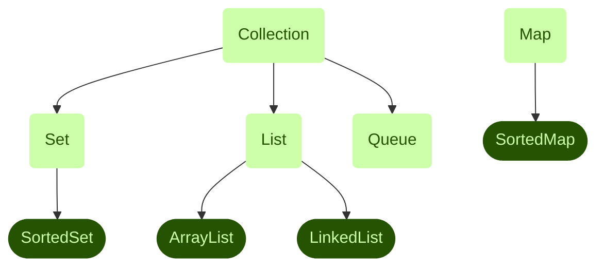
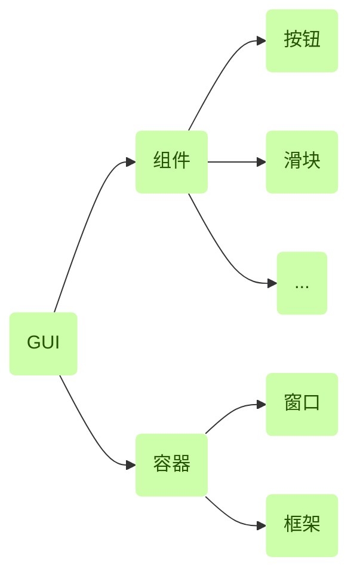

# 杂项

*[NaN]: Not a Number

import
----------

```java
//import 语句使你可以使用类的简称，不必再包含类所在的包名
import java.util.*; //引入 util 包中的所有类
import static java.lang.Math.PI; //引入静态成员
```

> 包（package）：一组用于完成相同目标的相关类
>
> import xxx.* 只会导入 xxx 包中的类，并不包括子包中的类

基本类型
----------

int, char, byte(-128~127), short, long, boolean, String

> 在输入较大的数时，可使用 `_` 分割数字：543_000_000。编译器将忽略这些下划线。
>
> 基本类型变量自动分配空间，而引用类型变量需要手动申请内存空间。
>
> 123L 表示长精度整数，1.23F 表示单精度浮点数，1.23D 表示双精度浮点数。0b1010 表示二进制数
>
> 在 Java 中，变量名可以以字母、下划线、美元符号开头，名称的其余部分可以是任何字母或数字。
>
> 判断浮点数是否相等：看两个数的差是否小于 10E-6

命名约定
----------

- 使用字母开头
- 方法名用动词；类名、接口名用名词。常量名全部大写，单词间用 `_` 分隔

== 运算符
----------

当用于引用变量时，返回的是两个引用变量指向的是不是同一个对象。相当于对指针使用 == 。

给循环命名
------------

```java
label:
while (expression) {
  //TO DO
  break label;
  continue label;
}
```

继承
----------

`extends`

> 子类并不一定能继承父类（超类）的所有属性和方法，如 private 成员
>
> 使用 Java 创建的每个程序都是类
>
> 所有类都是 Java 类层次结构的一部分。若不使用 extends，则默认超类为 Object。

valueOf()
----------

`String valueOf(<任何内置类型>)` 得到其他类型数据的字符串形式，对 Object 对象使用 valueOf() 返回的值和使用 toString() 一样。

行为和方法
-------------

行为描述了类中完成特定任务的不同部分，每一部分都称为方法。

访问限制
----------

protected 变量只能在其所在的类、该类的子类以及同一个包的其他类中使用。

private 变量只能在其所属的类中使用（注意是所属类不是所属对象）。

没有设置访问控制时（friendly），变量只能在同一个包的类中使用。这被称为默认访问控制或包访问控制。(default/package)

private < default < protected < public

> 用于访问非 public 变量的方法称为 accessor 方法
>
> 在一个类中控制其成员如何被其他类使用的过程称为封装

创建有多个类的程序
----------------------

1. 分别定义每个类
2. 将辅助类放在主类中，此时辅助类也称为内部类

> 当程序含有多个类时，只有主类可以被声明为 public，其他类不加访问限制符，其构造函数也无访问限制符
>
> 每个类都对应一个独立的 `.class` 文件

签名
----------

函数名和参数列表

> 传递给方法的参数称为方法签名（signature）

构造方法
----------

用于初始化，给未赋值属性赋值，并调用一些方法，没有返回值。访问权限一般和类相同。

父类构造方法中，被调用的一般方法执行重写后的行为，但其依赖的子类成员变量此时可能尚未被初始化，此时会导致错误行为。因此在实现构造方法时：

1. 应尽量避免调用其他一般方法
2. 调用能够被父类构造方法安全地调用的方法（final 方法和 private 方法）（private 方法隐含是 final 的）

> 方法重写并不会彻底删除被重写的方法，依然可以使用 super 访问。

向上转型
----------

把子类实例赋给父类变量，此时通过这个变量只能访问父类原有的成员（被重写的成员使用重写后的），子类特有的成员被隐藏。

向下转型
----------

父类不一定能当做子类使用，当需要把父类强制类型转换成子类时，为了保证向下转型的正确性，需要先测试以确定子类类型，再执行转换：

```java
if (SuperClass instanceof SubClass) (SubClass)SuperClass;
```

JVM 会对强制转换结果进行运行时类型识别，若结果类型与子类类型不符，则抛出 ClassCastException 异常。

> instanceof 运算符：测试运算符左边的对象是否是运算符右边的类的实例，返回 boolean 的数据类型。eg: `obj instanceof Class`
>
> 测试对象的类型取决于对象本身的类型，而不是对象变量的类型

JAR 包
----------

Java 可将相关类打包，它的作用与 .class 文件相同。

this, super 关键字
-------------------

this 是对当前对象的引用，super 是对象上一级超类的引用。

> super 一般用于子类的构造函数（避免 Java 自动调用超类无参的构造函数）
>
> 为了关联构造函数，在子类的构造函数中，第一条语句必须调用超类的构造函数
>
> this 可用于在重载构造函数时使用之前定义过的构造函数

static 关键字
-------------

声明类变量和类方法

static 语句块只会执行一次

```java
static {
  //该语句块中的内容只会执行一次
}
```

final 关键字
------------

final 变量是常量

final 方法无法被子类重写

final 类无法被继承

goto, const 关键字
--------------------

Java 保留了这两个关键字，但并未使用它们。在 Java 中常量用 `final` 修饰。

ANSI 编码
-----------

采用 Windows 代码页中对应的编码方式，不同地区的 ANSI 编码是不同的。

增强型 switch
---------------

```java
switch (i) {
  case 1 -> {
    //TO DO
  }
  case 2, 3 -> { //switch 标签允许在每种 case 下使用逗号分隔多个常量
    //TO DO
  }
}
```

> Java 中的 switch 语句可以使用 String 作为 case 的值

增强 for
----------

对基本类型是值传递，对引用类型是引用传递（可以改变原对象的值）。

逻辑运算符
------------

`&` 与 `&&` 的区别：`&&` 是短路与，当前件为假时不再判断后面。`|` 和 `||` 也是类似规则。

`>>>` 运算符：无符号右移，对负数右移时高位补 0，而不是 1。

可变长参数列表
-----------------

```java
public void func(int... li) {
  //TO DO
}
```

1. Java 将可变长参数作为数组对待。因此在传参时可以使用数组。
2. 可变长参数只能作为最后一个参数出现。

CLASSPATH 环境变量
-----------------------

是包存储的根路径。`.class` 文件应放在包储存路径中。

垃圾回收（Garbage Collection）
--------------------------------

Java 中的垃圾收集器在销毁对象前调用对象的 `finalize()` 方法

可以调用 `System.gc()` 建议 JVM 执行垃圾收集

接口（interface)
-----------------

将 “做什么” 与 “怎么做” 分离。

所有的方法都是抽象方法，不需要 abstract 修饰（方法默认 public abstract）。没有构造函数。

接口中的变量都（默认）是 public static final 的。

接口可以继承接口。

接口虽然不能被实例化，但有自己的引用变量。

接口名习惯上以 -ble 结尾。

直接向已使用的接口增加方法会导致很多问题，一般通过新接口继承旧接口来扩展接口。

> print() 方法会自动调用对象的 toString() 方法

范型
----------

如果在帮助文档中看到了 `<E>`，说明可以使用范型。

类的结构
----------

```java
class Demo {
  属性
  内部类 {...}
  方法 {...}
  static {...}
}
```

> 类的括号里面相当于 C 文件的最外层的部分

内存空间
----------

|      栈      |       堆       |              数据区              | 代码区 |
|:--------:|:---------:|:----------------------:|:-------:|
|存储变量|存储对象|存储字符串和静态变量|               |

多态
----------

多态需满足的三个条件：

1. 子类继承父类
2. 子类重写父类方法
3. 父类引用指向子类对象

Object 类
----------

|                 方法                |                                         说明                                        |
|:-----------------------|:---------------------------------------------------|
|Object clone()                |创建与该对象的类相同的新对象                                  |
|boolean equals(Object)|比较两对象是否相等（这里使用的是使用 == 判断）|
|void finalize()                  |当垃圾回收器确定不存在对该对象的更多引用时，对象垃圾回收器调用该方法|
|Class getClass()             |返回一个对象运行时的实例类                                     |
|int hashCode()               |返回该对象的散列码值                                                 |
|void notify()                    |激活等待在该对象的监视器上的一个线程                  |
|void notifyAll()                |激活等待在该对象的监视器上的全部线程                  |
|String toString()             |返回该对象的字符串表示<br>类名@十六进制哈希码<br>很多类重写了该方法，返回可以表述对象信息的字符串|
|void wait()                       |在其他线程调用此对象的 notify() 方法或 notifyAll() 方法前，导致当前线程等待|

> Object 变量相当于 void 指针，可以用 == 运算符确定指向的对象是否相同
>
> 只在需要时将对象存储在引用中是一个编程好习惯

# 数组

```java
int[] a; //声明了一个数组引用

//分配空间（实例化）
a = new int[3]; //创建指定长度的数组
a = new int[] { 1, 2, 3 } //创建数组的同时初始化
int[] b = { 4, 5, 6}; //直接指定数组的值
```

> 注意不要一边指定长度，一边指定数组的值
>
> 数组也是引用数据类型
>
> Java 中的数组元素的类型和变量的类型一样，要么是基本类型，要么是引用类型（指针）。因此如果我们的数组存储的是引用类型，那么在使用数组元素之前要记得为它分配对象。

## 数组方法

数组也是一个对象，因此也具有属性和方法

属性 length

方法 Object clone()

# String

## 定义方式

```java
String str = "Hello"; //C++ 风格
String str = new String("Hello"); //Java 风格

//同时，String 的构造函数还允许以字符数组为参数创建字符串：
char[] a = { 'a', 'b', 'c', 'd', 'e' };
String sChar = new String(a);
String sChar = new String(a, 起始位置, 长度); //截取 a 的一个子串作为新 String 的内容
```

`String str = "Hello";`：先在字符串常量池中查找该字符串，若找到则返回其引用，否则新建一个。

`String str = new String("Hello");`：在堆中创建一个 String，并在字符串常量池中查找。若没找到则创建一个 String 并将刚刚 new 的 String 的引用赋给它。

## 方法

```java
boolean equals()
boolean equalsIgnoreCase() //忽略大小写

//转换大小写
//这两个方法并不会改变原字符串
String toUpperCase()
String toLowerCase()

//查找字符串
int indexOf() //返回指定字符串第一次出现的下标，若未找到则返回 -1
boolean contains() //若包含指定字符串则返回 true，否则返回 false

char[] toCharArray() //转换为字符数组
byte[] getBytes() //转换为 byte 数组

substring(int 起始位置, int 终止位置) //获取字串 [起始, 终止)
```

> String 类是不可变类，即一旦一个 String 对象被创建以后，包含在这个对象中的字符序列是不可改变的，直至这个对象被销毁。Java 提供了两个可变字符串类 StringBuffer 和 StringBuilder，两者功能基本相似，方法也差不多。不同的是，StringBuffer 是线程安全的，而 StringBuilder 则没有实现线程安全功能，所以性能略高。

# 类型转换

## 简单变量类型转换

```java
char a;
int b = (int)a; //获得 a 的 int 型临时值
int c = a; //小类型可以直接当做大类型使用
```

## 对象类型转换

和简单变量类型转换方式一样，可转换有继承关系的对象。

## 在简单变量和对象之间转换

```java
Integer suffix = new Integer(5309); //创建简单变量类对象
Integer suffix = 5309; //使用自动封装
Integer suffix = "5309"; //也可以使用字符串创建包装类对象
int newSuffix = suffix.intValue(); //将对象转换为简单变量

//将字符串中的数字转换为数值变量
String num_s = “4321”;
int num = Integer.parseInt(num_s); 
//parse: 解析
//该方法可用于从命令行参数中获取数值
```

## 自动封装和拆封

简单变量$\mathop\rightleftharpoons\limits_{拆封}^{封装}$对象

> 在 Java 中，每一种基本数据类型都有其对应的对象类，基本变量与其相应类对象只有格式的差别

# 接口

## 概念

接口是一组方法，它提供了名称、参数和返回类型，但是没有包含实现方法的代码。接口充当对象之间的契约：如果一个对象实现了该接口，其他对象就会知道它们可以调用该对象中接口的所有方法。

## 定义接口

```java
public interface Demo {
  method1;
  method2;
}
```

> 接口成员无访问限制修饰符，因为接口中的成员变量只有一种类型：`public static final`，所以可以直接省去修饰符。

## 注解

注解（annotation）是一种巧妙的注释（comment）形式，可以被 Java 解释器、编译器和编程工具所理解。注解可以定义不属于程序一部分的程序信息，使得当程序在编译或运行时，这些程序信息能够触发行为。

# Collection

集合接口树：



> Set: 集合，无序，不含重复元素
>
> List: 链表，有序，可含重复元素

> 带有 "hash" 的集合类通过哈希值判断两个元素是否相同。
>
> 在集合类里判断两个元素是否相同，必须同时重写 `equals()` 方法和 `hashcode()` 方法。

> Collection 是接口，Collections 是类

可以用已有集合创建新的集合，只需在构造函数中传入原集合的引用。

## iterator

每个集合类都包含一个迭代器对象，相当于集合中元素之间的游标。使用 `iterator()` 函数获取集合类对象的迭代器，该迭代器准备返回集合中的第一个元素。迭代器引用可以使用泛型。

迭代器迭代时会启用一个新的线程，此时迭代器所属的集合类对象的线程被锁定，无法再进行操作，只能使用迭代器操作。迭代器相对增强 for 循环的好处是可以对元素进行操作。

# Collections 类

## 方法

```java
shuffle(E); // 将集合打乱；shuffle：洗牌
reverse(E); // 将集合倒序
sort(E);    // 通过集合元素对象所实现的 Comparable 接口中的 compareTo(Object) 方法进行排序
```

声明集合时如果不指明元素类型，则使用 Object 作为元素类型。

## List

```java
retainAll(E); // 将被调用该方法的集合对象与目标集合作交集
E set(int index, E element); // 取出在 index 处的元素，并用 element 替换该元素
```

## Map

一个 key 只对应一个 value，一个 value 可以对应多个 key。当使用重复的 key 加入新的键值对时，旧的键值对会被覆盖。

> `add()` 方法需要接收对象而不能接收基本数据类型的原因之一是基本数据类型存储在栈，当作用域结束后就不可用了，元素无法保证长久保存。

# ArrayList

java.util

## 声明

```java
ArrayList<Object> ary = new ArrayList<Object>();
```

可以通过构造函数指定数组长度，该长度与实际长度越接近，程序运行效率越高。

貌似 `<>` 可以不写，如 `Collection c = new ArrayList();`

## 方法

```java
add(Object);
add(int, Object); （在指定位置）添加元素

contains(Object); // 是否含有某元素

indexOf(Object); // 获取某元素的下标，元素未找到时返回 -1

get(int); // 检索元素

remove(Object);
remove(int); // 移除元素，可以用下标作为参数，也可以使用元素本身作为参数。使用 Object 时，函数使用对象的 equals() 方法来确定两个元素是否相同。

size(); // 获取大小
```

> 使用 Collections 接口的 `sort()` 方法可以对字符串 ArrayList 排序。
>
> ArrayList 只能存放同一类对象或具有共同超类的对象（所有对象都能存，但基本类型有限制）。
>
> Vector 和 ArrayList 功能相同，但前者需要同步，运行速度较慢。

# HashMap

hash: 散列

HashTable 和 HashMap 功能相同，但需要同步，速度更慢。

使用泛型创建对象时第二组 `<>` 中的类型参数可以省略。

## 声明

```java
HashMap<Object, Object>(int 初始容量, double 负载因子); // 缺省值为 (16, 0.75)
```

## 方法

```java
put(Object, Object); // 将对象存入 HashMap
get(Object key); // 检索对象，映射不存在时返回 null
getOrDefault(Object, Object); // 检索对象，映射不存在时返回第二个参数

containsKey(Object);
containsValue(); // 是否存在键或值

size(); // Map 中 entry 的个数
entrySet(); // 获得 entry set
```

## 遍历 HashMap

调用 HashMap 对象的 `entrySet()` 方法获得 HashMap 对象的条目集合，通过 `Map.Entry<Object, Object>` 对象访问 Set 中的每个条目。调用 `getKey()`，`getValue()` 方法获得键和值。

# GUI

## 基本概念



窗口：一种简单的容器

框架：常见的窗口

> Dialog: 对话框（无菜单栏的 Frame）

## 框架

框架的构造函数中应包括：

1. 调用超类 JFrame 的构造函数；
2. 设置框架的标题（向超类的构造函数传递字符串参数或稍后使用 `setTitle()` 方法）；
3. 设置框架的大小（使用 `setSize(int 宽度, int 高度)` 方法或在填充组件后使用无参的 `pack()` 方法）；
4. 设置框架的外观（使用 UIManager 类的 `setLookAndFeel()` 方法，参数为外观类的完整名称）；
5. 定义用户关闭框架时应执行的操作（调用框架的 `setDefaultCloseOperation(int)` 方法）；
  参数：
    - EXIT_ON_CLOSE 退出程序（关闭所有窗口）
    - DISPOSE_ON_CLOSE 关闭当前窗口
    - DO_NOTHING_ON_CLOSE 无操作
    - HIDE_ON_CLOSE 隐藏窗口
6. 设置是否显示框架（`setVisible(boolean)`）

> AWT: Abstract Window Toolkit（抽象窗口工具包），是早期的 GUI 编程开发工具包。Swing 是 AWT 的扩展，Swing 中与 AWT的同名组件的名称前都加了 J 用以区分。

```java
paint(Graphic g); // 当窗口发生变化时由窗口自动调用。g 是画笔，调用 g 的方法来绘制图形。
```

二次缓冲 `repaint()` > `update()` > `paint()`

awt 中的 Frame 的关闭按钮也是需要监听器来响应的，该监听器为 WindowListener。要关闭窗口，可以重写 WindowCloseing：

```java
WindowClosing(WindowEvent e) {
  setVisible(false);
  System.exit(0);
}
```

## 组件（Component）

```java
// 按钮
JButton(String label);

// 标签
JLabel(String text);
JLabel(String text, int align); // align 值：JLabel.RIGHT, JLabel.LEFT, JLabel.CENTER

// 文本框
JTextField(int width);
JTextField(string text, int width);
// 文本框包含的方法
Sting getText(); // 检索对象包含的文本
setText(String); // 设置对象的文本
setEchoChar(char); // 设置回显字符

// 复选框
JCheckBox(String text);
JCheckBox(String text, boolean isChosen); // 是否选中

// 组
ButtonGroup(); // 调用 add() 方法添加复选框
// 同组的复选框只能选中一个；ButtonGroup 对象只是关联复选框，没有容器的功能

// 组合框（选项列表）
JComboBox();
// JComboBox 的方法
addItem(String item); // 添加选项
setEditable(); // 设置是否接受文本输入，需要在 JComboBox 放入容器之前设置

// 文本区域
JTextArea(int height, int width);
JTextArea(String text, int height, int width); // 设置初始文本
// JTextArea 的方法
setLineWrap(); // 设置自动换行
setWrapStyleWord(boolean); // true 基于单词换行，false 基于字符换行

// 图像图标
ImageIcon(String fileName); // fileName 中使用斜杠 / 分隔文件夹
// 调用构造函数 Jlabel(ImageIcon), JButton(ImageIcon) 将图标应用于标签和按钮
// 也可以 JButton refresh = new JButton("Refresh", "images/refreshIcon.gif");
// ImageIcon 只支持 JPEG, PNG, GIF 格式的图片

// 表
// 表由一个存储数据的二位 Object 数组和一个表示表头的 String 数组组成，其中二维数组每列的数据类型必须相同。
JTable(Object[][] tableData, String[] columnLabels);
// JTable 的方法
setFillsViewportHeight(boolean); // 让表格占用图形用户界面中所有可用的高度
// 一般把表放在滚动面板里

// 滑块
JSlider(int min, int max);
JSlider(int min, int max, int default); // 无参时默认 (0, 100, 50)
JSlider(int dir, int min, int max, int default); // JSlider.VERTICAL, JSlider.HORIZONTAL
// JSlider 的方法
setMajorTickSpacing(int);
setMinorTickSpacing(int);// 设置刻度密度

setPaintTicks(boolean); // 显示刻度
setPaintLabels(true); // 显示主刻度数值
```

组件的方法

```java
setPreferredSize(); // 对组件使用 setSize() 无效，需使用 setPreferredSize()
paintConponent(); // 当需要刷新容器中的组件时，可以重写容器的 paintConponent() 方法，然后在需要刷新时调用容器的 repaint() 方法
```

缩放 ImageIcon

```java
ImageIcon icon = new ImageIcon("image.png");
Image image = icon.getImage().getScaledInstance(width, height, Image.SCALE_DEFAULT);
icon = new (image);
```

## 容器（Container）

```java
JPanel(); // 面板

// 滚动面板
JScrollPane(); // 无参数：在需要时出现滚动条
JScrollPane(int ver, int hor); // 创建一个带有指定垂直滚动条和水平滚动条的滚动面板
JScrollPane(Component); // 创建带有指定组件的滚动面板
JScrollPane(Component, int ver, int hor);
// 滚动条参数，以 VERTICAL 为例。可自行换为 HORIZONTAL
JScrollPane.VERTICAL_SCROLLBAR_AS_NEEDED
JScrollPane.VERTICAL_SCROLLBAR_NEVER
JScrollPane.VERTICAL_SCROLLBAR_ALWAYS

// 工具栏
JToolBar(int dir); // dir: SwingContants.HORIZONTAL（默认）, SwingContants.VERTICAL
// 调用 add() 添加组件
// 工具栏必须放在使用 BorderLayout 布局管理器的容器中，此时该容器只能将一个方向区域分配给工具栏，并将中央区域分配给剩下的组件。
```

> 滚动面板是一个容器，记得将文本框组件加入进去

容器的方法

```java
setEnabled(); // 启用/禁用组件
add(); // 添加组件
```

设置容器边界

```java
// 重写容器的 getInsets() 方法
public Insets getInsets() {
  Insets squeeze = new Insets(up, left, down, right); // 上边界要留高，否则组件可能排到标题栏里面。
}
```

## 布局管理器

```java
// 流式布局 java.awt
FlowLayout(<对齐方式>, <int 水平间距, int 垂直间距>);

// 网格布局 java.awt
GridLayout(int row, int col, <int 水平间距, int 垂直间距>)

// 边界布局 java.awt
BorderLayout(); // 使用 add() 方法时第一个参数是类变量 NORTH, SOUTH, EAST, WEST, CENTER

// 框式布局 java.swing
BoxLayout(布局方式);
// 参数
BoxLayout.Y_AXIS // 竖直排列
BoxLayout.X_AXIS // 水平排列（默认）
```

> 同一布局管理器可同时用于多个容器

## 监听器（EventListener）

### 监听接口类别及其方法

```java
// 响应鼠标单击或输入回车
ActionListener {
  void actionPerformed(ActionEvent);
}

// 响应使用选择列表或复选框
ItemListener {
  void itemStateChange(ItemEvent);
}

// 响应鼠标事件
MouseListener

// 响应键盘事件
KeyListener {
  void keyPressed(KeyEvent); // 按下按键时自动调用
  void keyReleased(KeyEvent); //松开按键时自动调用
  void keyTyped(KeyEvent); //按下并松开时自动调用
}

// 响应滑块输入
ChangeListener {
  void stateChanged(ChangeEvent);
}
```

组件生成用户事件时自动发送事件给接口的方法

### 设置监听器

调用组件的 `addXxxListener(Object)` 方法。例：

```java
button.addActionListener(this); // 参数是实现接口的对象
```

### 各事件对象包含的方法

ActionEvent

```java
String getActionCommand(); // 获得引发事件的组件的标签或文本等
Object getSource(); // 获得引发事件的对象
```

ItemEvent

```java
Object getItem(); // 获得引发事件的对象
int getStateChange(); // 获得对象当前选中状态：ItemEvent.SELECTED, ItemEvent.DESELECTED
```

KeyEvent

```java
char getKeyChar(); // 获得按下的字符，只适用于可显示字符
int getKeyCode(); // 监视键盘上的每个键，返回的整数可以作为getKeyText() 的参数
String getKeyText(int keyCode); // 获得键名
```

ChangeEvent

```java
Object getSource(); // 返回发生变更的对象
boolean getValueIsAdjusting(); // 确定滑块是否在移动
```

> 滑块在移动的过程中将一直触发 ChangeEvent

## 创建 Java 2D 图形

### Font 类

```java
Font(String fontName, int style, int weight);
// style: Font.BOLD, Font.ITALIC, Font.PLAIN

// 你可以将字体样式合并起来，就像这样：
Font headline = new Font("Courier New", Font.BOLD + Font.ITALIC, 72);
```